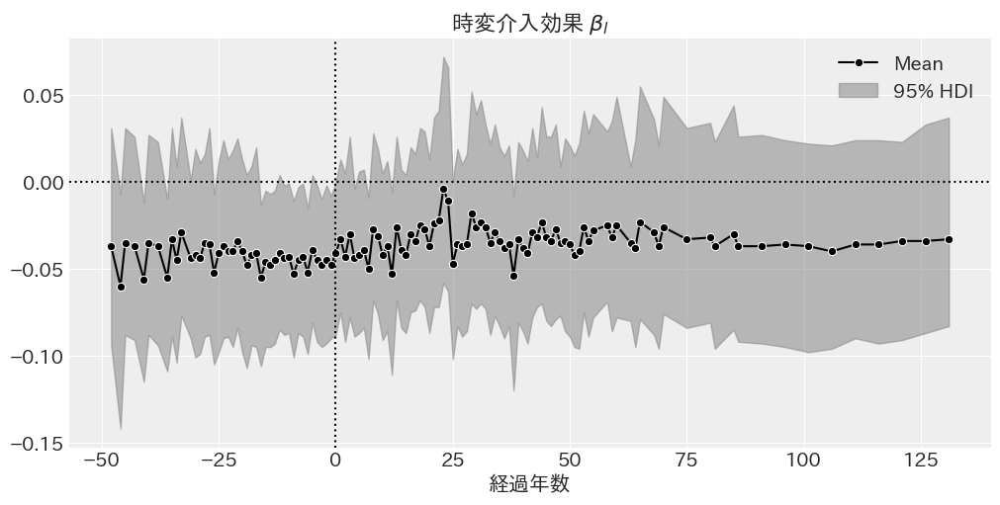

# 相談

- 2 つのコブ問題が解決した
- 平行トレンドの仮定が成立しているかどうか
- 島別の不均一分散をやってみようと思うがどうか
- Dynamic TWFE の結果
- Fully saturated の結果のグラフの見せ方

## 2 つのコブ問題が解決した

島・年平均をそのまま引くケース

$$
\log{Y_{it}}^* = \log{Y_{it}} - \bar{\log{Y_{i}}} - \bar{\log{Y_{t}}}
$$

島平均を引いてから，島平均を引いた後の年平均を引くケース

$$
\begin{aligned}
\log{Y_{it}}^* &= \log{Y_{it}} - \bar{\log{Y_{i}}} \\
\log{Y_{it}}^{**} &= \log{Y_{it}}^* - \bar{\log{Y_{t}}}^* \\
\end{aligned}
$$

計量経済学 / 西山慶彦 [ほか] 著.
東京: 有斐閣, 2019.7.

$$
\begin{aligned}
\log{Y_{it}}^{*} &= \log{Y_{it}} - \bar{\log{Y_{i}}} - \bar{\log{Y_{t}}} + \bar{\log{Y}} \\
\end{aligned}
$$

## 平行トレンドの仮定が成立しているかどうか

これで良さそうだが，Dynamic の時の平行トレンドの検証はどうなのか調べて藪先生に教える．

## 不均一分散をやってみようと思うがどうか

$$
\begin{aligned}
\log{Y_{it}}^{**} &\sim \mathcal{t} (\nu, \mu_{it}, \sigma_i^2) \\
\sigma_i &\sim \mathcal{Cauchy}^+(\sigma_{\text{global}}^2) \\
\sigma_{\text{global}} &\sim \mathcal{Cauchy}^+(0.15^2) \\
\end{aligned}
$$

誤差分散が島ごとに異なるということ．

これで良い．人口の関数にしても良い．

## Dynamic TWFE の結果

観測期間短くて良い．

## Fully saturated の結果のグラフの見せ方

いらない点を除く．

## 解釈

実際の島のデータと推定パラメータを比べてみる．
