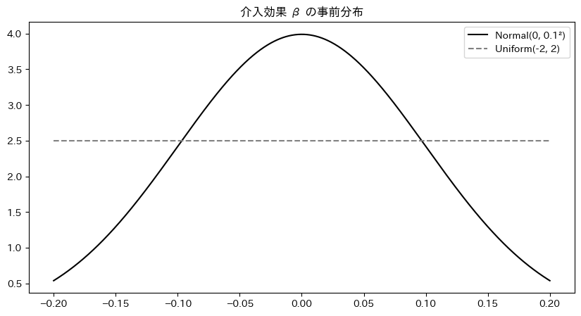
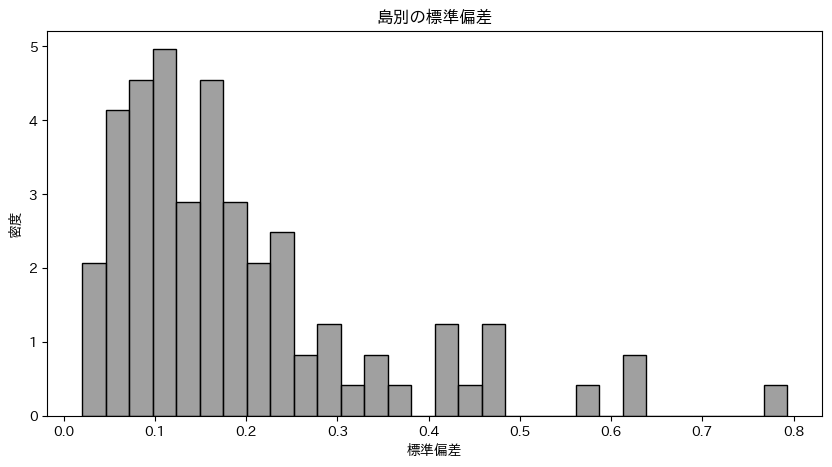
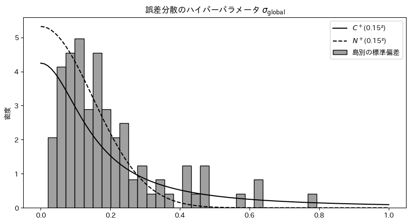
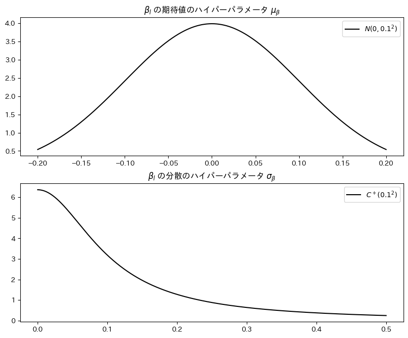
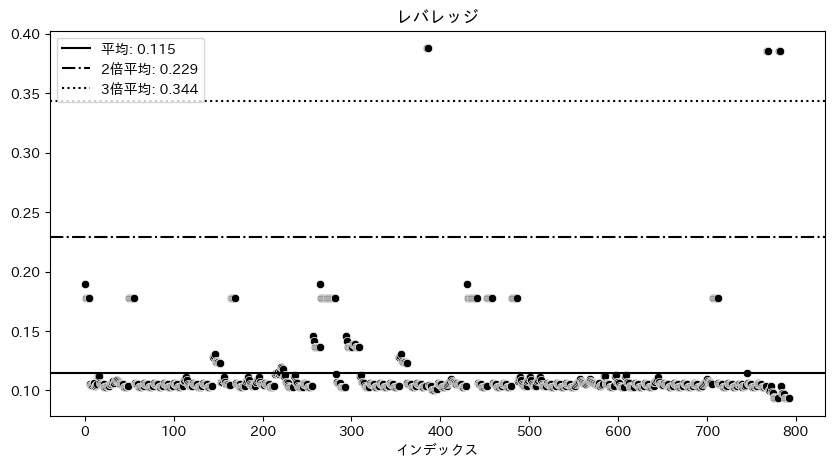

# 分析手法

島及び年の効果を考慮する方法を紹介し，次に使用する 3 つのモデルを紹介する．その後 $t$ 分布を用いたロバスト推定と欠損値への対処を議論する．

## 個体・時間効果を考慮する．

<!-- TODO ここ考える -->

$$
\begin{aligned}
\log{Y_{it}^*} &= \log{Y_{it}} - \bar{\log{Y}_i} \\
\log{Y_{it}^{**}} &= \log{Y_{it}^*} - \bar{\log{Y}^*_t} \\
\end{aligned}
$$

- $\log{Y_{it}}$: 観測値
- $\bar{\log{Y}_i}$: 個体 $i$ の平均値
- $\log{Y_{it}^*}$: 個体固定効果を除いた値
- $\bar{\log{Y}^*_t}$: 個体固定効果を除いた値の時間 $t$ の平均値
- $\log{Y_{it}^{**}}$: 個体と時間の固定効果を除いた値

添字 $i$，$t$ はそれぞれ島と年を示す．

## Two way Fixed Effects

$$
\begin{aligned}
\log{Y_{it}^{**}} &\sim \mathcal{t} (\nu, \mu_{it}, \sigma_i^2) \\
\nu &\sim \text{Gamma}(2, 0.1) \\
\mu_{it} &= \alpha + \beta \cdot W_{it}\\
\alpha &\sim \mathcal{N}(0, 0.1^2) \\
\beta &\sim \mathcal{N}(0, 0.1^2) \\
\sigma_i &\sim \mathcal{C}^+(\sigma_{\text{global}}^2) \\
\end{aligned}
$$

被説明変数 $\log{Y}_{it}^{**}$ は自由度 $\nu$ ，平均 $\mu_{it}$ ，分散 $\sigma_i^2$ の $t$ 分布に従う．$t$ 分布を使用することで外れ値に対してロバストな推定が可能になるが，詳細は自由度パラメータ $\nu$ とともに後ほど説明する．
平均構造は $W_{it}$ 一つの変数を用いており，これは介入後に $1$ を取るダミー変数である．Two way Fixed Effects は本来個体効果と時間効果をこの式に組み込むが，前述の固定効果の同定において考慮しているため，この式は単回帰となる．

この後は $\beta$ と $\sigma_i$ に関して議論するが，まずは介入効果のパラメータである $\beta$ の事前分布について紹介する．

$\beta$ の事前分布を決定するために，島効果及び年効果を考慮した対数人口の基本統計量を確認する．Pre-Treat が介入前の介入群，Post-Treat が介入後の介入群，Control が対照群である．

|            | サンプル |   平均   | 標準偏差 |   最小   |   中央   |  最大   |
| :--------: | :------: | :------: | :------: | :------: | :------: | :-----: |
| Pre-Treat  |  $178$   | $-0.135$ | $0.330$  | $-1.472$ | $-0.092$ | $1.199$ |
| Post-Treat |  $486$   | $-0.022$ | $0.209$  | $-1.256$ | $0.003$  | $0.655$ |
|  Control   |  $1059$  | $0.033$  | $0.230$  | $-0.937$ | $0.021$  | $1.328$ |

平均，最小，中央，最大によれば，介入群は対照群よりも小さく，介入の前後で比較すると最大値を除いて Pre-Treat の方が小さい．標準偏差に関しては，Pre-Treat が最も大きく，Post-Treat が最も小さい．Post-Treat と Pre-Treat の平均値の差は $0.113$ であり，これらは対数値であるから，介入にはおおよそ $11\%$ の正の影響があると推測できる．したがって，介入群は対照群よりも人口が少ない傾向にあるが，架橋は数%の人口増加と安定化をもたらす可能性がある．

以上の情報を用いて介入効果を示すパラメータの事前分布 $\beta$ を次のように設定する．

$$\beta \sim \mathcal{N}(0, 0.1^2)$$

期待値に関して，まずはパラメータの正負に関心がありどちらかに偏った情報を持たせないようにするために $0$ とする．また，標準偏差は $0.1$ とする．その場合， $95\%$ で $-0.196$ から $0.196$ の間に収まる．指数へ変換すると，架橋が人口に与える影響は $-17.80\%$ から $21.65\%$ の間に収まる事になる．介入前後の平均値の差が $0.113$ であったことを考慮すれば，この事前分布は十分に広い範囲をカバーしているといえる．

また， $\beta \sim \text{Uniform}(-0.2, 0.2)$ といった一様分布ではなく正規分布を選んだ理由は，$\beta$ が $0.2$ と大きな値を取る確率と $0$ に近い値を取る確率は等価でなく，絶対値の大きい値を取る確率は小さいことを反映させるためである．以下のグラフを参考にしてほしい．

次に誤差分散 $\sigma_i^2$ の事前分布の議論を行う．

被説明変数は島及び年の効果を考慮した対数人口であり，その分散は $0.24^2$ である．均一分散を仮定するならば，誤差分散が 0.24 より大きくなることはあり得ないため，$\sigma$ が $0$ から $0.24$ の値を取るような事前分布を設定すれば十分である．しかしながら現実的には不均一分散を考慮する必要がある．被説明変数である加工した対数人口の島別の標準偏差の基本統計量とヒストグラムは以下の通りだ．

| カウント |  平均  | 標準偏差 |  最小  |  中央  |  最大  |
| :------: | :----: | :------: | :----: | :----: | :----: |
|   $94$   | $0.19$ |  $0.15$  | $0.02$ | $0.15$ | $0.79$ |

島ごとの標準偏差は 0 から 0.2 の間に集中しているが，0.3 以上の値を取る島がいくつか存在することがわかる．したがって，均一分散と仮定して解析を進めるのは無理があるため，島ごとに誤差分散が異なると仮定して事前分布を設定することでこの問題に対処する．

$$
\sigma_i \sim \text{C}^+(\sigma_{\text{global}}^2)
$$

$\text{C}^+$ は半コーシー分布を表し，$\sigma_{\text{global}}$ はハイパーパラメータである． $\sigma_{global}^2$ は島間を横断した誤差分散の期待値であり，島内の誤差分散 $\sigma_i^2$ はこのハイパーパラメータから生成されているとする．

こうした階層構造を設けることによる利点は，島内だけのデータを使用して個別に誤差分散を推定するよりも，島間でデータを共有して効率的に推定できる事だ．もしある島のサンプルサイズが少なく推定が不安定になってしまう場合でも，より上位のパラメータで縛ることによってより頑健な推定が可能になる．

被説明変数の島別標準偏差の標準偏差が $0.15^2$ であることを考慮して $\sigma_{global} \sim \text{C}^+(0.15^2)$ と設定する．

以下のグラフを参考されたい．

こちらには 半コーシー分布と半正規分布，先ほどの島別の標準偏差をプロットした．点線の半正規分布は $0.4$ 以上の値を取る確率がほとんどない一方で，実線の半コーシー分布はデータ以上の範囲をカバーできている．したがって，スケールパラメータを $0.15$ とすることは決して恣意的ではなく十分に幅を持たせており弱情報事前分布として機能する．

また，コーシー分布は裾野の重い確率分布であり，正規分布に比べて情報が弱い事前分布であるため，使用するデータへの過適合のリスクを緩和し，外的妥当性を担保する狙いもある．

## Dynamic TWFE

$$
\begin{aligned}
\log{Y_{it}^{**}} &\sim \mathcal{t} (\nu, \mu_{it}, \sigma_i^2) \\
\nu &\sim \text{Gamma}(2, 0.1) \\
\mu_{it} &= \beta_l \cdot T_{i}\\
\beta_l &\sim \mathcal{N}(\mu_{\beta}, \sigma_{\beta}^2) \\
\sigma_i &\sim \mathcal{C}^+(\sigma_{\text{global}}^2) \\
\end{aligned}
$$

Two way Fixed Effects との相違点は平均構造にある．$\beta_l$ は介入の経過年数 $l$ における介入効果， $T_{i}$ は介入群ならば 1 を取るダミー変数であり，前述の $W_{it}$ と異なるのは，介入前の効果も測るため介入前も $1$ を取るということである．

$\beta_l$ は介入の経過年数によって効果が異なる事を考慮している．経過年数 $l$ は介入年を $0$ とし，介入前は負の値，介入後は正の値を取る．これは，橋を架ける前や架けた後，時間が経つにつれてその効果がどのように変化するかを観察するためである．

$\beta_l$ に関する平均と分散のハイパーパラメータの議論を行う．
$\beta_l$ はその期待値と分散が $l$ に関して時間変動する．
その際，時間ごとにそれぞれを個別に推定するのは非効率であり，ハイパーパラメータを通じて情報を共有する事が望ましい．
その際，時間を通じた期待値を $\mu_{\beta}$ とし，分散を $\sigma_{\beta}^2$ としている．

それらを決定するために，介入群と対照群の加工した対数人口の基本統計量を確認する．

|           | サンプル |   平均   | 標準偏差 |   最小   |   中央   |  最大   |
| :-------: | :------: | :------: | :------: | :------: | :------: | :-----: |
| Treatment |  $664$   | $-0.053$ | $0.252$  | $-1.472$ | $-0.028$ | $1.199$ |
|  Control  |  $1059$  | $0.033$  | $0.230$  | $-0.937$ | $0.021$  | $1.328$ |

介入効果の時間を通じた期待値はこの介入群の平均値 $-0.053$ や対照群との差 $-0.086$ からわかるとおり，負の値を持つ可能性があるが，$-0.1$ になることありえても，$-0.2$ になるほど離れるとは思えない．
したがって，Two way Fixed Effects の $\beta$ の期待値 $N(0, 0.1^2)$ と同様の幅をもたせれば十分弱情報事前分布として機能するだろう．

また， $\sigma_{\beta} \sim \text{C}^+(0.1^2)$ とすることで介入群の標準偏差 $0.252$ 以上の範囲をもって設ける．

設定したハイパーパラメータの確率密度は次のようになる．

ここからもパラメータが取りうる値をカバーできていることがわかる．

## Fully Saturated TWFE

$$
\begin{aligned}
\log{Y_{it}^{**}} &\sim \mathcal{t} (\nu, \mu_{it}, \sigma_i^2) \\
\nu &\sim \text{Gamma}(2, 0.1) \\
\mu_{it} &= \beta_{g, l} \cdot T_{i} \\
\beta_{g, l} &\sim \mathcal{N}(\mu_{\beta}, \sigma_{\beta}^2) \\
\sigma_i &\sim \mathcal{C}^+(\sigma_{\text{global}}^2) \\
\end{aligned}
$$

このモデルと従来のモデルの相違点は，$\beta_{g,l}$ である．

$\beta_{g, l}$ は介入時期 $g$ によって介入効果は異なるということを考慮している．つまり架橋には優先順位があり，介入時期が早い島と遅い島では，介入効果が異なるはずだということを反映している．

ハイパーパラメータ $\mu_{\beta}$ ， $\sigma_{\beta}$ については Dynamic TWFE と同様に設定する．

$$
\begin{aligned}
\mu_{\beta} &\sim \mathcal{N}(0, 0.1^2) \\
\sigma_{\beta} &\sim \mathcal{C}^+(0.1^2)
\end{aligned}
$$

## 外れ値への対処

以上のモデルは，被説明変数が $t$ 分布に従うと仮定しているが，それは外れ値に対処するためである．

外れ値の検出にはレバレッジという，観測値がデータ全体に与える影響の大きさを示す指標を用いる．
それらは $0$ から $1$ の値を取り，その値が大きいほどその観測値がデータ全体に与える影響が大きく，外れ値である可能性が高い．

Hoaglin & Welsch(1978) の手法を元にレバレッジを以下のように測定した．

まずハット行列 $\mathbf{H}$ を計算する．

$$
\mathbf{H} = \mathbf{X}(\mathbf{X}^{\top}\mathbf{X})^{-1}\mathbf{X}^{\top}
$$

ここで， $\mathbf{X}$ は説明変数のデザイン行列である．

次にハット行列の対角成分を取得し， $i$ 番目の要素を $L_i$ として取得する．

$$
\text{L}_{i} = \text{diag}(\mathbf{H})_i = h_{ii}
$$

以上の流れで計算されたレバレッジの基本統計量と分布は以下の通りだ．

|  平均   | 標準偏差 |  最小   |  中央   |  最大   |
| :-----: | :------: | :-----: | :-----: | :-----: |
| $0.066$ | $0.027$  | $0.048$ | $0.056$ | $0.388$ |

横軸は観測番号，縦軸はレバレッジであり，各点線・破線は下から平均レバレッジ，$2$ 倍の平均レバレッジ，$5$ 倍の平均レバレッジを示している．

通常 $2$ から $3$ 倍の平均レバレッジを閾値として外れ値の判断に用いるが， このデータセットでは，$5$ 倍の平均レバレッジを超える観測値が $6$ つ存在している．

このような外れ値が存在する場合，正規分布を仮定したモデルは外れ値に対して脆弱であり，外れ値を除いて推定する等の対処が必要である．

しかし外れ値を除くと重要な情報が失われてしまう危険性があるため，ここでは $t$ 分布を用いたロバスト推定を行う．

モデルの尤度関数部分と，自由度パラメータの事前分布を再掲する．

$$
\begin{aligned}
\log{Y_{it}^{**}} &\sim \mathcal{t} (\nu, \mu_{it}, \sigma_i^2) \\
\nu &\sim \text{Gamma}(2, 0.1) \\
\end{aligned}
$$

被説明変数の尤度関数として $t$ 分布を指定している．

<!-- TODO ｔ分布を用いたロバスト推定をもう少し考える -->

自由度が無限大の $t$ 分布は正規分布に収束するが，自由度が小さい場合は正規分布よりも裾野が重くなる．したがって自由度が小さいときは外れ値の影響を受けにくくなる．

自由度パラメータ $\nu$ の事前分布は $\text{Gamma}(2, 0.1)$ としている．

この事前分布は Juárez and Steel (2010) によって推奨されており，広いカバー範囲と適度な制約を持っている．

なお，正規分布を用いたパラメータの推定結果はこの研究においては過小評価される傾向にあった．これは，正規分布が外れ値に対して脆弱であるため，外れ値の影響を過度に受けてしまうことが原因だと考えられる．

## 欠損値への対処

被説明変数には欠損値が $140$ データポイント存在する．欠損値の対処法としては，欠損値を含む行を削除する方法や，欠損値に平均値等の固定値を代入して補完する方法があるが，前者は情報を破棄しているため良い方法ではなく，後者は実際には観測されていないのに欠損データを代入した値が確実であると主張しているため，統計的に正しくない方法である (Peter D. Hoff 2022)．
本稿で扱うデータの欠測は，島の特性や島の人口そのものに原因があるわけではなく，私の地理的な知識不足故に国勢調査や住民基本台帳調査を一部読み解けなかったために生じたものである．したがって欠測はランダムに発生していると仮定する．

<!-- TODO 欠損値補完の方法を調べる．以下は推測に過ぎない． -->

使用するライブラリ PyMC では欠損値を区間推定して補完する方法が提供されており，これを用いて欠損値を補完する．
