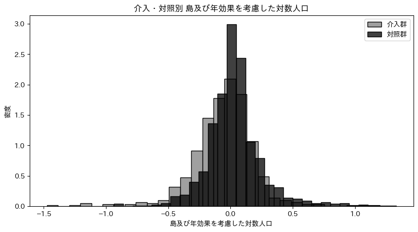
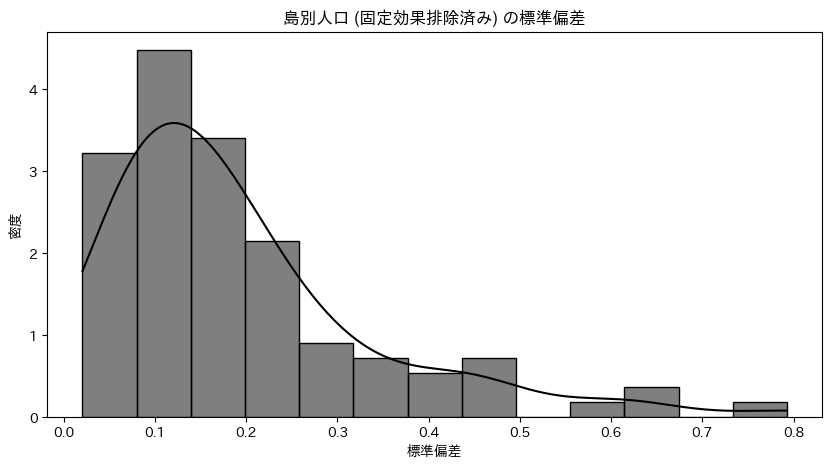

# モデルの定義

## 個体・時間ランダム効果

$$
\begin{aligned}
\log{Y_{it}^*} &= \log{Y_{it}} - \bar{\log{Y}_i} \\
\log{Y_{it}^{**}} &= \log{Y_{it}^*} - \bar{\log{Y}^*_t} \\
\end{aligned}
$$

- $\log{Y_{it}}$: 観測値
- $\bar{\log{Y}_i}$: 個体 $i$ の平均値
- $\log{Y_{it}^*}$: 個体固定効果を除いた値
- $\bar{\log{Y}^*_t}$: 個体固定効果を除いた値の時間 $t$ の平均値
- $\log{Y_{it}^{**}}$: 個体と時間の固定効果を除いた値

## Two way Fixed Effects

$$
\begin{aligned}
\log{Y_{it}^{**}} &\sim \mathcal{t} (\nu, \mu_{it}, \sigma_i^2) \\
\nu &\sim \text{Exponential}(1/10) \\
\mu_{it} &= \beta \cdot W_{it}\\
\beta &\sim \mathcal{N}(0, 0.1^2) \\
\sigma_i &\sim \mathcal{C}^+(\sigma_{\text{global}}^2) \\
\end{aligned}
$$

- $i$: 島
- $t$: 年
- $\nu$: $\mathcal{t}$ 分布の自由度パラメータ
- $\beta$: 介入効果
- $W_{it}$: 介入後に 1 を取るダミー変数
- $\sigma_i^2$: 島 $i$ の誤差分散
- $\sigma_0^2$: 島間の誤差分散を表すハイパーパラメータ

介入効果 $\beta$ の事前分布について議論したい．

このグラフは島効果と年効果を考慮した対数人口を介入群と対照群に分けてプロットしたものであり，灰色は橋が架かっているグループ，黒色は橋が架かっていないグループを示している．

両者は重なっているが，介入群の方が対照群よりも少ない方に偏っている．

ここで対数人口の基本統計量を確認する．

|        |  平均   | 標準偏差 |  最小   |  中央   |  最大   |
| :----: | :-----: | :------: | :-----: | :-----: | :-----: |
| 介入群 | $-0.05$ |  $0.25$  | $-1.47$ | $-0.03$ | $1.20$  |
| 対照群 | $0.03$  |  $0.23$  | $-0.93$ | $0.02$  | $1.33$  |
|   差   | $-0.08$ |  $0.02$  | $-0.54$ | $-0.05$ | $-0.13$ |

平均値をみると，処置群は $-0.05$，対照群は $0.03$ であり，その差は $-0.08$である．
標準偏差は介入群は 0.25，対照群は 0.23 であり，介入群の方がばらつきが大きいといえる．
その他の統計量は介入群の方が小さい値を示している．

したがって，架橋は $\plusmn10\%$ 以上程の大きな効果はないが，数%の人口減少をもたらす可能性がある．

以上の情報を用いて事前分布を決定する．

介入効果を示すパラメータ $\beta$ は次のように設定する．

$$\beta \sim \mathcal{N}(0, 0.1^2)$$

期待値は 0 とする．まずはパラメータの正負に関心があるため，どちらかに偏った情報を持たせないようにする．

標準偏差は 0.1 とする．次のグラフを見てほしい．標準偏差が 0.1 の場合，95%の確率で-0.196 から 0.196 の間に収まる．

指数に変換すると，架橋が人口に与える影響は $17.80\%$ の減少から $21.65\%$ の増加の間に収まる事になる．

介入群と処置群の両群の平均値の差が $-0.08$ であったことを考慮すれば，この事前分布は十分に広い範囲をカバーしているといえる．

また， $\beta \sim \text{Uniform}(-0.2, 0.2)$ といった一様分布ではなく正規分布を選んだ理由は，$\beta$ が $0.2$ と大きな値を取る確率と $0$ に近い値を取る確率は等価ではなく，大きな値を取る確率が小さいことを反映させるためである．

島間の誤差分散を表すハイパーパラメータ $\sigma_0^2$ は スケールパラメータ 1 の半コーシー分布としている．分散は 0 以上の値を取るため，そのように制約を設けている．スケールパラメータの値だが，被説明変数は対数故にそれほど大きな分散を持たないと考えられるため，1 としている．

$\sigma_i^2$ は島ごとに誤差分散が異なることを仮定している．

固定効果を排除した島別人口の対数値の標準偏差をヒストグラムで示している．人口が多い島や，人口が少ない島が混在しているため，島ごとに誤差分散が異なると考えられる．

## Dynamic TWFE

$$
\begin{aligned}
\log{Y_{it}^{**}} &\sim \mathcal{t} (\nu, \mu_{it}, \sigma_i^2) \\
\nu &\sim \text{Exponential}(1/10) \\
\mu_{it} &= \beta_l \cdot T_{i}\\
\beta_l &\sim \mathcal{N}(\mu_{\beta}, \sigma_{\beta}^2) \\
\sigma_i &\sim \mathcal{C}^+(\sigma_0^2) \\
\end{aligned}
$$

- $\beta_l$: 介入の経過年数 $l$ における介入効果
- $T_{i}$: 介入群ならば 1 を取るダミー変数
- $\mu_{\beta}$: 経過年数間の平均を表すハイパーパラメータ
- $\sigma_{\beta}^2$: 経過年数間の分散を表すハイパーパラメータ

$\beta_l$ は介入の経過年数によって効果が異なる事を考慮している．経過年数 $l$ は介入年を $0$ とし，介入前は負の値，介入後は正の値を取る．これは，橋を架ける前や架けた後，時間が経つにつれてその効果がどのように変化するかを観察するためである．

$\beta_l$ に関する平均と分散のハイパーパラメータは $\mu_{\beta} \sim \mathcal{N}(0, 1)$ ， $\sigma_{\beta} \sim \mathcal{C}^+(1)$ としている．

## Fully Saturated TWFE

$$
\begin{aligned}
\log{Y_{it}^{**}} &\sim \mathcal{t} (\nu, \mu_{it}, \sigma_i^2) \\
\nu &\sim \text{Exponential}(1/10) \\
\mu_{it} &= \beta_{g, l} \cdot T_{i} \\
\beta_{g, l} &\sim \mathcal{N}(\mu_{\beta}, \sigma_{\beta}^2) \\
\sigma_i &\sim \mathcal{C}^+(\sigma_0^2) \\
\end{aligned}
$$

- $\beta_{g, l}$: 介入時期 $g$ における経過年数 $l$ における介入効果
- $T_{i}$: 介入群ならば 1 を取るダミー変数
- $\mu_{\beta}$: 介入時期間，経過年数間の平均を表すハイパーパラメータ
- $\sigma_{\beta}^2$: 介入時期間，経過年数間の分散を表すハイパーパラメータ

$\beta_{g, l}$ は介入時期によって介入効果は異なるということを考慮している．架橋には優先順位があり，介入時期が早い島と遅い島では，介入効果が異なるはずである．
