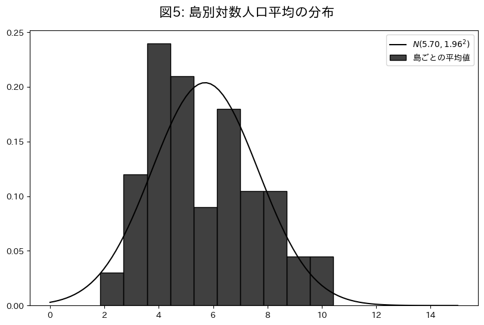

# 分析手法

データの説明をし，次に使用する 3 つのモデルを紹介する．不均一分散への対処， $t$ 分布を用いたロバスト推定と平行トレンドの仮定を議論する．

## 使用データ

本稿の実証分析では，島別のアンバランスドパネルデータを使用する．分析対象の島は瀬戸内地域を中心に中国・四国地方から選択した $78$ 島であり，介入群 $33$ 島，対照群 $45$ 島とする．
介入群の選定基準は，架橋前の人口データが入手可能かどうかであり，対照群の選定基準は，本土もしくは他の島からの距離が $1991m$ 以内であるかどうかである．$1991m$ はギネスブックに掲載されていた元世界最長の吊り橋である明石海峡大橋の全長であり，これよりも距離が長い場合は，技術的にも難しく，また架橋の動機も薄いため，いずれ架橋される可能性が低い．したがって対照群として適さないと判断した．
分析期間は最長で $1960$ 年から $2020$ 年，最短で $1995$ 年から $2020$ 年までとし，国勢調査を基本とした $5$ 年毎のデータを用いる．

| 変数名     | 出展                                                            | 備考                                                                                            |
| :--------- | :-------------------------------------------------------------- | :---------------------------------------------------------------------------------------------- |
| 人口       | 国勢調査 離島統計年報 地方自治体のウェブサイト等          | 同じ年なら国勢調査を採用．                                                                      |
| 橋の開通年 | 地方自治体のウェブサイト Weblio 辞書「日本の離島架橋の概要」 | その島で最初に開通した橋の開通年．  地方自治体と Weblio 辞書の情報が異なる場合は前者を採用． |

- 分析期間: 最長で $1960$ 年から $2020$ 年までの $5$ 年毎
  - 最短で $1995$ 年から $2020$ 年まで．
- 分析対象の島: 中国・四国地方の $78$ 島
- 介入群の選定: 橋がかかる前のデータも入手可能な $33$ 島．
- 対照群の選定: 本土もしくは他の島からの距離が $1991m$ 以内の $45$ 有人島．

出所:
人口: 国勢調査，離島統計年報，地方自治体のウェブサイト等
架橋年: 地方自治体のウェブサイト，Weblio 辞書「日本の離島架橋の概要」

基本統計量

|   項目   |   平均    | 標準偏差  |  最小  |   中央   |  最大   |
| :------: | :-------: | :-------: | :----: | :------: | :-----: |
|   人口   | $2084.47$ | $5664.25$ |  $4$   | $232.50$ | $44819$ |
| 対数人口 |  $5.70$   |  $2.02$   | $1.39$ |  $5.45$  | $10.71$ |
| 介入変数 |  $0.26$   |  $0.44$   |  $0$   |   $0$    |   $1$   |
|  介入年  | $1989.56$ |  $12.48$  | $1970$ |  1988$   | $2016$  |
| 経過年数 |  $5.88$   |  $20.04$  | $-46$  |   $6$    |  $50$   |

## Two way Fixed Effects

$$
\begin{aligned}
\log{Y_{it}} &\sim \mathcal{t} (\nu, \mu_{it}, \sigma^2) \\
\nu &\sim \text{Gamma}(2, 0.1) \\
\mu_{it} &= \alpha_i + \lambda_t + \beta \cdot W_{it}\\
\alpha_i &\sim \mathcal{N}(\mu_{\alpha}, \sigma_{\alpha}^2) \\
\lambda_t &\sim \mathcal{N}(\mu_{\lambda}, \sigma_{\lambda}^2) \\
\beta &\sim \mathcal{N}(0, 1) \\
\sigma &\sim \mathcal{C}^+(1) \\
\end{aligned}
$$

被説明変数 $\log{Y}_{it}^{**}$ は自由度 $\nu$ ，平均 $\mu_{it}$ ，分散 $\sigma_i^2$ の $t$ 分布に従う．$t$ 分布を使用することで外れ値に対してロバストな推定が可能になるが，詳細は自由度パラメータ $\nu$ とともに後ほど説明する．

平均構造は島効果 $\alpha_i$，年効果 $\lambda_t$，介入効果 $\beta$，介入変数 $W_{it}$ によって構成される．

島効果 $\alpha_i$ は島 $i$ の固有の効果を示しており，ハイパーパラメータ $\mu_{\alpha}$ と $\sigma_{\alpha}$ によって平均と分散が決定される．

以下は島別の対数人口平均値のグラフである．

島ごとにグループ化した場合の対数人口の平均値の分布は，平均 $5.78$，標準偏差 $1.98$ であり，島ごとの違いは以上のような正規分布から生成されていると仮定する．
したがって島効果の期待値 $\mu_{\alpha}$ は $5$，島効果の標準偏差 $\sigma_{\alpha}$ は $2$ を中心に分布すると考え，それを事前分布として設定する．

$$
\begin{aligned}
\mu_{\alpha} &\sim \mathcal{N}(5, 1) \\
\sigma_{\alpha} &\sim \text{Gamma}(3, 1) \\
\end{aligned}
$$

なお，これらの $1$ というスケールは，被説明変数が対数であることを考えれば十分広いものだと考えられる．

年効果 $\lambda_t$ は年 $t$ の固有の効果を示しており，ハイパーパラメータ $\mu_{\lambda}$ と $\sigma_{\lambda}$ によって平均と分散が決定される．$1960$ 年を基準にした対数人口の年平均推移は以下の通りである．

平均は $-0．968$，標準偏差は $0.588$ であった．

したがって，年効果の期待値 $\mu_{\lambda}$ は $-1$，年効果の標準偏差 $\sigma_{\lambda}$ は $0.6$ を中心に分布すると考え，それを事前分布として以下のように設定する．

$$
\begin{aligned}
\mu_{\lambda} &\sim \mathcal{N}(-1, 1) \\
\sigma_{\lambda} &\sim \text{Gamma}(2, 1) \\
\end{aligned}
$$

介入効果 $\beta$ は介入の効果を示しており，事前分布として平均 $0$，標準偏差 $1$ の正規分布を設定する．これは橋の効果が数 $10\%$ 程度のばらつきを持つという仮定であり，弱情報事前分布として適切である．

## Dynamic TWFE

$$
\begin{aligned}
\log{Y_{it}} &\sim \mathcal{t} (\nu, \mu_{it}, \sigma^2) \\
\nu &\sim \text{Gamma}(2, 0.1) \\
\mu_{it} &= \alpha_i + \lambda_t + \sum_{\ell} \beta_{\ell} (\mathbb{1}\{t - E_i \in \ell\}) \\
\beta_{\ell} &\sim \mathcal{N}(0, 1) \\
\sigma &\sim \mathcal{C}^+(1) \\
\end{aligned}
$$

Two way Fixed Effects との相違点は平均構造にある．
$\mathbb{1}\{t - E_i \in \ell\}$ は，$t$ を観測年，$E_i$ を介入年，$\ell$ を介入の経過年数として，介入の経過年数 $\ell$ における介入効果を示すダミー変数である．
$\beta_{\ell}$ は介入の経過年数 $\ell$ における介入効果を示している．

経過年数 $l$ は介入年を $0$ とし，介入前は負の値，介入後は正の値を取る．これは，橋を架ける前や架けた後，時間が経つにつれてその効果がどのように変化するかを観察するためである．

## Fully Saturated TWFE

$$
\begin{aligned}
\log{Y_{it}} &\sim \mathcal{t} (\nu, \mu_{it}, \sigma^2) \\
\nu &\sim \text{Gamma}(2, 0.1) \\
\mu_{it} &= \alpha_i + \lambda_t + \sum_{e} \sum_{\ell} \beta_{e, \ell} (\mathbb{1}\{E_i \in e\} \cdot \{t - E_i \in \ell\}) \\
\beta_{g, \ell} &\sim \mathcal{N}(0, 1) \\
\sigma &\sim \mathcal{C}^+(1) \\
\end{aligned}
$$

このモデルと従来のモデルの相違点は，$\beta_{g,\ell}$ である．

$\beta_{g, l}$ は介入時期 $g$ によって介入効果は異なるということを考慮している．つまり架橋には優先順位があり，介入時期が早い島と遅い島では，介入効果に異質性がある．このような状況では上の Dynamic TWFE ではバイアスが生じる可能性がある．

したがって介入時期が異なるならば，それらを別々に推定した後で，得られた推定値に関して介入時期ごとの橋の数で重み付けを行う．

このグラフは経過年数別の橋の本数を示している．

Fully saturated TWFE では，経過年数別に複数の推定値を得るため，それらを経過年数ごとに平均して推定量を獲得する．

ハイパーパラメータ $\mu_{\beta}$ ， $\sigma_{\beta}$ については Dynamic TWFE と同様に設定する．

$$

\begin{aligned}
\mu*{\beta} &\sim \mathcal{N}(0, 0.1^2) \\
\sigma*{\beta} &\sim \mathcal{C}^+(0.1^2)
\end{aligned}

$$

## 不均一分散

## 外れ値への対処

以上のモデルは，被説明変数が $t$ 分布に従うと仮定しているが，それは外れ値に対処するためである．

外れ値の検出にはレバレッジという，観測値がデータ全体に与える影響の大きさを示す指標を用いる．
それらは $0$ から $1$ の値を取り，その値が大きいほどその観測値がデータ全体に与える影響が大きく，外れ値である可能性が高い．

Hoaglin & Welsch(1978) の手法を元にレバレッジを以下のように測定した．

まずハット行列 $\mathbf{H}$ を計算する．

$$

\mathbf{H} = \mathbf{X}(\mathbf{X}^{\top}\mathbf{X})^{-1}\mathbf{X}^{\top}

$$

ここで， $\mathbf{X}$ は説明変数のデザイン行列である．

次にハット行列の対角成分を取得し， $i$ 番目の要素を $L_i$ として取得する．

$$

\text{L}_{i} = \text{diag}(\mathbf{H})\_i = h_{ii}

$$

以上の流れで計算されたレバレッジの基本統計量と分布は以下の通りだ．

|  平均   | 標準偏差 |  最小   |  中央   |  最大   |
| :-----: | :------: | :-----: | :-----: | :-----: |
| $0.066$ | $0.027$  | $0.048$ | $0.056$ | $0.388$ |

横軸は観測番号，縦軸はレバレッジであり，各点線・破線は下から平均レバレッジ，$2$ 倍の平均レバレッジ，$5$ 倍の平均レバレッジを示している．

通常 $2$ から $3$ 倍の平均レバレッジを閾値として外れ値の判断に用いるが， このデータセットでは，$7.5$ 倍の平均レバレッジを超える観測値が $4$ つ存在している．

このような外れ値が存在する場合，正規分布を仮定したモデルは外れ値に対して脆弱であり，外れ値を除いて推定する等の対処が必要である．

しかし外れ値を除くと重要な情報が失われてしまう危険性があるため，ここでは $t$ 分布を用いたロバスト推定を行う．

モデルの尤度関数部分と，自由度パラメータの事前分布を再掲する．

$$

\begin{aligned}
\log{Y*{it}} &\sim \mathcal{t} (\nu, \mu*{it}, \sigma_i^2) \\
\nu &\sim \text{Gamma}(2, 0.1) \\
\end{aligned}

$$

被説明変数の尤度関数として $t$ 分布を指定している．

<!-- TODO ｔ分布を用いたロバスト推定をもう少し考える -->

自由度が無限大の $t$ 分布は正規分布に収束するが，自由度が小さい場合は正規分布よりも裾野が重くなる．したがって自由度が小さいときは外れ値の影響を受けにくくなる．

自由度パラメータ $\nu$ の事前分布は $\text{Gamma}(2, 0.1)$ としている．

この事前分布は Juárez and Steel (2010) によって推奨されており，広いカバー範囲と適度な制約を持っている．

なお，正規分布を用いたパラメータの推定結果はこの研究においては過小評価される傾向にあった．これは，正規分布が外れ値に対して脆弱であるため，外れ値の影響を過度に受けてしまうことが原因だと考えられる．

## 平行トレンドの仮定

平行トレンドの仮定は，介入群にもし介入がなかった場合，対照群と同じような傾向で推移していたという仮定である．

この図は，介入前の介入群と対照群の対数人口の推移を示している．
介入は段階的に行われるため，期間の後半になるにつれて，介入前のサンプルサイズが減るが故に[^1]，変動が見られやすいが，両群とも下降トレンドであり，介入前の傾向は似ている．

[^1]: 2010 年以降の介入前のサンプルサイズは$6$から$2$へ減少している．

$$

$$
