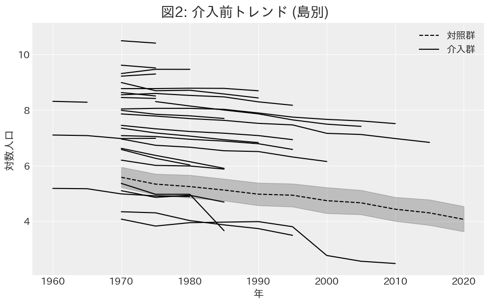
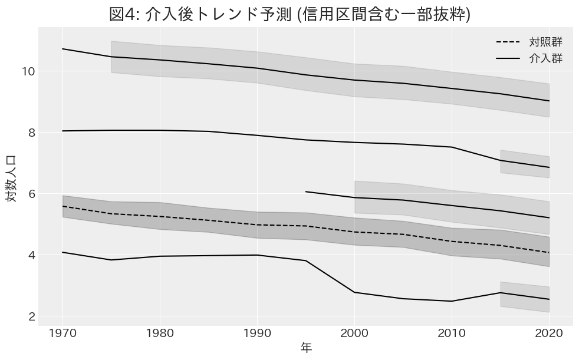
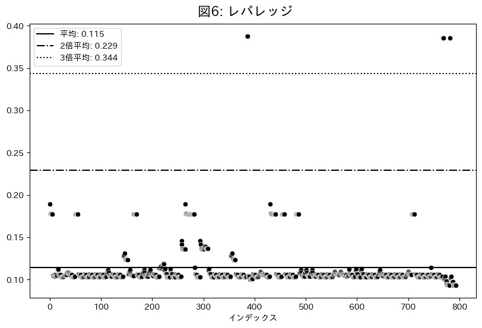
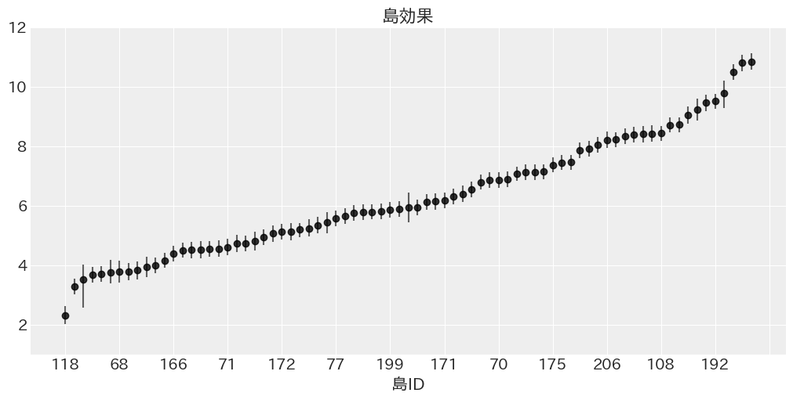
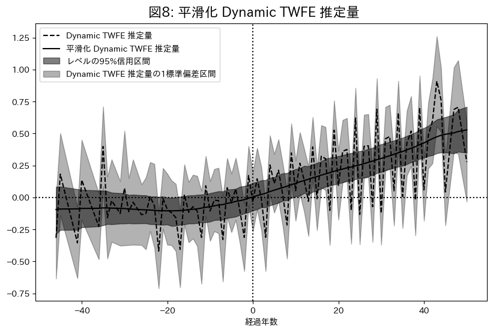

<h1 style='text-align: center;'>離島架橋の介入効果</h1>

<要約>

本稿では離島架橋が離島人口に与える影響を島別パネルデータを用いて推定した．介入の時系列的かつ横断的な異質性を考慮した Fully Saturated TWFE モデルを利用し，得られた推定値を平滑化することで介入効果のパターンを明確にした．その結果，離島架橋の介入効果は介入数年前から正の方向に作用し，徐々にその効果を高め，人口減少を抑制する力を持つことを明らかにした．

<キーワード> 離島人口，離島架橋，因果推論，ATT，Two-way Fixed Effects，Dynamic TWFE，Fully Saturated TWFE，階層ベイズモデル，状態空間モデル，ローカル線形トレンドモデル

# $1.$ はじめに

離島架橋とは，本土と離島，又は離島同士を結ぶために架けられる橋のことを指す．日本は 6,852 の島嶼により構成される島国であり，本州，北海道，四国，九州，沖縄本島を除く 6,847 島が離島である（国土交通省 国土政策局 離島振興課 2022）．このうち，離島振興法による離島振興対策実施地域に含まれる有人離島は 254 島であるが，1955 年から 2015 年までの間に，全国の人口が約 4 割増加する一方で，これらの有人離島の人口は約 6 割減少している．

このような離島の人口減少に対し，離島架橋は有効な対策となりうるのか．離島架橋は，離島の交通インフラとして経済活動の活性化や生活環境の向上に寄与する可能性がある一方で，ストロー効果を引き起こし人口流出を招く可能性も指摘されている．本研究は，離島架橋が離島人口に与える影響を定量的に明らかにすることを目的とする．

続いて先行研究のレビューを行う．

寺井ら $(1998)$ は，芸予諸島において，本四架橋を契機とした島嶼整備のあり方に関する研究を行っている．架橋の問題点は，渡船業者が大きな影響を受けたり，島らしさを体現する観光資源を衰退に導いているということだと述べられている．

沖山・後藤 $(2001)$ は，佐賀県加部島における農業を事例として離島の基幹産業に与える架橋政策の影響に関する研究を行っている．
架橋前は農道の発達が悪く，生産性が極めて低かった．
架橋後は，土地改良，農道の整備，農業の機械化を促進させ，生産性を向上させた上に，パイプラインによって農業用水が確保されたことで水不足が解消され，陸路によって安定した出荷が出来るようになった．

湯本ら $(2002)$ では有人離島 $423$ 島農地離島振興法対象の $288$ 離島を対象に，離島の類型化と人口増減要因に関する基礎的分析を行っている．
離島の類型化は $4$ 側面，自然特性 $12$ 指標，生活環境 $16$ 指標，産業形態 $19$ 指標，離島の側からのアピールポイント $11$ 指標から主成分分析によって行われた．
特に生活環境に関する指標は交通，生活，保健，教育，余暇等からなる指標を用いており，ある主成分は正の方向に｢空港が利用可能｣ ｢船の大きさ｣ ｢中学校あり｣．負の方向に｢他から送水｣ ｢最大就航回数｣ ｢本土から行ける｣が付置されていることから，｢核的 ―― 枝的｣軸と解釈されている．
人口増加に対しては，自然特性が圧倒的に大きな影響力を持ち，長期人口増及び社会増には本土へのアクセス等よりも島での快適な暮らしが効果的であると述べられている．

黒田 $(2003)$ は架橋されている周防大島と架橋されていない小豆島を比較して，架橋の影響を分析している．架橋が行われる前は両者の傾向は変わらないが，架橋後は周防大島の方が減少の度合いが大きいと述べられている．

宮内ら $(2003)$ は 沖縄県浜比嘉島を対象に $1997$ 年に架橋した浜比嘉大橋による人口増加の影響を分析している．米軍向け野菜供給地として指定されていたが，台湾からの安価な野菜輸入により需要が減少し，農業が衰退．農民層が労働需要が盛んな地域に移住したため激しい人口流出を経験した．浜比嘉大橋完成により，沖縄島と道路で結ばれた島には島外から U ターンを中心とする転入者が相次いだ．浜比嘉島は年通勤可能架橋島であるため，人口麺の架橋効果が大きいとのことであった．離島の人口流出対策として，交通インフラ整備が有効であることを示唆している．

山崎ら $(2007)$ は $1970$ 年から $30$ 年にわたって人口増加を続けた特異な離島である兵庫県姫路市家島町に属する防勢島を研究している．
その島に橋はないが，防勢島は自然増が社会減を上回る形で人口が増加しているが，その要因は，養殖への産業構造の変化と埋め立てによる住宅用地の確保，新宅分けという慣行にあると述べられている．

猪原ら $(2015)$ は，明石海峡大橋を事例として空間経済学に基づくストロー効果の検証を行っている．
ストロー効果を，交通インフラの整備等による $2$ 地域間輸送費の低下により，一方の地域の出荷額が他方の地域と比べて相対的に減少することと定義して分析しており，兵庫県では市場拡大効果が優勢で出荷額増加が観察された一方，徳島県では競争拡大効果が優勢で出荷額減少が見られた．明石海峡大橋開通後，徳島県の中小店舗が経済的影響を強く受けたとしている．

重松 $(2022)$ は $1980$ から $2020$ 年の $272$ 島を分析対象として，離島の人口変化の要因分析を行っている．
被説明変数には人口比率や合計特殊出生率，死亡率，転入率，転出率．説明変数には本土からの距離や平均気温等の自然地域特性，各産業の従業員数等の島内雇用，架橋の有無等の行政の取組，年代別等の人口を用いて重回帰分析をしている．
架橋の有無を示すダミー変数のパラメータの推定値に関しては，
$2020$ 年の人口変化率に対して $1.25$ と正の影響を与えているが，
$2010$ 年の転入率に対しては $-0.52$ ，$2010$ 年の転出率に対しては $-0.40$ と負の影響を与えている．
$2010$ 年時点では転出超過が起きるストロー効果が発生しているが，
$2020$ 年ではストロー効果を起こしていないと述べられている．

これらの先行研究は，個別の離島における架橋の影響を詳細に分析しているものの，複数の離島を対象とした架橋の平均的な効果を定量的に検証した研究は存在しない．本研究は，複数の離島における架橋前後のデータを用いて，離島架橋の動的な介入効果を推定する点に新規性がある．

また本研究は，インフラ投資の政策効果を実証的に検証することで，離島振興政策の立案に示唆を与える点で社会的意義を持つ．離島架橋が人口維持に有効であれば，政府は離島架橋への財政支出を通じて離島の経済活動の活性化や生活環境の向上を図ることができる．一方，効果が限定的であれば，政府は他の政策手段を検討することで，有限な資源のより効果的な配分を目指すことができる．

本稿の構成は以下の通りである．第 $2$ 章では分析手法を説明する．第 $3$ 章では分析結果を示し，第 $4$ 章ではまとめを行う．

# $2.$ 分析手法

本章では，まず使用するデータの説明をし，次に平行トレンドの仮定の検証をした後，$3$ つのモデルを紹介する．最後に $\text{Student-t}$ 分布を用いたロバスト推定を説明する．

## $2.1$ 使用データ

本稿の実証分析では，島別のアンバランスドパネルデータを使用する．分析対象の島は瀬戸内地域を中心に中国・四国地方から選択した $78$ 島であり，介入群 $33$ 島，対照群 $45$ 島とする．
介入群の選定基準は，架橋前の人口データが入手可能かどうかであり，対照群の選定基準は，本土もしくは他の島からの距離が $1991m$ 以内であるかどうかである．$1991m$ はギネスブックに掲載されていた元世界最長の吊り橋である明石海峡大橋の全長であり，これよりも距離が長い場合は，技術の進歩を加味しても，いずれ架橋される可能性は低い．また離れすぎていると人口動態が異なる場合があるため，対照群として適さないと判断した．
分析期間は最長で $1960$ 年から $2020$ 年，最短で $1995$ 年から $2020$ 年までとし，国勢調査を基本とした $5$ 年毎のデータを用いる．
人口データは主に国勢調査から取得[^1]し，足りない部分は離島統計年報や地方自治体のウェブサイトから補完した．
橋の開通年は地方自治体のウェブサイトを参照し，その島で最初に開通した橋の開通年を採用した．地方自治体のウェブサイトが見つからない場合は，Weblio 辞書 「日本の離島架橋の概要」の情報を採用した．

[^1]: 都道府県市区町村というウェブサイトから小地域区分を取得し，合計することで人口データを得た．

| 項目       | 出典                                                              |
| :--------- | :---------------------------------------------------------------- |
| 人口       | 国勢調査 離島統計年報 地方自治体のウェブサイト等            |
| 橋の開通年 | 地方自治体のウェブサイト等 Weblio 辞書「日本の離島架橋の概要」 |

※ 筆者作成

また，各変数の基本統計量は以下の通りである．人口は分散が大きく，最小値と最大値は $1$ 万倍以上の差がある．平均に対して標準偏差が非常に大きいため，正規性を仮定することが難しい．一方対数人口は安定した分散を持ち，正規性を仮定しやすい．その上，人口の変動を変化率で捉える事ができるため，被説明変数には対数人口を用いる．
介入変数は，架橋年以降で $1$ を取るダミー変数である．平均は $0.26$ であり，全てのデータポイント中 $26\%$ が介入後のデータとして扱われる．
介入年は $1970$ 年から $2016$ 年までの範囲であり，平均は $1989.56$ 年である．
経過年数は介入年からの相対年数であり，介入年を $0$，介入前を負の値，介入後を正の値で表す．平均は $5.88$ 年であり，最小値は $-46$ 年，最大値は $50$ 年である．

|   項目   |   平均    | 標準偏差  |  最小  |   中央   |  最大   |
| :------: | :-------: | :-------: | :----: | :------: | :-----: |
|   人口   | $2084.47$ | $5664.25$ |  $4$   | $232.50$ | $44819$ |
| 対数人口 |  $5.70$   |  $2.02$   | $1.39$ |  $5.45$  | $10.71$ |
| 介入変数 |  $0.26$   |  $0.44$   |  $0$   |   $0$    |   $1$   |
|  介入年  | $1989.56$ |  $12.48$  | $1970$ |  $1988$  | $2016$  |
| 経過年数 |  $5.88$   |  $20.04$  | $-46$  |   $6$    |  $50$   |

※ 筆者作成

## $2.2$ 平行トレンドの仮定と検証

本稿では差の差分析 (DID) を基本としたモデルを使用する．DID における重要な識別仮定の一つである平行トレンドの仮定は，反実仮想として，介入がなかった場合の介入群のトレンドが対照群のトレンドと平行であったという想定を指す．本節では，この仮定の妥当性を定量的に検証する．

### $2.2.1$ 介入前のトレンド分析

下図は，介入前期間における介入群の対数人口と，対照群の平均対数人口の推移を示している．離島架橋は段階的導入により介入の実施時期が異なるため，時間の経過とともに介入前サンプルは減少するが，グループレベルで観察すると両群ともに類似した下降トレンドを示しており，介入前の傾向に顕著な差異は見られない．

### $2.2.2$ 反実仮想による介入後のトレンド検証

より厳密な検証として，介入群の介入前のデータのみを用いて，もし介入がなかった場合の反実仮想的なトレンドを予測し，対照群と比較することで平行トレンドの仮定を検証する．予測モデルには，島効果と年効果のみを考慮した以下の Two-way Fixed Effects モデルを採用した．

$$
\begin{aligned}
\log{Y_{it}} &\sim \text{Student-t} (\nu, \mu_{it}, \sigma^2) \\
\nu &\sim \text{Gamma}(2, 0.1) \\
\mu_{it} &= \alpha_i + \lambda_t \\
\alpha_i &\sim \text{Normal}(\mu_{\alpha}, \sigma_{\alpha}^2) \\
\lambda_t &\sim \text{Normal}(\mu_{\lambda}, \sigma_{\lambda}^2) \\
\sigma &\sim \text{Cauchy}^+(1) \\
\end{aligned}
$$

添字 $i$ は島，$t$ は年を表す．被説明変数 $\log{Y_{it}}$ は対数人口であり，$2.4$ 節にて述べるが，外れ値への対処のため 自由度 $\nu$，平均 $\mu$，分散 $\sigma^2$ の $t$ 分布に従うと仮定している．$\alpha_i$ は島効果，$\lambda_t$ は年効果である．各事前分布は $2.3$ 節にて説明する．

下図は介入後のトレンドを予測により補完した対数人口の推移を示している．

予測された介入群の反実仮想トレンドは，対照群の実際のトレンドと高い類似性を示している．より詳細な評価のため，$95\%$ 信用区間を含む一部の予測結果を以下に示す．

ここからも介入群のトレンドは対照群のトレンドと類似していたことが示唆される．これらの分析結果から，本研究における平行トレンドの仮定は十分な妥当性を持つと判断できる．

本検証では $2$ つの留意点がある．第 $1$ に対数変換前の実数人口においては平行トレンドの性質が必ずしも保持されない可能性がある．第 $2$ に，自己相関や単位根などの基本的な時系列特性を考慮していないため，より厳密な時系列分析を用いた追加検証の余地が残されている．ただし，これらの制約は本稿の主要な結論を大きく損なうものではないと考えられる．

## $2.3$ モデル

### $2.3.1$ Two-way Fixed Effects

まずはじめのモデルとしては Two-way Fixed Effects (TWFE) を用いる．

$$
\begin{aligned}
\log{Y_{it}} &\sim \text{Student-t} (\nu, \mu_{it}, \sigma^2) \\
\nu &\sim \text{Gamma}(2, 0.1) \\
\mu_{it} &= \alpha_i + \lambda_t + \beta \cdot W_{it}\\
\alpha_i &\sim \text{Normal}(\mu_{\alpha}, \sigma_{\alpha}^2) \\
\lambda_t &\sim \text{Normal}(\mu_{\lambda}, \sigma_{\lambda}^2) \\
\beta &\sim \text{Normal}(0, 1) \\
\sigma &\sim \text{Cauchy}^+(1) \\
\end{aligned}
$$

被説明変数 $\log{Y}_{it}$ は対数人口であり，自由度 $\nu$ ，平均 $\mu_{it}$ ，分散 $\sigma_i^2$ の $t$ 分布に従う．$t$ 分布を使用することで外れ値に対してロバストな推定が可能になるが，詳細は自由度パラメータ $\nu$ とともに後ほど説明する．$\mu_{it}$ の構造は島効果 $\alpha_i$，年効果 $\lambda_t$，介入効果 $\beta$，介入変数 $W_{it}$ によって構成される．島効果 $\alpha_i$ は島 $i$ の固有の効果を示しており，ハイパーパラメータ $\mu_{\alpha}$ と $\sigma_{\alpha}$ によって平均と分散が決定される階層構造を仮定している．年効果 $\lambda_t$ は年 $t$ の固有の効果を示しており，同様にハイパーパラメータ $\mu_{\lambda}$ と $\sigma_{\lambda}$ によって平均と分散が決定される階層構造を仮定している．介入効果 $\beta$ は介入の効果を示しており，事前分布として平均 $0$，標準偏差 $1$ の正規分布を設定している．$\sigma$ は誤差分散を示しており，事前分布としてスケールパラメータ $1$ の半コーシー分布を設定している．以降では島効果と年効果のハイパーパラメータについて説明する．

下図は島別対数人口の平均値の分布である．

※ 筆者作成

島ごとにグループ化した場合の対数人口の平均値の分布は，平均 $5.78$，標準偏差 $1.98$ であり，島ごとの違いは以上のような正規分布から生成されていると仮定できる．したがって，島効果を個別に推定するのではなく，適切なハイパーパラメータを設定することで推定精度を向上させる．島効果の期待値 $\mu_{\alpha}$ は $6$，島効果の標準偏差 $\sigma_{\alpha}$ は $2$ を中心に分布すると考え，それを事前分布として設定する．

$$
\begin{aligned}
\mu_{\alpha} &\sim \text{Normal}(6, 1) \\
\sigma_{\alpha} &\sim \text{Gamma}(3, 1) \\
\end{aligned}
$$

なお，これらの $1$ というスケールは，$\mu_{\alpha}$ がおよそ $4$ から $8$，$\sigma_{\alpha}$ が $1.6$, $8.2$ になることを考えれば十分広いものだと考えられる．

年効果 $\lambda_t$ は年 $t$ の固有の効果を示しており，ハイパーパラメータ $\mu_{\lambda}$ と $\sigma_{\lambda}$ によって平均と分散が決定される．$1960$ 年を基準にした対数人口の年平均は，平均 $-0.968$，標準偏差は $0.588$ であった．

したがって，年効果の期待値 $\mu_{\lambda}$ は $-1$，年効果の標準偏差 $\sigma_{\lambda}$ は $0.6$ を中心に分布すると考え，それを事前分布として以下のように設定する．

$$
\begin{aligned}
\mu_{\lambda} &\sim \text{Normal}(-1, 1) \\
\sigma_{\lambda} &\sim \text{Gamma}(2, 1) \\
\end{aligned}
$$

介入効果 $\beta$ は介入の効果を示しており，事前分布として平均 $0$，標準偏差 $1$ の正規分布を設定する．これは橋の効果がおよそ $-2$ から $2$．被説明変数が対数であることを考慮し，指数変換すると $-86\%$ から $639\%$ の範囲にあるという仮定であり，弱情報事前分布としては十分に広い範囲であると考えられる．

誤差分散 $\sigma^2$ は事前分布としてスケールパラメータ $1$ の半コーシー分布を設定する．対数人口の標準偏差は $2.02$ であり，誤差項はモデルで説明できない変動であるため，誤差項の標準偏差がこれよりも大きい値を取ることはない．したがって，スケールパラメータ $1$ の半コーシー分布は十分に広い範囲をカバーしている．

### $2.3.2$ Dynamic TWFE

次に介入の動的な効果を測るため，Dynamic TWFE を用いる．

$$
\begin{aligned}
\log{Y_{it}} &\sim \text{Student-t} (\nu, \mu_{it}, \sigma^2) \\
\nu &\sim \text{Gamma}(2, 0.1) \\
\mu_{it} &= \alpha_i + \lambda_t + \sum_{\ell} \beta_{\ell} (\mathbb{1}\{t - E_i \in \ell\}) \\
\beta_{\ell} &\sim \text{Normal}(0, 1) \\
\sigma &\sim \text{Cauchy}^+(1) \\
\end{aligned}
$$

前述の TWFE との相違点は $\mu_{it}$ の構造にある．$\mathbb{1}\{t - E_i \in \ell\}$ は，$t$ を観測年，$E_i$ を島 $i$ の介入年，$\ell$ を介入の経過年数として，介入の経過年数 $\ell$ における介入効果を示すダミー変数であり，$\beta_{\ell}$ は介入の経過年数 $\ell$ における介入効果を示している．
このモデルは，介入効果が介入後に一定であるという TWFE の仮定を緩和し，介入後の経過年数によって介入効果が変化することを考慮している．その他の事前分布は TWFE と同様である．

### 2.3.3 Fully Saturated TWFE

Dynamic TWFE では介入効果が介入後の経過年数によって変化することを考慮しているが，介入時期が異なる島間で介入効果が異なる場合にバイアスを持つ (Sun & Abraham 2021)．したがって，介入効果の横断的な異質性を考慮した Fully Saturated TWFE を用いる．

$$
\begin{aligned}
\log{Y_{it}} &\sim \text{Student-t} (\nu, \mu_{it}, \sigma^2) \\
\nu &\sim \text{Gamma}(2, 0.1) \\
\mu_{it} &= \alpha_i + \lambda_t + \sum_{e} \sum_{\ell} \beta_{e, \ell} (\mathbb{1}\{E_i \in e\} \cdot \{t - E_i \in \ell\}) \\
\beta_{e, \ell} &\sim \text{Normal}(0, 1) \\
\sigma &\sim \text{Cauchy}^+(1) \\
\end{aligned}
$$

$\mathbb{1}\{E_i \in e\}$ は島 $i$ の介入時期 $e$ を示すダミー変数であり，$\beta_{e, \ell}$ は介入時期 $e$ の島における介入の経過年数 $\ell$ によって変動する介入効果を示している．

架橋には優先順位があり，介入時期が早い島と遅い島では効果が異なると考えるのが現実的だ．例えば効果が高いと見込まれたから早期から介入を受けた等の理由により異質性が生じる可能性が高い．このような状況では上述の Dynamic TWFE ではバイアスが生じる．

<!-- TODO Fully saturatedの説明する -->

介入を受けた時期に基づいて分類されたものをコホートとし，コホート別に介入効果を推定することで $CATT_{e,\ell}$ (Cohort Average Treatment Effect on the Treated) を得る．各 CATT を介入からの経過年数で分類し，経過年数別に平均を取り，$\ell$ 時点の介入効果とする．
例えば，$1990$ 年に出来た橋の $5$ 年後の効果と $2000$ 年に出来た橋の $5$ 年後の効果を別々に推定した後，それらを平均することによって介入 $5$ 年後の効果を推定する．

## 2.4 外れ値への対処と頑健な推定

本稿で使用するモデルでは，外れ値に対する頑健性を確保するた，被説明変数が $\text{Student-t}$ 分布に従うと仮定している．外れ値の影響を評価するため，まず診断的分析としてレバレッジの検討を行う．

レバレッジは観測値がデータ全体に与える影響の大きさを示す指標であり， $0$ から $1$ の値を取る．値が大きいほどその観測値がデータ全体に与える影響が大きく，潜在的な外れ値である可能性を示唆する．

Hoaglin & Welsch(1978) に基づき，以下の手順でレバレッジを算出した．

まず，説明変数のデザイン行列 $\mathbf{{X}}$ を用いてハット行列 $\mathbf{H}$ を計算する．

$$
\mathbf{H} = \mathbf{X}(\mathbf{X}^{\top}\mathbf{X})^{-1}\mathbf{X}^{\top}
$$

次にハット行列の対角成分を取得し， $i$ 番目の要素を $L_i$ として取得する．

$$
\text{L}_{i} = h_{ii}
$$

算出されたレバレッジの基本統計量と分布は以下の通りだ．

|  平均   | 標準偏差 |  最小   |  中央   |  最大   |
| :-----: | :------: | :-----: | :-----: | :-----: |
| $0.115$ | $0.032$  | $0.093$ | $0.106$ | $0.388$ |

図において，横軸は観測番号，縦軸はレバレッジを示す．各水平線は下から順に平均レバレッジ，平均の $2$ 倍，$3$ 倍の値を示している．

一般的に平均レバレッジの $2$ から $3$ 倍を超える観測値は外れ値として扱われるが，本データセットでは平均の $3$ 倍を超える観測値が $6$ 個検出された．このような外れ値が存在する場合，通常の正規分布を仮定したモデルでは推定結果が大きく歪む可能性がある．外れ値を除外する方法も考えられるが，重要な情報の損失を招く恐れがあるため，本稿では以下のように $\text{Student-t}$ 分布を用いたロバスト推定を採用する．

$$
\begin{aligned}
\log{Y_{it}} &\sim \text{Student-t} (\nu, \mu_{it}, \sigma_i^2) \\
\nu &\sim \text{Gamma}(2, 0.1) \\
\end{aligned}
$$

$\text{Student-t}$ 分布は，自由度 $\nu$ が無限大に近づくと正規分布に収束する一方，自由度が小さい場合には正規分布よりも裾の重い分布となる．この特性により，外れ値が推定結果に与える影響を自然に抑制することが可能となる．自由度パラメータ $\nu$ の事前分布には，Juárez and Steel (2010) に従い $\text{Gamma}(2, 0.1)$ を採用した．この設定により，データに応じて適切な自由度が推定され，モデルの柔軟性が確保される．

# 3. 分析結果

## 3.1 Two-way fixed effect

|          params          |   EAP    |   SD    | 95%下限  | 95%上限  | $\hat{R}$ |
| :----------------------: | :------: | :-----: | :------: | :------: | :-------: |
|         $\beta$          | $0.208$  | $0.031$ | $0.151$  | $0.266$  |   $1.0$   |
|  $\mu_{\text{island}}$   | $6.342$  | $0.249$ | $5.858$  | $6.794$  |   $1.0$   |
| $\sigma_{\text{island}}$ | $1.994$  | $0.161$ | $1.702$  | $2.307$  |   $1.0$   |
|   $\mu_{\text{year}}$    | $-0.659$ | $0.202$ | $-1.048$ | $-0.285$ |   $1.0$   |
|  $\sigma_{\text{year}}$  | $0.577$  | $0.146$ | $0.345$  | $0.846$  |   $1.0$   |
|         $\sigma$         | $0.143$  | $0.009$ | $0.126$  | $0.160$  |   $1.0$   |
|          $\nu$           | $2.221$  | $0.271$ | $1.731$  | $2.728$  |   $1.0$   |

- $\beta$: 介入効果を示すパラメータ．
- $\sigma$: 誤差分散の平方根．
- $\nu$: 自由度パラメータ．
- $\mu_{\text{island}}$は島効果の平均値．
- $\sigma_{\text{island}}$は島効果の標準偏差．
- $\mu_{\text{year}}$は年効果の平均値．
- $\sigma_{\text{year}}$は年効果の標準偏差．

介入効果を示すパラメータである $\beta$ は $0.208$ と推定された．$95\%$ 信用区間は $0$ を含まず，介入効果が正，つまり介入後には介入前より人口が増加する確率は $100\%$ と推定された．被説明変数は対数値であるため指数変換により評価すると架橋後の人口は平均 $23.18\%$ 増加する．

以下は $1960$ 年を基準とした年効果の推移である．

$1970$ には一度上昇し $0.034$ の効果を持つが，その後は一貫して下降傾向にある．
特に $2020$ 年の効果は $-1.443$ であり，指数変換により評価すると $1960$ 年に比べて $-76.4\%$ の減少を示している．

以下は島効果の分布である．

横軸は島の ID，縦軸は係数としている．平均値は $6.342$，標準偏差は $1.994$ であり，島ごとに異なる切片は以上のような分布をしている．

## 3.2 Dynamic TWFE

|          param           |   EAP    |   SD    | 95% 下限 | 95% 上限 | $\hat{R}$ |
| :----------------------: | :------: | :-----: | :------: | :------: | :-------: |
|  $\mu_{\text{island}}$   | $6.489$  | $0.258$ | $5.993$  | $7.006$  |   $1.0$   |
| $\sigma_{\text{island}}$ | $1.966$  | $0.163$ | $1.646$  | $2.284$  |   $1.0$   |
|   $\mu_{\text{year}}$    | $-0.758$ | $0.225$ | $-1.196$ | $-0.304$ |   $1.0$   |
|  $\sigma_{\text{year}}$  | $0.643$  | $0.161$ | $0.380$  | $0.951$  |   $1.0$   |
|         $\sigma$         | $0.119$  | $0.010$ | $0.101$  | $0.138$  |   $1.0$   |
|          $\nu$           | $1.881$  | $0.231$ | $1.452$  | $2.329$  |   $1.0$   |

- $\mu_{\text{island}}$は島効果の平均値．
- $\sigma_{\text{island}}$は島効果の標準偏差．
- $\mu_{\text{year}}$は年効果の平均値．
- $\sigma_{\text{year}}$は年効果の標準偏差．
- $\sigma$: 誤差分散の平方根．
- $\nu$: 自由度パラメータ．

以下は介入前 $45$ 年から介入後 $55$ 年まで推定した介入効果の時間変化を示す．

一見すると時間変化が激しいように見えるが，本来はこれほど激しくないだろう．

なぜなら，国勢調査では $5$ 年毎にしかデータが得られず，介入年が $1$ 年異なると経過年数毎のサンプルサイズが小さくなってしまい，個別の橋の効果が強く出てしまうからだ．

経過年数 $-15$ 年や，経過年数 $0$ 年，経過年数 $10$ 年といったダミー変数によって推定しているが，これらの変数の中で $1$ をとる割合は平均的に $0.5\%$ 程度である．
たとえば，$1990$ 年に架かった橋と $1991$ 年に架かった橋があるとき，$1995$ 年のデータは前者は $5$ 年目の効果，後者は $4$ 年目の効果のために使用される．両者の島の介入効果に異質性がある場合，個別の橋の効果が強く出てしまう．

そこで，得られた介入効果に対して以下のローカル線形トレンドモデルを用いて平滑化を行なった．

$$

\begin{aligned}
\delta*{l} &= \delta*{l-1} + \zeta*l, \quad &\zeta_l \sim \text{Normal}(0, \sigma*{\zeta}^2)\\
\mu*{l} &= \mu*{l-1} + \delta*{l-1} + w_l, \quad &w_l \sim \text{Normal}(0, \sigma*{w}^2)\\
\beta*{l} &= \beta*{l-1} + \mu*{l} + v_l, \quad &v_l \sim \text{Normal}(0, \sigma*{v}^2)\\
\end{aligned}

$$

$l$ は経過年数であり，$\delta_l$ はトレンドの傾き，$\mu_l$ はトレンドの潜在状態，$\beta_l$ は介入効果を示している．$\zeta_l$，$w_l$，$v_l$ はそれぞれの誤差項である．
誤差項の分散の事前分布はスケールパラメータ $1$ の半コーシー分布とした．

誤差項の分散は以下のように推定された．

|      param       |   EAP   |   SD    | 95% 下限 | 95% 上限 | $\hat{R}$ |
| :--------------: | :-----: | :-----: | :------: | :------: | :-------: |
| $\sigma_{\zeta}$ | $0.002$ | $0.002$ |   $0$    | $0.006$  |   $1.0$   |
|   $\sigma_{w}$   | $0.018$ | $0.013$ |   $0$    | $0.043$  |   $1.0$   |
|   $\sigma_{v}$   | $0.229$ | $0.018$ | $0.196$  | $0.265$  |   $1.0$   |

トレンドと潜在状態の誤差項の分散 $\sigma_{\zeta}$ 及び $\sigma_{w}$ の期待値はそれぞれ $0.003$ と $0.020$ であるが，それに比べて介入効果の誤差項の分散 $\sigma_{v}$ は $0.268$ と大きい．これはそれぞれの経過年数 $l$ の時点での介入効果がプラスマイナス $50\%$ のばらつきを持っていることを示している．

以下は平滑化された介入効果 $\beta_l$ を示している．

破線は平滑化をする前の介入効果の期待値であり，実線は平滑化後の期待値，濃い灰色の帯は潜在状態 $\mu_l$ の$95\%$ 信用区間，薄い灰色の帯は介入効果の $95\%$ 信用区間である．

平滑化を行うことで介入効果の時間変化が滑らかになったことが確認できる．

平滑化期待値は，介入前 $-40$ はほぼ $0$ であり，$-20$ 年に向けて低下しているが，その後は方向を変えて徐々に上昇し，介入の 5 年前には期待値が $0.003$ と正に転換した．介入 $8$ 年目には潜在状態 $\mu_l$ の 95%信用区間が $0$ を含まなくなり，期待値は $0.13$ に達している．その後の期待値は負になることなく上昇し，$50$ 年目の期待値は $0.55$ となった．

介入前からわずかに正に向く傾向があるが，橋の建設段階から地域経済活性化の見通しが立てられていることによるものと考えられる．

一方で介入効果の信用区間は最後まで $0$ を含んでいるが，これは，介入効果の出やすい島と出づらい島といった横断的な異質性が大きいためだと考えられる．しかし，負の割合は経過年数が進むにつれて減少しており，少なくとも人口減少を抑制する効果があることが示されている．

ここから言えることは，離島架橋は平均的に人口減少を改善させる可能性が高く，全てのケースにおいて人口増加をもたらすわけではないが，人口減少を抑制する効果があることが示されている．

## 3.3 Fully Saturated TWFE

|          param           |   EAP    |   SD    | 95% 下限 | 95% 上限 | $\hat{R}$ |
| :----------------------: | :------: | :-----: | :------: | :------: | :-------: |
|  $\mu_{\text{island}}$   | $5.930$  | $0.358$ | $4.968$  | $6.890$  |   $1.0$   |
| $\sigma_{\text{island}}$ | $1.975$  | $0.159$ | $1.674$  | $2.311$  |   $1.0$   |
|   $\mu_{\text{year}}$    | $-0.193$ | $0.337$ | $-1.112$ | $0.762$  |   $1.0$   |
|  $\sigma_{\text{year}}$  | $0.626$  | $0.157$ | $0.372$  | $0.946$  |   $1.0$   |
|         $\sigma$         | $0.137$  | $0.011$ | $0.116$  | $0.160$  |   $1.0$   |
|          $\nu$           | $2.446$  | $0.365$ | $1.766$  | $3.181$  |   $1.0$   |

|      params      |   EAP   |   SD    | 95%下限 | 95%上限 | $\hat{R}$ |
| :--------------: | :-----: | :-----: | :-----: | :-----: | :-------: |
|   $\sigma_{w}$   | $0.016$ | $0.012$ |   $0$   | $0.040$ |   $1.0$   |
| $\sigma_{\zeta}$ | $0.002$ | $0.002$ |   $0$   | $0.006$ |   $1.0$   |
|   $\sigma_{v}$   | $0.170$ | $0.014$ | $0.144$ | $0.196$ |   $1.0$   |

## 4. まとめ

$$
$$
