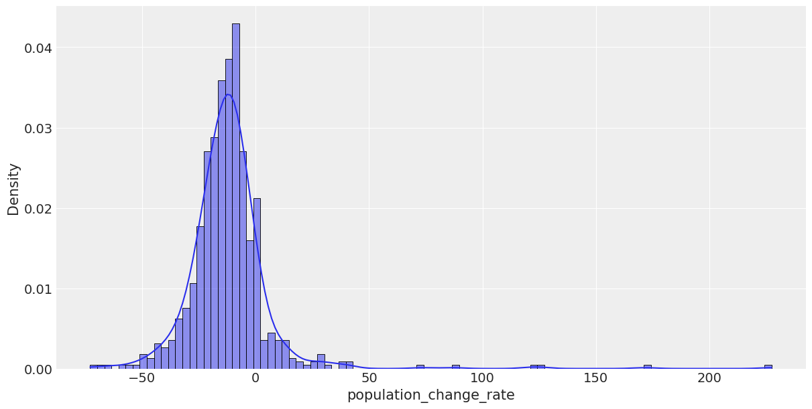
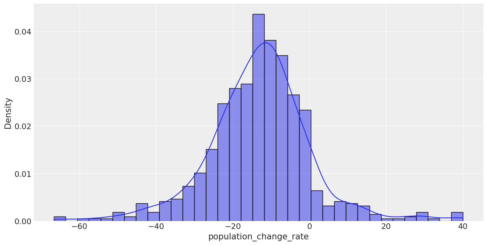

# 外れ値の検出方法

3 標準偏差を超えるデータを外れ値とみなした．

```python
# 特定の列の外れ値を除去する例
column = 'population_change_rate'

# 平均と標準偏差の計算
mean = df[column].mean()
std = df[column].std()

# 外れ値の定義（ここでは3標準偏差を超えるデータを外れ値とみなす）
lower_bound = mean - 3 * std
upper_bound = mean + 3 * std

# 外れ値を除去
df_cleaned = df[(df[column] >= lower_bound) & (df[column] <= upper_bound)]

# 除去されたデータを確認
outliers = df[(df[column] < lower_bound) | (df[column] > upper_bound)]
outliers
```

## 外れ値除去前



## 外れ値除去後



## 除かれたデータ

架橋後のデータが外れ値になってしまっている．

### 表

|     | island         | year | island_id | region_code | region_name                            | prefecture_code | population | treatment_group | treatment_group_mainland | year_bridge | after_treatment | passage_of_year | year_connect_mainland | dummy_after_connect_mainland | income      | prefecture_name | area_km2 | distance_m | population_change_rate |
| --- | -------------- | ---- | --------- | ----------- | -------------------------------------- | --------------- | ---------- | --------------- | ------------------------ | ----------- | --------------- | --------------- | --------------------- | ---------------------------- | ----------- | --------------- | -------- | ---------- | ---------------------- |
| 190 | 因島           | 1995 | 94        | 34206       | （旧）因島市                           | 34              | 28411.0    | 1               | 1                        | 1983        | 1               | 12              | 1983                  | 1                            | 3506.231862 | 広島県          | 35.04    | 800.0      | 121.804981             |
| 211 | 生口島         | 1995 | 95        | 34430       | （旧）瀬戸田町                         | 34              | 11097.0    | 1               | 1                        | 1991        | 1               | 4               | 1991                  | 1                            | 1509.931029 | 広島県          | 31.21    | 500.0      | 87.007078              |
| 225 | 大久野島       | 2010 | 99        | 34203       | 竹原市                                 | 34              | 26.0       | 0               | 0                        | 0           | 0               | 0               | 0                     | 0                            | 3387.313924 | 広島県          | 0.72     | 1263.0     | 73.333333              |
| 242 | 長島           | 1985 | 103       | 34427       | （旧）大崎町                           | 34              | 39.0       | 1               | 0                        | 1987        | 0               | 0               | 0                     | 0                            | NaN         | 広島県          | 1.04     | 350.0      | -72.916667             |
| 364 | 江田島・能美島 | 1990 | 117       | 3431X       | （旧）江田島町・大柿町・沖美町・能美町 | 34              | 37257.0    | 1               | 1                        | 1973        | 1               | 17              | 1973                  | 1                            | 1807.199041 | 広島県          | 91.33    | 300.0      | 227.390158             |
| 380 | 沖野島         | 2015 | 118       | 34215       | 江田島市                               | 34              | 9.0        | 1               | 1                        | 1972        | 1               | 43              | 1973                  | 1                            | 2769.395700 | 広島県          | 0.94     | 30.0       | 125.000000             |
| 399 | 屋代島         | 2000 | 125       | 35302       | （旧）大島町                           | 35              | 21796.0    | 1               | 1                        | 1976        | 1               | 24              | 1976                  | 1                            | 747.373507  | 山口県          | 128.48   | 950.0      | 171.499751             |
