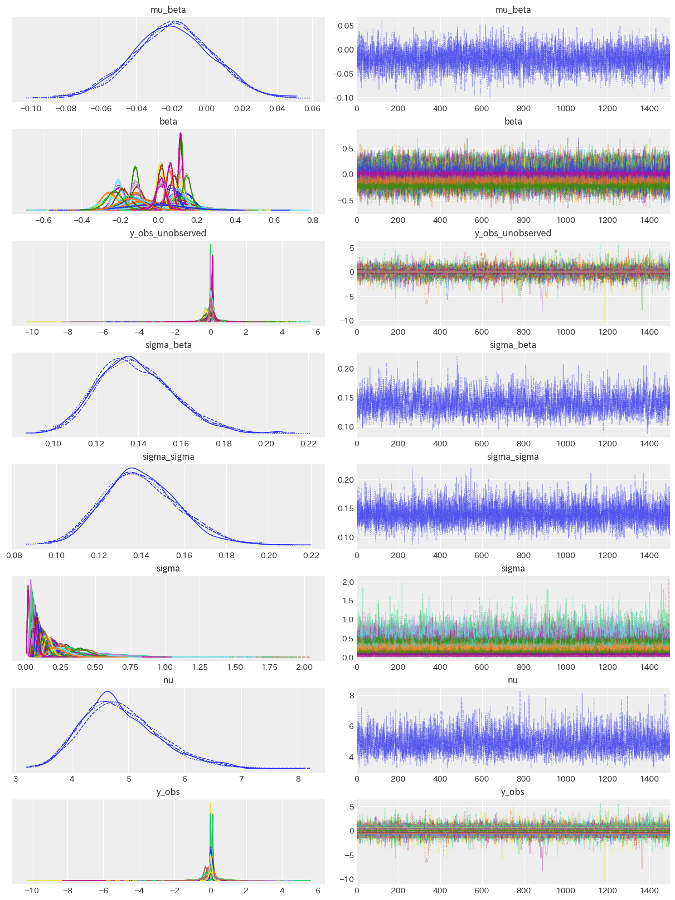
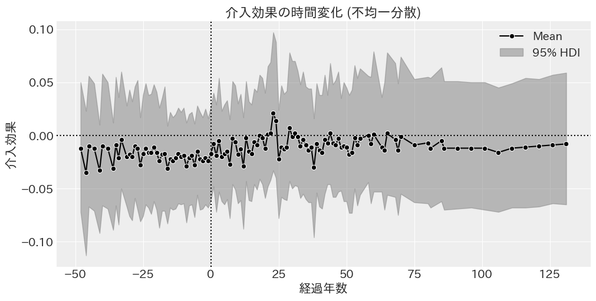
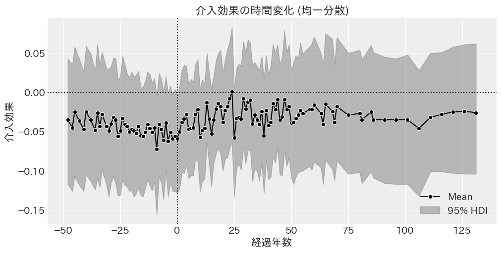
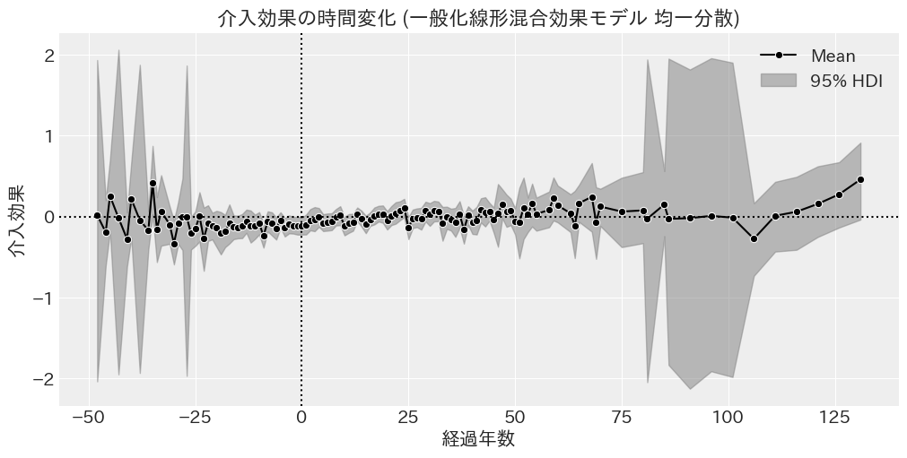

# 推定結果

- [推定結果](#推定結果)
  - [個体・時間ランダム効果](#個体時間ランダム効果)
  - [Two-way fixed effect](#two-way-fixed-effect)
    - [階層ベイズモデル 不均一分散](#階層ベイズモデル-不均一分散)
    - [GLMM 不均一分散](#glmm-不均一分散)
    - [GLMM 均一分散](#glmm-均一分散)
    - [階層ベイズモデル 不均一分散 ランダム効果](#階層ベイズモデル-不均一分散-ランダム効果)
  - [Dynamic Two-way fixed effect](#dynamic-two-way-fixed-effect)
    - [階層ベイズモデル 不均一分散](#階層ベイズモデル-不均一分散-1)
    - [GLMM](#glmm)
  - [Fully Saturated TWFE](#fully-saturated-twfe)

## 個体・時間ランダム効果

$$
\begin{aligned}
\log{Y_{it}^*} &= \log{Y_{it}} - \bar{\log{Y}_i} \\
\log{Y_{it}^{**}} &= \log{Y_{it}^*} - \bar{\log{Y}^*_t} \\
\end{aligned}
$$

- $\log{Y_{it}}$: 観測値
- $\bar{\log{Y}_i}$: 個体 $i$ の平均値
- $\log{Y_{it}^*}$: 個体固定効果を除いた値
- $\bar{\log{Y}^*_t}$: 個体固定効果を除いた値の時間 $t$ の平均値
- $\log{Y_{it}^{**}}$: 個体と時間の固定効果を除いた値

## Two-way fixed effect

### 階層ベイズモデル 不均一分散

$$
\begin{aligned}
\log{Y_{it}^{**}} &\sim \mathcal{t} (\nu, \mu_{it}, \sigma_i^2) \\
\nu &\sim \text{Exponential}(1/10) \\
\mu_{it} &= \beta \cdot W_{it}\\
\beta &\sim \mathcal{N}(0, 1) \\
\sigma_i &\sim \mathcal{C}^+(\sigma_0^2) \\
\end{aligned}
$$

- $\sigma^2_0$: 島間の誤差分散を表すハイパーパラメータ

|   params   |   EAP   |   SD    |      95% HDI      | $\hat{R}$ |
| :--------: | :-----: | :-----: | :---------------: | :-------: |
|  $\beta$   | $0.029$ | $0.009$ | $[0.012, 0.046]$  |   $1.0$   |
|   $\nu$    | $7.499$ | $1.545$ | $[4.853, 10.608]$ |   $1.0$   |
| $\sigma_0$ | $0.175$ | $0.023$ | $[0.131, 0.218]$  |   $1.0$   |

|           | Estimate | SE  |
| :-------: | :------: | :-: |
| elpd_waic |    $$    | $$  |
|  p_waic   |    $$    |  -  |

### GLMM 不均一分散

$$
\begin{aligned}
\log{Y_{it}^{**}} &\sim \mathcal{t} (\nu, \mu_{it}, \sigma_i^2) \\
\nu &\sim \text{Exponential}(1/10) \\
\mu_{it} &= \beta \cdot W_{it}\\
\beta &\sim \mathcal{N}(0, 1) \\
\sigma_i &\sim \mathcal{C}^+(1) \\
\end{aligned}
$$

- $\sigma_i^2$: 島別の誤差分散

|  param  |   EAP    |   SD    |      95% HDI      | $\hat{R}$ |
| :-----: | :------: | :-----: | :---------------: | :-------: |
| $\beta$ | $0.028$  | $0.009$ | $[0.009, 0.045]$  |   $1.0$   |
|  $\nu$  | $10.619$ | $3.096$ | $[6.191, 16.466]$ |   $1.0$   |

$\beta$: 100%の確率で 0 より大きい

|           | Estimate |   SE    |
| :-------: | :------: | :-----: |
| elpd_waic | $471.15$ | $42.32$ |
|  p_waic   | $83.64$  |    -    |

### GLMM 均一分散

$$
\begin{aligned}
\log{Y_{it}^{**}} &\sim \mathcal{t} (\nu, \mu_{it}, \sigma^2) \\
\nu &\sim \text{Exponential}(1/10) \\
\mu_{it} &= \beta \cdot W_{it}\\
\beta &\sim \mathcal{N}(0, 1) \\
\sigma &\sim \mathcal{C}^+(1) \\
\end{aligned}
$$

- $\beta$: 介入効果
- $W_{it}$: 介入変数
- $\nu$: t 分布の自由度
- $\sigma^2$: 誤差分散

※ 個体と時間の効果を除いているため，定数項は必要ない．なお，定数項を入れて推定したが 0 だった．

|  param   |   EAP    |   SD    |      95% HDI      | $\hat{R}$ |
| :------: | :------: | :-----: | :---------------: | :-------: |
| $\beta$  | $-0.005$ | $0.009$ | $[-0.023, 0.011]$ |   $1.0$   |
| $\sigma$ | $0.147$  | $0.005$ | $[0.138, 0.157]$  |   $1.0$   |
|  $\nu$   | $2.851$  | $0.228$ | $[2.401, 3.283]$  |   $1.0$   |

$\beta$: 負の効果である確率は 75.0%

|           | Estimate |   SE    |
| :-------: | :------: | :-----: |
| elpd_waic | $203.60$ | $44.88$ |
|  p_waic   |  $3.06$  |    -    |

※ elpd_waic は予測精度を示す指標で，大きいほど良い．p_waic はモデルの複雑さを示す指標で，小さいほどシンプルで良い．

### 階層ベイズモデル 不均一分散 ランダム効果

※ いらない．なぜなら後で Fully saturated twfe で推定するから．

$$
\begin{aligned}
\log{Y_{it}^*} &\sim \mathcal{t} (\nu, \mu_{it}, \sigma_i^2) \\
\nu &\sim \text{Exponential}(1/10) \\
\mu_{it} &= \beta_i \cdot W_{it}\\
\beta_i &\sim \mathcal{N}(\mu_{\beta}, \sigma_{\beta}^2) \\
\sigma_i &\sim \mathcal{C}^+(\sigma_0^2) \\
\end{aligned}
$$

- $\beta_i$: 個体 $i$ の介入効果
- $\mu_{\beta}$: 個体間の期待値を表すハイパーパラメータ
- $\sigma_{\beta}^2$: 個体間の分散を表すハイパーパラメータ
- $\sigma_0^2$: 個体間の誤差分散を表すハイパーパラメータ
- $\sigma_i^2$: 個体間の誤差分散

|      params      |   EAP    |   SD    |      95% HDI      | $\hat{R}$ |
| :--------------: | :------: | :-----: | :---------------: | :-------: |
|  $\mu_{\beta}$   | $-0.019$ | $0.022$ | $[-0.064, 0.024]$ |   $1.0$   |
| $\sigma_{\beta}$ | $0.139$  | $0.018$ | $[0.106, 0.174]$  |   $1.0$   |
|    $\sigma_0$    | $0.140$  | $0.018$ | $[0.106, 0.175]$  |   $1.0$   |
|      $\nu$       | $4.877$  | $0.689$ | $[3.691, 6.313]$  |   $1.0$   |

※ draws=1500, warmup=1500, chains=4

## Dynamic Two-way fixed effect

### 階層ベイズモデル 不均一分散

介入の経過時間と不均一分散を考慮したモデル

$$
\begin{aligned}
\log{Y_{it}^*} &\sim \mathcal{t} (\nu, \mu_{it}, \sigma_i^2) \\
\nu &\sim \text{Exponential}(1/10) \\
\mu_{it} &= \beta_{l} \cdot T_{i} \\
\beta_{l} &\sim \mathcal{N}(\mu_{\beta}, \sigma_{\beta}^2) \\
\sigma_i &\sim \mathcal{C}^+(\sigma_0^2) \\
\end{aligned}
$$

- $\beta_l$: 経過年数毎に変動する介入効果
- $T_{it}$: 介入群ダミー
- $\mu_{\beta}$: 経過年数間の期待値を表すハイパーパラメータ
- $\sigma_{\beta}^2$: 経過年数間の分散を表すハイパーパラメータ
- $\sigma_0^2$: 島間の誤差分散を表すハイパーパラメータ

|      params      |   EAP    |   SD    |      95% HDI      | $\hat{R}$ |
| :--------------: | :------: | :-----: | :---------------: | :-------: |
|  $\mu_{\beta}$   | $-0.012$ | $0.009$ | $[-0.030, 0.005]$ |   $1.0$   |
| $\sigma_{\beta}$ | $0.023$  | $0.014$ | $[0.000, 0.048]$  |   $1.0$   |
|    $\sigma_0$    | $0.176$  | $0.022$ | $[0.135, 0.219]$  |   $1.0$   |
|      $\nu$       | $7.937$  | $1.722$ | $[5.045, 11.341]$ |   $1.0$   |

|           | Estimate |   SE    |
| :-------: | :------: | :-----: |
| elpd_waic | $473.60$ | $42.61$ |
|  p_waic   | $103.26$ |    -    |

均一分散を仮定したモデル

$$
\begin{aligned}
\log{Y_{it}^*} &\sim \mathcal{t} (\nu, \mu_{it}, \sigma^2) \\
\nu &\sim \text{Exponential}(1/10) \\
\mu_{it} &= \beta_{l} \cdot T_{i} \\
\beta_{l} &\sim \mathcal{N}(\mu_{\beta}, \sigma_{\beta}^2) \\
\sigma &\sim \mathcal{C}^+(1) \\
\end{aligned}
$$

- $\beta_l$: 経過年数毎に変動する介入効果
- $T_{it}$: 介入群ダミー
- $\mu_{\beta}$: 経過年数間の期待値を表すハイパーパラメータ
- $\sigma_{\beta}^2$: 経過年数間の標準偏差を表すハイパーパラメータ

|      params      |   EAP    |   SD    |      95% HDI       | $\hat{R}$ |
| :--------------: | :------: | :-----: | :----------------: | :-------: |
|  $\mu_{\beta}$   | $-0.035$ | $0.009$ | $[-0.052, -0.019]$ |   $1.0$   |
| $\sigma_{\beta}$ | $0.035$  | $0.015$ |  $[0.003, 0.061]$  |   $1.0$   |
|     $\sigma$     | $0.146$  | $0.005$ |  $[0.137, 0.156]$  |   $1.0$   |
|      $\nu$       | $2.879$  | $0.235$ |  $[2.432, 3.335]$  |   $1.0$   |

|           | Estimate |   SE    |
| :-------: | :------: | :-----: |
| elpd_waic | $214.96$ | $44.65$ |
|  p_waic   | $26.37$  |    -    |

### GLMM

|  param   |   EAP   |   SD    |     95% HDI      | $\hat{R}$ |
| :------: | :-----: | :-----: | :--------------: | :-------: |
| $\sigma$ | $0.144$ | $0.005$ | $[0.135, 0.154]$ |   $1.0$   |
|  $\nu$   | $2.834$ | $0.224$ | $[2.392, 3.259]$ |   $1.0$   |

|           | Estimate |   SE    |
| :-------: | :------: | :-----: |
| elpd_waic | $165.43$ | $44.22$ |
|  p_waic   | $126.45$ |    -    |

## Fully Saturated TWFE

$$
\begin{aligned}
\log{Y^{**}_{it}} &\sim \mathcal{t} (\nu, \mu_{it}, \sigma_i^2) \\
\nu &\sim \text{Exponential}(1/10) \\
\mu_{it} &= \beta_{gl} \cdot T_{i} \\
\beta_{gl} &\sim \mathcal{N}(\mu_{\beta}, \sigma_{\beta}^2) \\
\sigma_i &\sim \mathcal{C}^+(\sigma_0^2) \\
\end{aligned}
$$

- $\beta_{gl}$: 介入時期 $g$ と介入経過時間 $l$ によって変動する介入効果
- $T_{it}$: 介入群ダミー
- $\mu_{\beta}$: 介入時期と介入経過時間の期待値を表すハイパーパラメータ
- $\sigma_{\beta}^2$: 介入時期と介入経過時間の分散を表すハイパーパラメータ
- $\sigma_0^2$: 島間の誤差分散を表すハイパーパラメータ
- $\sigma_i^2$: 島間の誤差分散

|      param       | EAP |  SD | 95% HDI | $\hat{R}$ |
| :--------------: | :-: | --: | :-----: | :-------: |
|  $\mu_{\beta}$   | $$  |  $$ | $[, ]$  |    $$     |
| $\sigma_{\beta}$ | $$  |  $$ | $[, ]$  |    $$     |
|      $\nu$       | $$  |  $$ | $[, ]$  |    $$     |
|    $\sigma_0$    | $$  |  $$ | $[, ]$  |    $$     |
