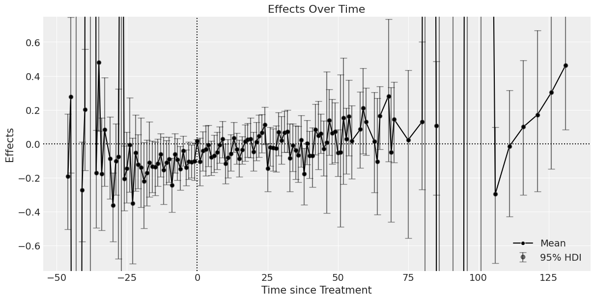

# 推定結果

## Two-way fixed effect

### 定数項あり

$$
\begin{aligned}
\log{Y_{it}^*} &= \log{Y_{it}} - \bar{\log{Y}_i} \\
\log{Y_{it}^*} &\sim \mathcal{t} (\nu, \mu_{it}, \sigma^2) \\
\mu_{it} &= \alpha + \beta \cdot W_{it}\\
\alpha &\sim \mathcal{N}(0, 100) \\
\beta &\sim \mathcal{N}(0, 100) \\
\nu &\sim \mathcal{Exponential}(1/30) \\
\sigma &\sim \mathcal{Cauchy}^+(100) \\
\end{aligned}
$$

<!-- 階層ベイズモデル -->

<!-- |    params     |   EAP    |   SD    |      95% HDI       | $\hat{R}$ |
| :-----------: | :------: | :-----: | :----------------: | :-------: |
|   $\alpha$    | $0.026$  | $0.992$ | $[-1.884, 1.904]$  |  $1.00$   |
|    $\beta$    | $-0.065$ | $0.020$ | $[-0.102, -0.027]$ |  $1.00$   |
|  $\mu_\eta$   | $-0.059$ | $0.992$ | $[-1.930, 1.860]$  |  $1.00$   |
| $\sigma_\eta$ | $0.044$  | $0.035$ |  $[0.000, 0.111]$  |  $1.02$   |
|   $\sigma$    | $0.302$  | $0.014$ |  $[0.275, 0.328]$  |  $1.01$   |
|     $\nu$     | $3.363$  | $0.348$ |  $[2.748, 4.113]$  |  $1.00$   | -->

ベイズモデル

|  param   |    EAP    |    SD    |       95% HDI        | $\hat{R}$ |
| :------: | :-------: | :------: | :------------------: | :-------: |
| $\alpha$ | $-15.527$ | $0.057$  | $[-15.633, -15.415]$ |   $1.0$   |
| $\beta$  | $-1.421$  | $0.106$  |  $[-1.637, -1.219]$  |   $1.0$   |
| $\sigma$ | $1.899.$  | $0.041$  |   $[1.821, 1.983]$   |   $1.0$   |
|  $\nu$   | $52.123$  | $30.671$ | $[11.070, 113.313]$  |   $1.0$   |

### 定数項なし

$$
\begin{aligned}
\log{Y_{it}^*} &= \log{Y_{it}} - \bar{\log{Y}_i} \\
\log{Y_{it}^*} &\sim \mathcal{t} (\nu, \mu_{it}, \sigma^2) \\
\mu_{it} &= \beta \cdot W_{it}\\
\beta &\sim \mathcal{N}(0, 100) \\
\nu &\sim \mathcal{Exponential}(1/30) \\
\sigma &\sim \mathcal{Cauchy}^+(100) \\
\end{aligned}
$$

<!-- 階層ベイズモデル -->

<!-- |    params     |   EAP    |   SD    |      95% HDI       | $\hat{R}$ |
| :-----------: | :------: | :-----: | :----------------: | :-------: |
|   $\alpha$    | $0.026$  | $0.992$ | $[-1.884, 1.904]$  |  $1.00$   |
|    $\beta$    | $-0.065$ | $0.020$ | $[-0.102, -0.027]$ |  $1.00$   |
|  $\mu_\eta$   | $-0.059$ | $0.992$ | $[-1.930, 1.860]$  |  $1.00$   |
| $\sigma_\eta$ | $0.044$  | $0.035$ |  $[0.000, 0.111]$  |  $1.02$   |
|   $\sigma$    | $0.302$  | $0.014$ |  $[0.275, 0.328]$  |  $1.01$   |
|     $\nu$     | $3.363$  | $0.348$ |  $[2.748, 4.113]$  |  $1.00$   | -->

ベイズモデル

|   param   |   EAP    |   SD    |      95% HDI      |  Pr(>0)  | $\hat{R}$ |
| :-------: | :------: | :-----: | :---------------: | :------: | :-------: |
|  $\beta$  | $-0.006$ | $0.009$ | $[-0.024, 0.010]$ | $25.8\%$ |   $1.0$   |
| $\sigma$  | $0.147$  | $0.005$ | $[0.138, 0.157]$  |    -     |   $1.0$   |
|   $\nu$   | $2.847$  | $0.228$ | $[2.385, 3.288]$  |    -     |   $1.0$   |
| elpd_waic | $203.48$ | $44.89$ |         -         |    -     |     -     |
|  p_waic   |  $3.18$  |    -    |         -         |    -     |     -     |

## Dynamic Two-way fixed effect

$$
\begin{aligned}
\log{Y}^*_{it} &= \log{Y_{it}} - \bar{\log{Y}}_i - \bar{\log{Y}}_t \\
\log{Y_{it}^*} &\sim \mathcal{t} (\nu, \mu_{it}, \sigma^2) \\
\mu_{it} &= \sum_{\ell} \beta_{\ell} \mathbf{1} [k - e \in \ell] \\
\beta &\sim \mathcal{N}(0, 100) \\
\nu &\sim \mathcal{Exponential}(1/30) \\
\sigma &\sim \mathcal{Cauchy}^+(100) \\
\end{aligned}
$$

ベイズモデル

|  param   | EAP | SD  | 95% HDI | $\hat{R}$ |
| :------: | :-: | :-: | :-----: | :-------: |
| $\alpha$ | $$  | $$  | $[, ]$  |   $1.0$   |

