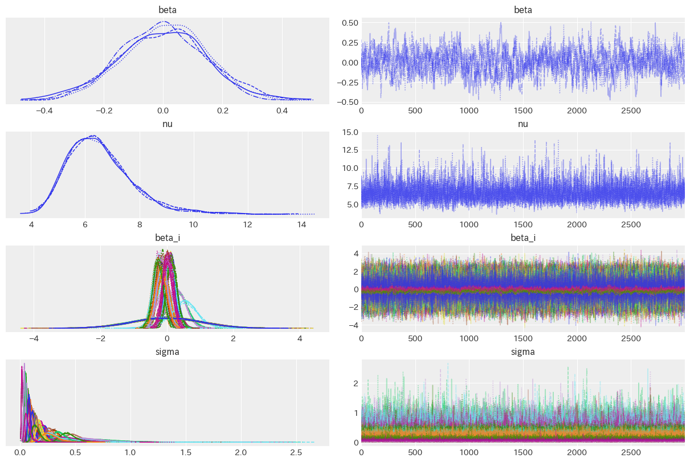
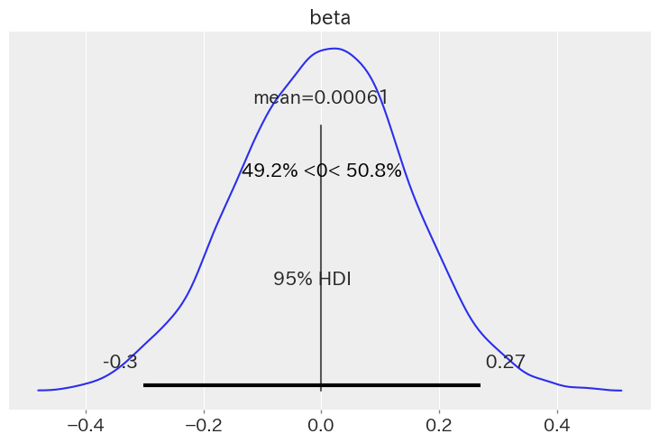
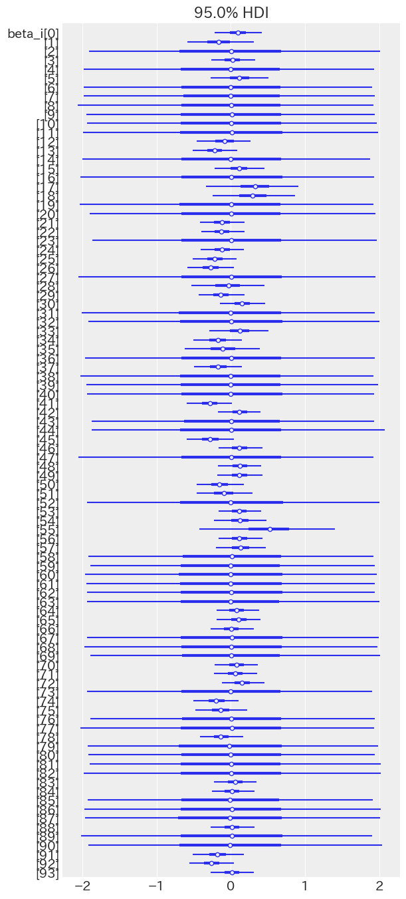
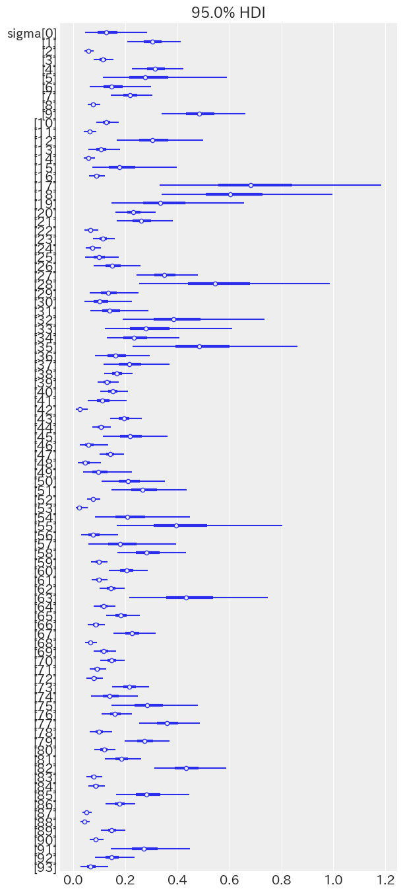
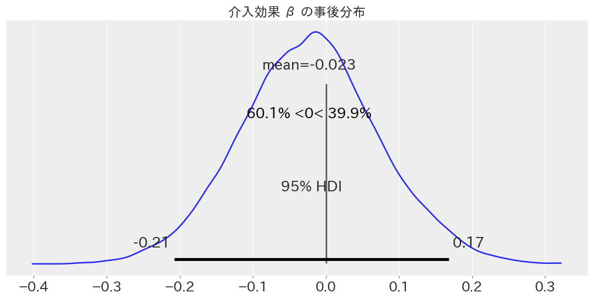

# 推定結果

## Two-way fixed effect

### ベイズモデル

$$
\begin{aligned}
\log{Y_{it}^*} &= \log{Y_{it}} - \bar{\log{Y}_i} \\
\log{Y_{it}^*} &\sim \mathcal{t} (\nu, \mu_{it}, \sigma^2) \\
\mu_{it} &= \beta \cdot W_{it}\\
\beta &\sim \mathcal{N}(0, 1) \\
\nu &\sim \text{Exponential}(1/10) \\
\sigma &\sim \mathcal{C}^+(1) \\
\end{aligned}
$$

※ 固定効果を除いているため，定数項は必要ない．また，定数項は入れても 0 だった．

|  param   |   EAP    |   SD    |      95% HDI      | $\hat{R}$ |
| :------: | :------: | :-----: | :---------------: | :-------: |
| $\beta$  | $-0.005$ | $0.009$ | $[-0.023, 0.011]$ |   $1.0$   |
| $\sigma$ | $0.147$  | $0.005$ | $[0.138, 0.157]$  |   $1.0$   |
|  $\nu$   | $2.851$  | $0.228$ | $[2.401, 3.283]$  |   $1.0$   |

$\beta$: 負の効果である確率は 75.0%

|           | Estimate |   SE    |
| :-------: | :------: | :-----: |
| elpd_waic | $203.60$ | $44.88$ |
|  p_waic   |  $3.06$  |    -    |

※ elpd_waic は予測精度を示す指標で，大きいほど良い．p_waic はモデルの複雑さを示す指標で，小さいほどシンプルで良い．

### 不均一分散

$$
\begin{aligned}
\log{Y_{it}^*} &= \log{Y_{it}} - \bar{\log{Y}_i} \\
\log{Y_{it}^*} &\sim \mathcal{t} (\nu, \mu_{it}, \sigma_i^2) \\
\mu_{it} &= (\beta + \beta_i) \cdot W_{it}\\
\beta &\sim \mathcal{N}(0, 1) \\
\nu &\sim \text{Exponential}(1/10) \\
\sigma_i &\sim \mathcal{C}^+(1) \\
\end{aligned}
$$

- $\sigma_i$: 島別の誤差標準偏差

|  param  |   EAP    |   SD    |      95% HDI      | $\hat{R}$ |
| :-----: | :------: | :-----: | :---------------: | :-------: |
| $\beta$ | $0.028$  | $0.009$ | $[0.009, 0.045]$  |   $1.0$   |
|  $\nu$  | $10.619$ | $3.096$ | $[6.191, 16.466]$ |   $1.0$   |

$\beta$: 100%の確率で 0 より大きい

|           | Estimate |   SE    |
| :-------: | :------: | :-----: |
| elpd_waic | $471.15$ | $42.32$ |
|  p_waic   | $83.64$  |    -    |

### 不均一分散とランダム効果

$$
\begin{aligned}
\log{Y_{it}^*} &= \log{Y_{it}} - \bar{\log{Y}_i} \\
\log{Y_{it}^*} &\sim \mathcal{t} (\nu, \mu_{it}, \sigma_i^2) \\
\mu_{it} &= (\beta + \beta_i) \cdot W_{it}\\
\beta &\sim \mathcal{N}(0, 1) \\
\beta_i &\sim \mathcal{N}(0, 1) \\
\nu &\sim \text{Exponential}(1/10) \\
\sigma_i &\sim \mathcal{C}^+(1) \\
\end{aligned}
$$

|  param  |   EAP   |   SD    |      95% HDI      | $\hat{R}$ |
| :-----: | :-----: | :-----: | :---------------: | :-------: |
| $\beta$ | $0.010$ | $0.139$ | $[-0.267, 0.268]$ |  $1.01$   |
|  $\nu$  | $6.565$ | $1.240$ | $[4.397, 8.964]$  |   $1.0$   |

|           | Estimate |   SE    |
| :-------: | :------: | :-----: |
| elpd_waic | $593.51$ | $44.64$ |
|  p_waic   | $127.31$ |    -    |

<!-- 階層ベイズモデル -->

<!-- |    params     |   EAP    |   SD    |      95% HDI       | $\hat{R}$ |
| :-----------: | :------: | :-----: | :----------------: | :-------: |
|   $\alpha$    | $0.026$  | $0.992$ | $[-1.884, 1.904]$  |  $1.00$   |
|    $\beta$    | $-0.065$ | $0.020$ | $[-0.102, -0.027]$ |  $1.00$   |
|  $\mu_\eta$   | $-0.059$ | $0.992$ | $[-1.930, 1.860]$  |  $1.00$   |
| $\sigma_\eta$ | $0.044$  | $0.035$ |  $[0.000, 0.111]$  |  $1.02$   |
|   $\sigma$    | $0.302$  | $0.014$ |  $[0.275, 0.328]$  |  $1.01$   |
|     $\nu$     | $3.363$  | $0.348$ |  $[2.748, 4.113]$  |  $1.00$   | -->

## Dynamic Two-way fixed effect

GLMM

定数項なし

$$
\begin{aligned}
\log{Y}^*_{it} &= \log{Y_{it}} - \bar{\log{Y}}_i - \bar{\log{Y}}_t \\
\log{Y_{it}^*} &\sim \mathcal{t} (\nu, \mu_{it}, \sigma^2) \\
\mu_{it} &= (\beta + r_{\beta}) \cdot W_{it} \\
\beta &\sim \mathcal{N}(0, 1) \\
r_{\beta} &\sim \mathcal{N}(0, 1) \\
\nu &\sim \text{Exponential}(1/5) \\
\sigma &\sim \mathcal{C}^+(1) \\
\end{aligned}
$$

ベイズモデル

|  param   |   EAP    |   SD    |      95% HDI      | $\hat{R}$ |
| :------: | :------: | :-----: | :---------------: | :-------: |
| $\beta$  | $-0.023$ | $0.095$ | $[-0.208, 0.168]$ |  $1.01$   |
| $\sigma$ | $0.144$  | $0.005$ | $[0.134, 0.154]$  |   $1.0$   |
|  $\nu$   | $2.829$  | $0.236$ | $[2.375, 3.286]$  |   $1.0$   |

|           | Estimate |   SE    |
| :-------: | :------: | :-----: |
| elpd_waic | $165.54$ | $44.13$ |
|  p_waic   | $127.08$ |    -    |

$\beta$: 39.9%の確率で 0 より大きい

## Dynamic Two-way fixed effect Bayesian Lasso

$$
\begin{aligned}
\log{Y}^*_{it} &= \log{Y_{it}} - \bar{\log{Y}}_i - \bar{\log{Y}}_t \\
\log{Y_{it}^*} &\sim \mathcal{t} (\nu, \mu_{it}, \sigma^2) \\
\mu_{it} &= (\beta + r_{\ell}) * W_{it} \\
\beta &\sim \mathcal{N}(0, 100) \\
\rho_{\ell} &\sim \mathcal{Gamma}(1, 1) \\
r_{\ell} &\sim \mathcal{Laplace}(0, 1/\rho_{\ell}^2) \\
\nu &\sim \mathcal{Exponential}(1/30) \\
\sigma &\sim \mathcal{Cauchy}^+(100) \\
\end{aligned}
$$

|   param   |   EAP    |   SD    |     95% HDI      | $\hat{R}$ |
| :-------: | :------: | :-----: | :--------------: | :-------: |
|  $\beta$  | $-0.033$ | $0.019$ | $[-0.07, 0.003]$ |   $1.0$   |
|  $\rho$   |    $$    |   $$    |      $[, ]$      |   $1.0$   |
| $\sigma$  | $0.144$  | $0.005$ |      $[, ]$      |   $1.0$   |
|   $\nu$   | $2.871$  | $0.241$ |      $[, ]$      |   $1.0$   |
| elpd_waic |    $$    |   $$    |      $[, ]$      |   $1.0$   |
|  p_waic   |    $$    |   $$    |      $[, ]$      |   $1.0$   |

## Staggered Difference-in-Difference

$$
\begin{aligned}
\log{Y}^*_{it} &= \log{Y_{it}} - \bar{\log{Y}}_i - \bar{\log{Y}}_t \\
\log{Y_{it}^*} &\sim \mathcal{t} (\nu, \mu_{it}, \sigma^2) \\
\mu_{it} &= \beta \cdot W_{it} \\
\beta &\sim \mathcal{N}(0, 100) \\
\nu &\sim \text{Exponential}(1/30) \\
\sigma &\sim \mathcal{C}^+(100) \\
\end{aligned}
$$

|  param   | EAP |  SD | 95% HDI | $\hat{R}$ |
| :------: | :-: | --: | :-----: | :-------: |
| $\beta$  | $$  |  $$ | $[, ]$  |    $$     |
| $\sigma$ | $$  |  $$ | $[, ]$  |    $$     |
|  $\nu$   | $$  |  $$ | $[, ]$  |    $$     |
