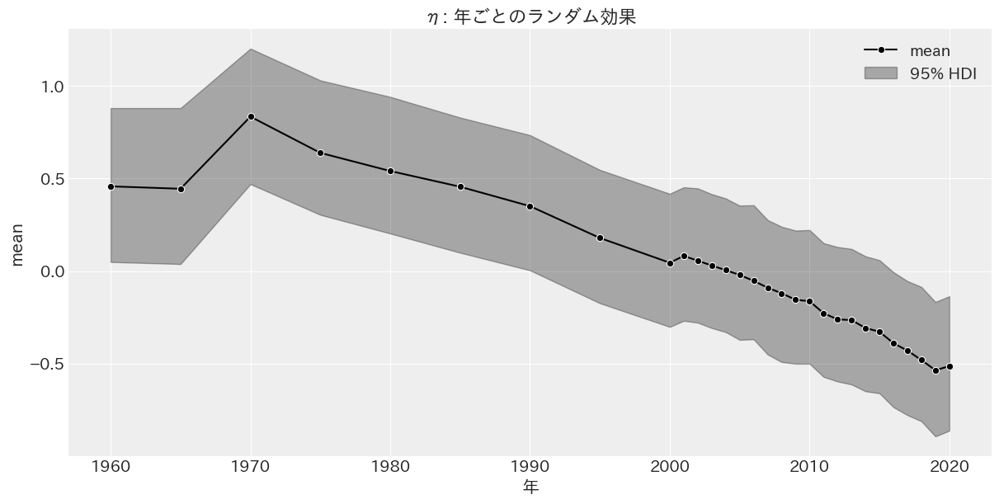

# 推定結果

## Two-way fixed effect

$$
\begin{aligned}
\log{Y_{it}^*} &= \log{Y_{it}} - \bar{\log{Y}_i} \\
\log{Y_{it}^*} &\sim \mathcal{t} (\nu, \mu_{it}, \sigma^2) \\
\mu_{it} &= \alpha + \beta D_{it} + \eta_t \\
\alpha &\sim \mathcal{N}(0, 1) \\
\beta &\sim \mathcal{N}(0, 1) \\
\eta_t &\sim \mathcal{N}(\mu_{\eta}, \sigma_{\eta}) \\
\mu_{\eta} &\sim \mathcal{N}(0, 1) \\
\sigma_{\eta} &\sim \mathcal{Cauchy}^+(1) \\
\nu &\sim \mathcal{Exponential}(1/30) \\
\sigma &\sim \mathcal{Cauchy}^+(1) \\

\end{aligned}
$$

階層ベイズモデル

|    params     |   EAP    |   SD    |      95% HDI       | $\hat{R}$ |
| :-----------: | :------: | :-----: | :----------------: | :-------: |
|   $\alpha$    | $0.026$  | $0.992$ | $[-1.884, 1.904]$  |  $1.00$   |
|    $\beta$    | $-0.065$ | $0.020$ | $[-0.102, -0.027]$ |  $1.00$   |
|  $\mu_\eta$   | $-0.059$ | $0.992$ | $[-1.930, 1.860]$  |  $1.00$   |
| $\sigma_\eta$ | $0.044$  | $0.035$ |  $[0.000, 0.111]$  |  $1.02$   |
|     $\nu$     | $3.363$  | $0.348$ |  $[2.748, 4.113]$  |  $1.00$   |
|   $\sigma$    | $0.302$  | $0.014$ |  $[0.275, 0.328]$  |  $1.01$   |

Computed from 3000 posterior samples and 1723 observations log-likelihood matrix.

|           | Estimate  |   SE    |
| :-------: | :-------: | :-----: |
| elpd_waic | $-947.97$ | $41.90$ |
|  p_waic   |  $43.80$  |    -    |

ベイズモデル

|  param   |   EAP    |   SD    |      95% HDI      | $\hat{R}$ |
| :------: | :------: | :-----: | :---------------: | :-------: |
| $\alpha$ | $0.016$  | $0.187$ | $[-0.357, 0.364]$ |  $1.01$   |
| $\beta$  | $-0.010$ | $0.010$ | $[-0.030, 0.009]$ |  $1.00$   |
|  $\nu$   | $2.795$  | $0.226$ | $[2.398, 3.256]$  |  $1.00$   |
| $\sigma$ | $0.147$  | $0.005$ | $[0.138, 0.157]$  |  $1.00$   |

Computed from 3000 posterior samples and 1723 observations log-likelihood matrix.

|           | Estimate |   SE    |
| :-------: | :------: | :-----: |
| elpd_waic | $178.13$ | $44.98$ |
|  p_waic   | $38.29$  |    -    |

There has been a warning during the calculation. Please check the results.
