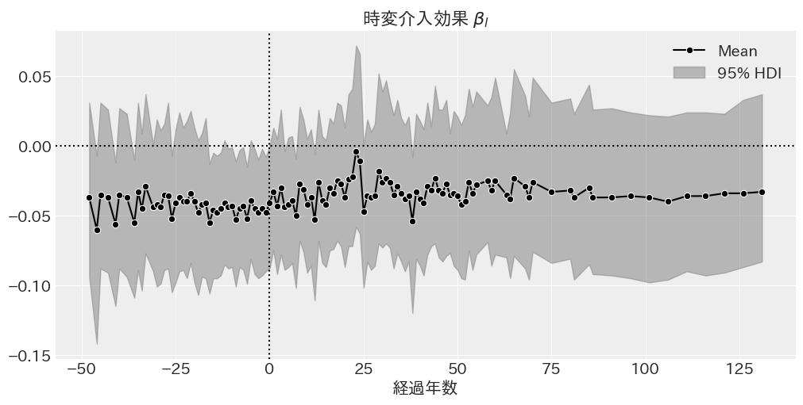

# 推定結果

## Two-way fixed effect

### 階層ベイズモデル 不均一分散

|                          |   EAP    |    SD    | 95%下限  | 95%上限  | $\hat{R}$ |
| :----------------------: | :------: | :------: | :------: | :------: | :-------: |
|         $\beta$          | $0.117$  | $0.028$  | $0.064$  | $0.173$  |   $1.0$   |
|          $\nu$           | $31.076$ | $14.982$ | $8.736$  | $60.997$ |   $1.0$   |
| $\sigma_{\text{global}}$ | $0.181$  | $0.025$  | $0.135$  | $0.232$  |   $1.0$   |
|  $\mu_{\text{island}}$   | $6.284$  | $0.243$  | $5.801$  | $6.754$  |  $1.01$   |
| $\sigma_{\text{island}}$ | $2.010$  | $0.167$  | $1.712$  | $2.346$  |  $1.01$   |
|   $\mu_{\text{year}}$    | $-0.504$ | $0.186$  | $-0.855$ | $-0.125$ |   $1.0$   |
|  $\sigma_{\text{year}}$  | $0.508$  | $0.132$  | $0.285$  | $0.762$  |   $1.0$   |

|           | Estimate |   SE    |
| :-------: | :------: | :-----: |
| elpd_waic | $117.24$ | $27.66$ |
|  p_waic   | $158.28$ |    -    |

階層ベイズモデル均一分散の $\beta$ は $0.117$ であり，$95\%$ 信用区間は $0$ を含まず，パラメータが正である確率は $100\%$ と推定された．被説明変数は対数値であるため，指数変換すると，人口は $12.38\%$ 増加する．

<!-- ### 階層ベイズモデル WLS

|          params          |   EAP   |   SD    | 95%下限 | 95%上限 | $\hat{R}$ |
| :----------------------: | :-----: | :-----: | :-----: | :-----: | :-------: |
|         $\beta$          | $0.111$ | $0.018$ | $0.078$ | $0.146$ |   $1.0$   |
|         $\sigma$         | $0.194$ | $0.009$ | $0.178$ | $0.212$ |   $1.0$   |
|          $\nu$           | $1.590$ | $0.107$ | $1.396$ | $1.795$ |   $1.0$   |
|  $\mu_{\text{island}}$   | $5.155$ | $0.267$ | $4.709$ | $5.722$ |  $1.01$   |
| $\sigma_{\text{island}}$ | $2.057$ | $0.158$ | $1.759$ | $2.340$ |  $1.02$   |

|           | Estimate |   SE    |
| :-------: | :------: | :-----: |
| elpd_waic | $396.17$ | $52.41$ |
|  p_waic   | $214.98$ |    -    | -->

### 階層ベイズモデル 均一分散

|          params          |   EAP    |   SD    | 95%下限  | 95%上限  | $\hat{R}$ |
| :----------------------: | :------: | :-----: | :------: | :------: | :-------: |
|         $\beta$          | $0.176$  | $0.031$ | $0.117$  | $0.233$  |   $1.0$   |
|         $\sigma$         | $0.144$  | $0.009$ | $0.127$  | $0.161$  |   $1.0$   |
|          $\nu$           | $2.252$  | $0.274$ | $1.736$  | $2.757$  |   $1.0$   |
|  $\mu_{\text{island}}$   | $6.336$  | $0.239$ | $5.858$  | $6.756$  |  $1.01$   |
| $\sigma_{\text{island}}$ | $2.015$  | $0.164$ | $1.712$  | $2.313$  |  $1.02$   |
|   $\mu_{\text{year}}$    | $-0.539$ | $0.203$ | $-0.914$ | $-0.147$ |   $1.0$   |
|  $\sigma_{\text{year}}$  | $0.533$  | $0.141$ | $0.331$  | $0.811$  |  $1.01$   |

|           | Estimate |   SE    |
| :-------: | :------: | :-----: |
| elpd_waic | $-57.80$ | $32.84$ |
|  p_waic   | $169.85$ |    -    |

$\beta$: 介入効果を示すパラメータであり，$\mu_{\text{island}}$は島間の平均値，$\sigma_{\text{island}}$は島間の標準偏差，$\sigma^2$は誤差分散，$\nu$は自由度パラメータを示す．

階層ベイズモデル均一分散の $\beta$ は $0.124$ であり，$95\%$ 信用区間は $0$ を含まず，パラメータが正である確率は $100\%$ と推定された．被説明変数は対数値であるため，指数変換すると，人口は $19.2\%$ 増加する．

## Dynamic Two-way fixed effect

階層ベイズモデル 不均一分散

|          params          |   EAP    |   SD    | 95%下限  | 95%上限  | $\hat{R}$ |
| :----------------------: | :------: | :-----: | :------: | :------: | :-------: |
|         $\alpha$         | $0.024$  | $0.004$ | $0.017$  | $0.031$  |   $1.0$   |
|      $\mu_{\beta}$       | $-0.037$ | $0.009$ | $-0.055$ | $-0.018$ |   $1.0$   |
|     $\sigma_{\beta}$     | $0.023$  | $0.014$ | $0.000$  | $0.047$  |   $1.0$   |
| $\sigma_{\text{global}}$ | $0.174$  | $0.021$ | $0.135$  | $0.217$  |   $1.0$   |
|          $\nu$           | $9.259$  | $2.484$ | $5.611$  | $14.180$ |   $1.0$   |

|           | Estimate |   SE    |
| :-------: | :------: | :-----: |
| elpd_waic | $494.26$ | $42.64$ |
|  p_waic   | $103.58$ |    -    |

階層ベイズモデル 不均一分散 定数項なし

|      params      |   EAP    |   SD    | 95%下限  | 95%上限  | $\hat{R}$ |
| :--------------: | :------: | :-----: | :------: | :------: | :-------: |
|  $\mu_{\beta}$   | $-0.012$ | $0.009$ | $-0.030$ | $0.005$  |   $1.0$   |
| $\sigma_{\beta}$ | $0.023$  | $0.014$ | $0.000$  | $0.048$  |   $1.0$   |
|    $\sigma_0$    | $0.176$  | $0.022$ | $0.135$  | $0.219$  |   $1.0$   |
|      $\nu$       | $7.937$  | $1.722$ | $5.045$  | $11.341$ |   $1.0$   |

|           | Estimate |   SE    |
| :-------: | :------: | :-----: |
| elpd_waic | $473.60$ | $42.61$ |
|  p_waic   | $103.26$ |    -    |

階層ベイズモデル 均一分散

|      params      |   EAP    |   SD    | 95%下限  | 95%上限  | $\hat{R}$ |
| :--------------: | :------: | :-----: | :------: | :------: | :-------: |
|  $\mu_{\beta}$   | $-0.035$ | $0.009$ | $-0.052$ | $-0.019$ |   $1.0$   |
| $\sigma_{\beta}$ | $0.035$  | $0.015$ | $0.003$  | $0.061$  |   $1.0$   |
|     $\sigma$     | $0.146$  | $0.005$ | $0.137$  | $0.156$  |   $1.0$   |
|      $\nu$       | $2.879$  | $0.235$ | $2.432$  | $3.335$  |   $1.0$   |

|           | Estimate |   SE    |
| :-------: | :------: | :-----: |
| elpd_waic | $214.96$ | $44.65$ |
|  p_waic   | $26.37$  |    -    |

GLMM 均一分散

|  param   |   EAP   |   SD    | 95%下限 | 95%上限 | $\hat{R}$ |
| :------: | :-----: | :-----: | :-----: | :-----: | :-------: |
| $\sigma$ | $0.144$ | $0.005$ | $0.135$ | $0.154$ |   $1.0$   |
|  $\nu$   | $2.834$ | $0.224$ | $2.392$ | $3.259$ |   $1.0$   |

|           | Estimate |   SE    |
| :-------: | :------: | :-----: |
| elpd_waic | $165.43$ | $44.22$ |
|  p_waic   | $126.45$ |    -    |

## Fully Saturated TWFE

階層ベイズモデル 不均一分散

|          param           | EAP |  SD | 95%下限 | 95%上限 | $\hat{R}$ |
| :----------------------: | :-: | --: | :-----: | :-----: | :-------: |
|         $\alpha$         | $$  |  $$ |   $$    |   $$    |    $$     |
|      $\mu_{\beta}$       | $$  |  $$ |   $$    |   $$    |    $$     |
|     $\sigma_{\beta}$     | $$  |  $$ |   $$    |   $$    |    $$     |
|          $\nu$           | $$  |  $$ |   $$    |   $$    |    $$     |
| $\sigma_{\text{global}}$ | $$  |  $$ |   $$    |   $$    |    $$     |

|           | Estimate | SE  |
| :-------: | :------: | :-: |
| elpd_waic |    $$    | $$  |
|  p_waic   |    $$    |  -  |

階層ベイズモデル 均一分散

|      param       |   EAP    |   SD    | 95% 下限 | 95% 上限 | $\hat{R}$ |
| :--------------: | :------: | :-----: | :------: | :------: | :-------: |
|     $\alpha$     | $0.016$  | $0.005$ | $0.006$  | $0.026$  |   $1.0$   |
|  $\mu_{\beta}$   | $-0.062$ | $0.010$ | $-0.082$ | $-0.043$ |   $1.0$   |
| $\sigma_{\beta}$ | $0.110$  | $0.011$ | $0.089$  | $0.130$  |   $1.0$   |
|     $\sigma$     | $0.127$  | $0.005$ | $0.116$  | $0.137$  |   $1.0$   |
|      $\nu$       | $2.457$  | $0.200$ | $2.075$  | $2.862$  |   $1.0$   |

|           | Estimate |   SE    |
| :-------: | :------: | :-----: |
| elpd_waic | $256.83$ | $45.88$ |
|  p_waic   | $181.55$ |    -    |
