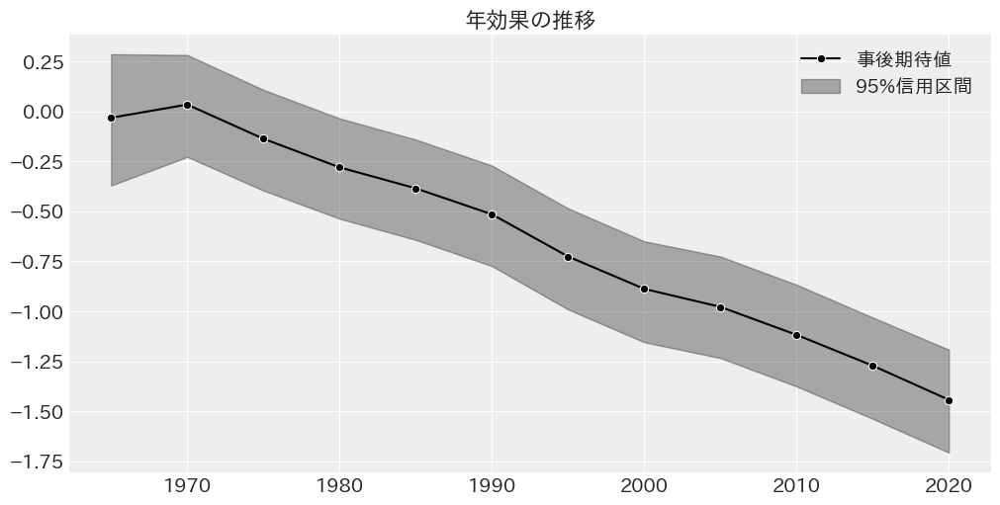
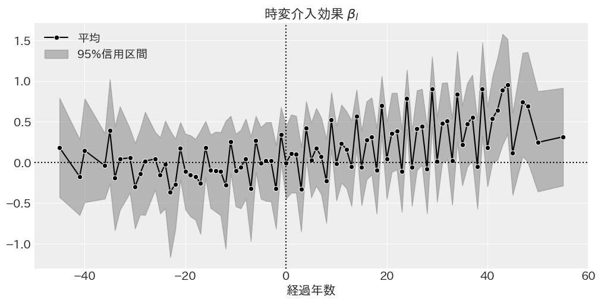

# 推定結果 均一分散

## Two-way fixed effect

|          params          |   EAP    |   SD    | 95%下限  | 95%上限  | $\hat{R}$ |
| :----------------------: | :------: | :-----: | :------: | :------: | :-------: |
|         $\beta$          | $0.176$  | $0.031$ | $0.117$  | $0.233$  |   $1.0$   |
|  $\mu_{\text{island}}$   | $6.336$  | $0.239$ | $5.858$  | $6.756$  |  $1.01$   |
| $\sigma_{\text{island}}$ | $2.015$  | $0.164$ | $1.712$  | $2.313$  |  $1.02$   |
|   $\mu_{\text{year}}$    | $-0.539$ | $0.203$ | $-0.914$ | $-0.147$ |   $1.0$   |
|  $\sigma_{\text{year}}$  | $0.533$  | $0.141$ | $0.331$  | $0.811$  |  $1.01$   |
|         $\sigma$         | $0.144$  | $0.009$ | $0.127$  | $0.161$  |   $1.0$   |
|          $\nu$           | $2.252$  | $0.274$ | $1.736$  | $2.757$  |   $1.0$   |

- $\beta$: 介入効果を示すパラメータ．
- $\sigma$: 誤差分散の平方根．
- $\nu$: 自由度パラメータ．
- $\mu_{\text{island}}$は島効果の平均値．
- $\sigma_{\text{island}}$は島効果の標準偏差．
- $\mu_{\text{year}}$は年効果の平均値．
- $\sigma_{\text{year}}$は年効果の標準偏差．

介入効果を示すパラメータである $\beta$ は $0.176$ と推定された．$95\%$ 信用区間は $0$ を含まず，介入効果が正である確率は $100\%$ と推定された．被説明変数は対数値であるため指数変換により評価すると架橋後の人口は平均 $19.2\%$ 増加する．

以下は $1960$ 年を基準とした年効果の推移である．

$1970$ には一度上昇するが，その後は一貫して下降傾向にある．特に $2020$ 年の効果は $-1.315$ であり，指数変換により評価すると $1960$ 年に比べて $-73.2\%$ の減少を示している．

## Dynamic TWFE

|          param           |   EAP    |   SD    | 95% 下限 | 95% 上限 | $\hat{R}$ |
| :----------------------: | :------: | :-----: | :------: | :------: | :-------: |
|  $\mu_{\text{island}}$   | $6.143$  | $0.269$ | $5.581$  | $6.632$  |   $1.0$   |
| $\sigma_{\text{island}}$ | $1.957$  | $0.162$ | $1.664$  | $2.288$  |   $1.0$   |
|   $\mu_{\text{year}}$    | $-0.453$ | $0.230$ | $-0.921$ | $-0.006$ |   $1.0$   |
|  $\sigma_{\text{year}}$  | $0.618$  | $0.161$ | $0.367$  | $0.942$  |   $1.0$   |
|         $\sigma$         | $0.124$  | $0.010$ | $0.105$  | $0.145$  |   $1.0$   |
|          $\nu$           | $1.938$  | $0.253$ | $1.480$  | $2.438$  |   $1.0$   |

- $\sigma$: 誤差分散の平方根．
- $\nu$: 自由度パラメータ．
- $\mu_{\text{island}}$は島効果の平均値．
- $\sigma_{\text{island}}$は島効果の標準偏差．
- $\mu_{\text{year}}$は年効果の平均値．
- $\sigma_{\text{year}}$は年効果の標準偏差．

以下は介入前 $45$ 年から介入後 $55$ 年まで推定した介入効果の時間変化を示す．

介入前は $0$ の周辺で変動しており，パラメータの推定値の平均値は $-0.042$ であった．

一方，介入後は上昇傾向にあり，推定値の平均値は $0.304$ と大きく上昇している．介入後の $50$ の推定値中 $16$ 個の $95\%$ 信用区間が $0$ を含まず有意に正であった．

## Fully Saturated TWFE

|          param           |   EAP    |   SD    | 95% 下限 | 95% 上限 | $\hat{R}$ |
| :----------------------: | :------: | :-----: | :------: | :------: | :-------: |
|  $\mu_{\text{island}}$   | $5.941$  | $0.372$ | $5.231$  | $6.685$  |   $1.0$   |
| $\sigma_{\text{island}}$ | $1.962$  | $0.165$ | $1.663$  | $2.303$  |   $1.0$   |
|   $\mu_{\text{year}}$    | $-0.261$ | $0.349$ | $-0.947$ | $0.428$  |   $1.0$   |
|  $\sigma_{\text{year}}$  | $0.615$  | $0.155$ | $0.360$  | $0.919$  |   $1.0$   |
|         $\sigma$         | $0.143$  | $0.012$ | $0.121$  | $0.167$  |   $1.0$   |
|          $\nu$           | $2.523$  | $0.400$ | $1.782$  | $3.301$  |   $1.0$   |

|      |          形状          | 介入前 | 介入後 | 介入後長期 |
| :--: | :--------------------: | :----: | :----: | ---------- |
| 1965 |  介入後初期負その後 0  |   0    |   -    | 0          |
| 1972 |   ずっと負．長期で正   |   -    |   -    | +          |
| 1973 |       右肩上がり       |   -    |   -    | 0          |
| 1975 |  ほぼ横ばい．後半陰る  |   0    |   +    | -          |
| 1976 |       右肩上がり       |   -    |   0    | +          |
| 1979 |       右肩上がり       |   -    |   -    | 0          |
| 1982 | 介入前低下介入効果アリ |   -    |   +    | 0          |
| 1983 |    上がった後横ばい    |   -    |   0    | 0          |
| 1987 |     ストロー効果　     |   +-   |   -    | -          |
| 1988 |       右肩上がり       |   +    |   +    | +          |
| 1989 |       右肩上がり       |   +    |   +    | +          |
| 1991 |        効果絶大        |   -    |   +    | +          |
| 1992 |         横ばい         |   +    |   +    | +          |
| 1995 |    横ばいから少低下    |   +    |   +    | -          |
| 1996 |       右肩上がり       |   +    |   +    | +          |
| 1997 |     正にほぼ横ばい     |   -    |   0    | +          |
| 1999 |         \\/\           |  +0+   |   +    | 0          |
| 2000 |       右肩上がり       |   +    |   +    | +          |
| 2004 |       右肩上がり       |   +    |   +    | +          |
| 2008 |         横ばい         |   0    |   0    | 0          |
| 2011 |       右肩上がり       |   +    |   +    | +          |
| 2016 |       右肩上がり       |   +    |   +    | +          |
| 2018 |       右肩上がり       |   +    |   +    | +          |
