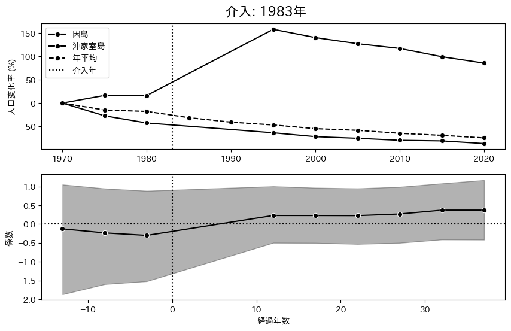
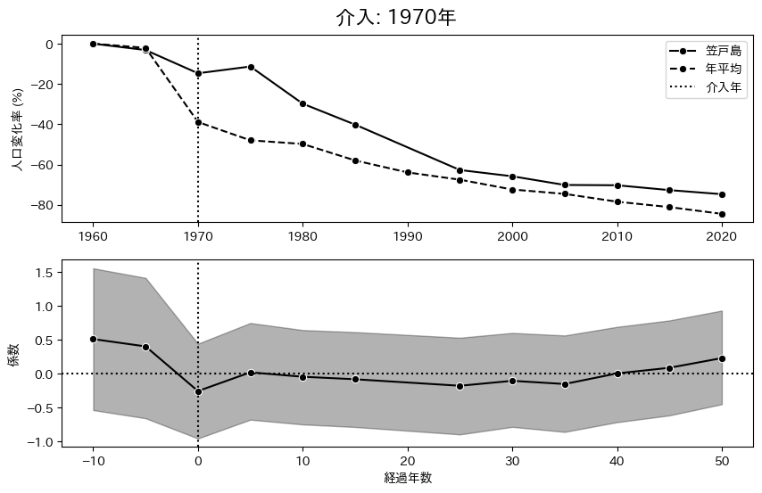
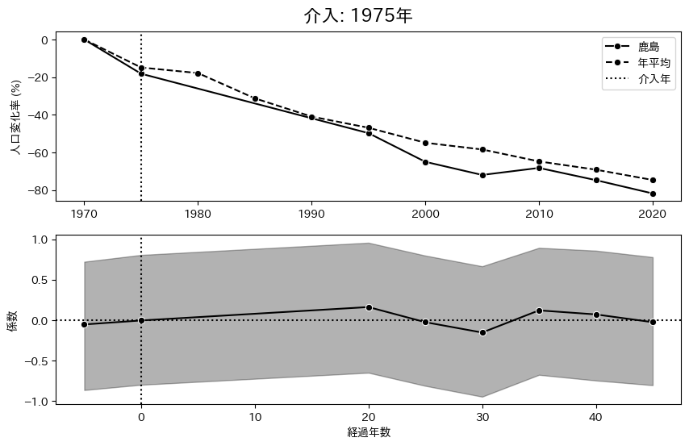
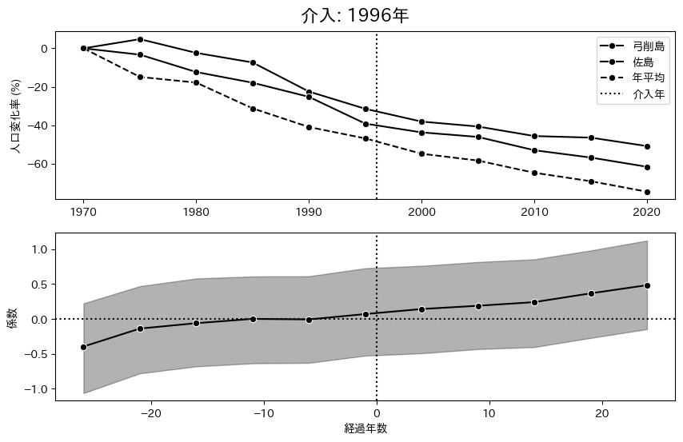

# 推定結果 均一分散

## Two-way fixed effect

|          params          |   EAP    |   SD    | 95%下限  | 95%上限  | $\hat{R}$ |
| :----------------------: | :------: | :-----: | :------: | :------: | :-------: |
|         $\beta$          | $0.208$  | $0.031$ | $0.151$  | $0.266$  |   $1.0$   |
|  $\mu_{\text{island}}$   | $6.342$  | $0.249$ | $5.858$  | $6.794$  |   $1.0$   |
| $\sigma_{\text{island}}$ | $1.994$  | $0.161$ | $1.702$  | $2.307$  |   $1.0$   |
|   $\mu_{\text{year}}$    | $-0.659$ | $0.202$ | $-1.048$ | $-0.285$ |   $1.0$   |
|  $\sigma_{\text{year}}$  | $0.577$  | $0.146$ | $0.345$  | $0.846$  |   $1.0$   |
|         $\sigma$         | $0.143$  | $0.009$ | $0.126$  | $0.160$  |   $1.0$   |
|          $\nu$           | $2.221$  | $0.271$ | $1.731$  | $2.728$  |   $1.0$   |

- $\beta$: 介入効果を示すパラメータ．
- $\sigma$: 誤差分散の平方根．
- $\nu$: 自由度パラメータ．
- $\mu_{\text{island}}$は島効果の平均値．
- $\sigma_{\text{island}}$は島効果の標準偏差．
- $\mu_{\text{year}}$は年効果の平均値．
- $\sigma_{\text{year}}$は年効果の標準偏差．

介入効果を示すパラメータである $\beta$ は $0.208$ と推定された．$95\%$ 信用区間は $0$ を含まず，介入効果が正である確率は $100\%$ と推定された．被説明変数は対数値であるため指数変換により評価すると架橋後の人口は平均 $23.18\%$ 増加する．

以下は $1960$ 年を基準とした年効果の推移である．

$1970$ には一度上昇し $0.034$ の効果を持つが，その後は一貫して下降傾向にある．
特に $2020$ 年の効果は $-1.443$ であり，指数変換により評価すると $1960$ 年に比べて $-76.4\%$ の減少を示している．

以下は島効果の分布である．

横軸は島の ID，縦軸は係数としている．平均値は $6.342$，標準偏差は $1.994$ であり，島ごとに異なる切片は以上のような分布をしている．

## Dynamic TWFE

|          param           |   EAP    |   SD    | 95% 下限 | 95% 上限 | $\hat{R}$ |
| :----------------------: | :------: | :-----: | :------: | :------: | :-------: |
|  $\mu_{\text{island}}$   | $6.470$  | $0.252$ | $5.983$  | $6.962$  |   $1.0$   |
| $\sigma_{\text{island}}$ | $1.942$  | $0.159$ | $1.651$  | $2.267$  |   $1.0$   |
|   $\mu_{\text{year}}$    | $-0.748$ | $0.220$ | $-1.179$ | $-0.305$ |   $1.0$   |
|  $\sigma_{\text{year}}$  | $0.641$  | $0.162$ | $0.379$  | $0.961$  |   $1.0$   |
|         $\sigma$         | $0.119$  | $0.010$ | $0.100$  | $0.137$  |   $1.0$   |
|          $\nu$           | $1.868$  | $0.226$ | $1.447$  | $2.313$  |   $1.0$   |

- $\mu_{\text{island}}$は島効果の平均値．
- $\sigma_{\text{island}}$は島効果の標準偏差．
- $\mu_{\text{year}}$は年効果の平均値．
- $\sigma_{\text{year}}$は年効果の標準偏差．
- $\sigma$: 誤差分散の平方根．
- $\nu$: 自由度パラメータ．

以下は介入前 $45$ 年から介入後 $55$ 年まで推定した介入効果の時間変化を示す．

一見すると時間変化が激しいように見えるが，本来はこれほど激しくないだろう．

なぜなら，国勢調査では $5$ 年毎にしかデータが得られず，介入年が $1$ 年異なると経過年数毎のサンプルサイズが小さくなってしまい，個別の橋の効果が強く出てしまうからだ．

経過年数 $-15$ 年や，経過年数 $0$ 年，経過年数 $10$ 年といったダミー変数を使用しているが，これらの変数の中で $1$ をとる割合は $4\%$ 程度である．
たとえば，1990 年に架かった橋と 1991 年に架かった橋があるとき，1995 年のデータは前者は 5 年目の効果，後者は 4 年目の効果のために使用される．両者の島の介入効果に異質性がある場合，個別の橋の効果が強く出てしまう．

そこで，得られた介入効果に対してローカル線形トレンドモデルを適用し介入効果の平滑化を行なった．

介入前は $0$ の周辺で変動しており，パラメータの推定値の平均値は $-0.042$ であった．また，介入前から増加している傾向も見られる．

一方，介入後の推定値の平均値は $0.304$ と大きく上昇している．
介入後の $50$ の推定値中 $16$ 個の $95\%$ 信用区間が $0$ を含まず有意に正であり，
介入年の推定値は $-0.006$ とほとんど効果が $0$ だが，$4$ 年後は $0.423$，$9$ 年後は $0.523$，$19$ 年後は $0.697$，$32$ 年後は $0.511$ と介入後は続けて上昇傾向にある．

## Fully Saturated TWFE

|          param           |   EAP    |   SD    | 95% 下限 | 95% 上限 | $\hat{R}$ |
| :----------------------: | :------: | :-----: | :------: | :------: | :-------: |
|         $\sigma$         | $0.137$  | $0.011$ | $0.115$  | $0.160$  |   $1.0$   |
|          $\nu$           | $2.405$  | $0.365$ | $1.720$  | $3.105$  |   $1.0$   |
|  $\mu_{\text{island}}$   | $6.037$  | $0.358$ | $5.328$  | $6.735$  |   $1.0$   |
| $\sigma_{\text{island}}$ | $1.980$  | $0.159$ | $1.681$  | $2.291$  |   $1.0$   |
|   $\mu_{\text{year}}$    | $-0.314$ | $0.337$ | $-0.982$ | $0.347$  |   $1.0$   |
|  $\sigma_{\text{year}}$  | $0.612$  | $0.157$ | $0.351$  | $0.911$  |   $1.0$   |

|      |          形状          | 介入前 | 介入後 | 介入後長期 |
| :--: | :--------------------: | :----: | :----: | ---------- |
| 1965 |  介入後初期負その後 0  |   0    |   -    | 0          |
| 1972 |   ずっと負．長期で正   |   -    |   -    | +          |
| 1973 |       右肩上がり       |   -    |   -    | 0          |
| 1975 |  ほぼ横ばい．後半陰る  |   0    |   +    | -          |
| 1976 |       右肩上がり       |   -    |   0    | +          |
| 1979 |       右肩上がり       |   -    |   -    | 0          |
| 1982 | 介入前低下介入効果アリ |   -    |   +    | 0          |
| 1983 |    上がった後横ばい    |   -    |   0    | 0          |
| 1987 |     ストロー効果　     |   +-   |   -    | -          |
| 1988 |       右肩上がり       |   +    |   +    | +          |
| 1989 |       右肩上がり       |   +    |   +    | +          |
| 1991 |        効果絶大        |   -    |   +    | +          |
| 1992 |         横ばい         |   +    |   +    | +          |
| 1995 |    横ばいから少低下    |   +    |   +    | -          |
| 1996 |       右肩上がり       |   +    |   +    | +          |
| 1997 |     正にほぼ横ばい     |   -    |   0    | +          |
| 1999 |         \\/\           |  +0+   |   +    | 0          |
| 2000 |       右肩上がり       |   +    |   +    | +          |
| 2004 |       右肩上がり       |   +    |   +    | +          |
| 2008 |         横ばい         |   0    |   0    | 0          |
| 2011 |       右肩上がり       |   +    |   +    | +          |
| 2016 |       右肩上がり       |   +    |   +    | +          |
| 2018 |       右肩上がり       |   +    |   +    | +          |

### 実際に人口増加

人口変化率を見て架橋後に人口が増える又は減少率が小さくなる事がわかる島を分析する．

こちらは $1972$ 年に開通した橋であり広島県江田島市沖野島にある．**グラフの上段は実際の人口変化率**，下段は推定された介入効果，横軸はどちらも $0$ を介入年とした経過年数を示している．

こちらは $1982$ 年に開通した橋であり，

### 介入前は負，介入後は 0 以上

介入前の係数の期待値は負だが，介入後は $0$ 以上になった橋を列挙している．
介入前は人口が減っている島でも，橋ができることで人口減少が抑制されたり，増加に転じたりする可能性がある．

### ストロー効果

## ほとんど横ばい

### 介入前から正

介入前から係数が正である橋を列挙している．

$2000$ 年代にできた橋は元から係数が増加している傾向にある．

緊縮財政によって相応の効果が見込まれる島でないと橋の建設が行われなかったことを示している可能性がある．
