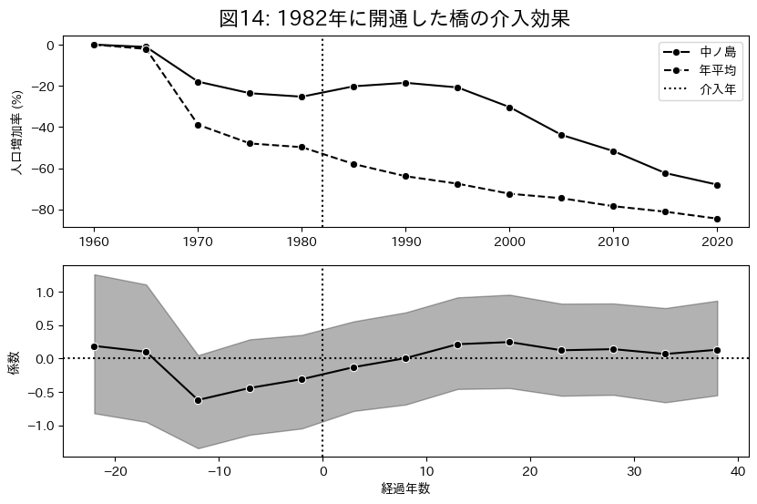
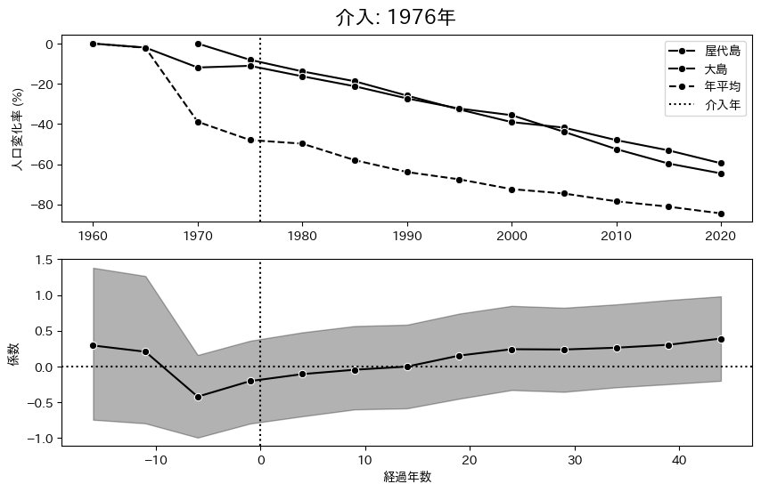
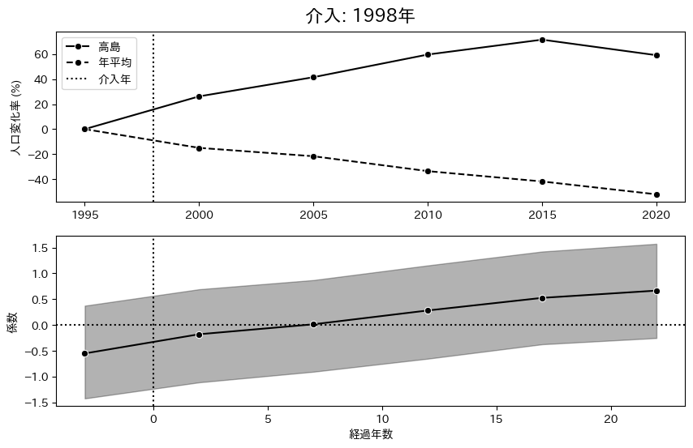
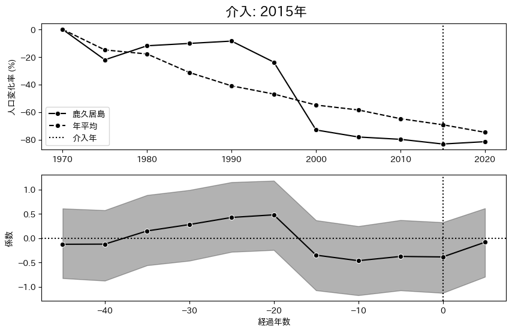
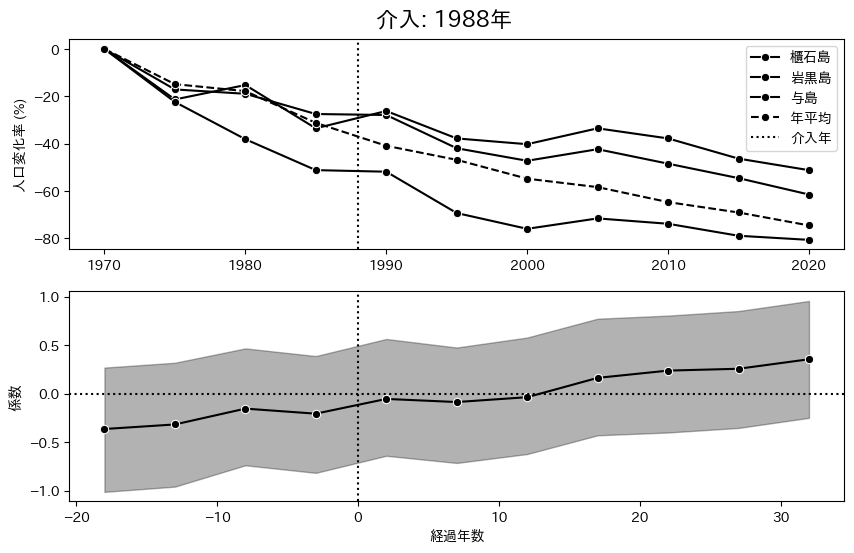
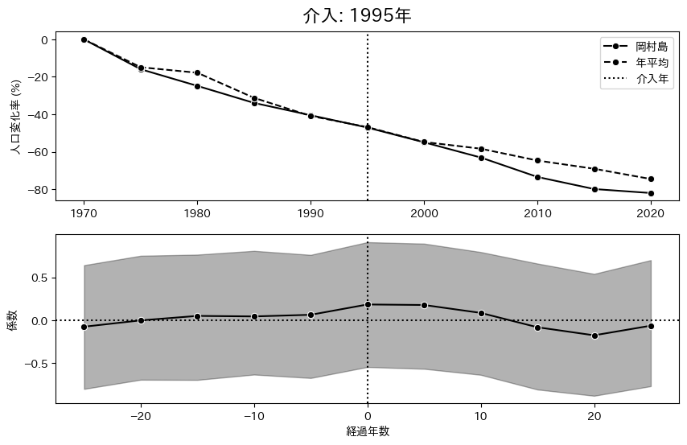

# 推定結果 均一分散

## Two-way fixed effect

|          params          |   EAP    |   SD    | 95%下限  | 95%上限  | $\hat{R}$ |
| :----------------------: | :------: | :-----: | :------: | :------: | :-------: |
|         $\beta$          | $0.208$  | $0.031$ | $0.151$  | $0.266$  |   $1.0$   |
|  $\mu_{\text{island}}$   | $6.342$  | $0.249$ | $5.858$  | $6.794$  |   $1.0$   |
| $\sigma_{\text{island}}$ | $1.994$  | $0.161$ | $1.702$  | $2.307$  |   $1.0$   |
|   $\mu_{\text{year}}$    | $-0.659$ | $0.202$ | $-1.048$ | $-0.285$ |   $1.0$   |
|  $\sigma_{\text{year}}$  | $0.577$  | $0.146$ | $0.345$  | $0.846$  |   $1.0$   |
|         $\sigma$         | $0.143$  | $0.009$ | $0.126$  | $0.160$  |   $1.0$   |
|          $\nu$           | $2.221$  | $0.271$ | $1.731$  | $2.728$  |   $1.0$   |

- $\beta$: 介入効果を示すパラメータ．
- $\sigma$: 誤差分散の平方根．
- $\nu$: 自由度パラメータ．
- $\mu_{\text{island}}$は島効果の平均値．
- $\sigma_{\text{island}}$は島効果の標準偏差．
- $\mu_{\text{year}}$は年効果の平均値．
- $\sigma_{\text{year}}$は年効果の標準偏差．

介入効果を示すパラメータである $\beta$ は $0.208$ と推定された．$95\%$ 信用区間は $0$ を含まず，介入効果が正，つまり介入後には介入前より人口が増加する確率は $100\%$ と推定された．被説明変数は対数値であるため指数変換により評価すると架橋後の人口は平均 $23.18\%$ 増加する．

以下は $1960$ 年を基準とした年効果の推移である．

$1970$ には一度上昇し $0.034$ の効果を持つが，その後は一貫して下降傾向にある．
特に $2020$ 年の効果は $-1.443$ であり，指数変換により評価すると $1960$ 年に比べて $-76.4\%$ の減少を示している．

以下は島効果の分布である．

横軸は島の ID，縦軸は係数としている．平均値は $6.342$，標準偏差は $1.994$ であり，島ごとに異なる切片は以上のような分布をしている．

## Dynamic TWFE

|          param           |   EAP    |   SD    | 95% 下限 | 95% 上限 | $\hat{R}$ |
| :----------------------: | :------: | :-----: | :------: | :------: | :-------: |
|  $\mu_{\text{island}}$   | $6.489$  | $0.258$ | $5.993$  | $7.006$  |   $1.0$   |
| $\sigma_{\text{island}}$ | $1.966$  | $0.163$ | $1.646$  | $2.284$  |   $1.0$   |
|   $\mu_{\text{year}}$    | $-0.758$ | $0.225$ | $-1.196$ | $-0.304$ |   $1.0$   |
|  $\sigma_{\text{year}}$  | $0.643$  | $0.161$ | $0.380$  | $0.951$  |   $1.0$   |
|         $\sigma$         | $0.119$  | $0.010$ | $0.101$  | $0.138$  |   $1.0$   |
|          $\nu$           | $1.881$  | $0.231$ | $1.452$  | $2.329$  |   $1.0$   |

- $\mu_{\text{island}}$は島効果の平均値．
- $\sigma_{\text{island}}$は島効果の標準偏差．
- $\mu_{\text{year}}$は年効果の平均値．
- $\sigma_{\text{year}}$は年効果の標準偏差．
- $\sigma$: 誤差分散の平方根．
- $\nu$: 自由度パラメータ．

以下は介入前 $45$ 年から介入後 $55$ 年まで推定した介入効果の時間変化を示す．

一見すると時間変化が激しいように見えるが，本来はこれほど激しくないだろう．

なぜなら，国勢調査では $5$ 年毎にしかデータが得られず，介入年が $1$ 年異なると経過年数毎のサンプルサイズが小さくなってしまい，個別の橋の効果が強く出てしまうからだ．

経過年数 $-15$ 年や，経過年数 $0$ 年，経過年数 $10$ 年といったダミー変数によって推定しているが，これらの変数の中で $1$ をとる割合は平均的に $0.5\%$ 程度である．
たとえば，$1990$ 年に架かった橋と $1991$ 年に架かった橋があるとき，$1995$ 年のデータは前者は $5$ 年目の効果，後者は $4$ 年目の効果のために使用される．両者の島の介入効果に異質性がある場合，個別の橋の効果が強く出てしまう．

そこで，得られた介入効果に対して以下のローカル線形トレンドモデルを用いて介入効果の平滑化を行なった．

$$
\begin{aligned}
\delta_{l} &= \delta_{l-1} + \zeta_l, \quad &\zeta_l \sim \mathcal{N}(0, \sigma_{\zeta}^2)\\
\mu_{l} &= \mu_{l-1} + \delta_{l-1} + w_l, \quad &w_l \sim \mathcal{N}(0, \sigma_{w}^2)\\
\beta_{l} &= \beta_{l-1} + \mu_{l} + v_l, \quad &v_l \sim \mathcal{N}(0, \sigma_{v}^2)\\
\end{aligned}
$$

$l$ は経過年数であり，$\delta_l$ はトレンドの傾き，$\mu_l$ はトレンドの潜在状態，$\beta_l$ は介入効果を示している．$\zeta_l$，$w_l$，$v_l$ はそれぞれの誤差項である．
誤差項の分散の事前分布はスケールパラメータ $1$ の半コーシー分布とした．

誤差項の分散は以下のように推定された．

|      param       |   EAP   |   SD    | 95% 下限 | 95% 上限 | $\hat{R}$ |
| :--------------: | :-----: | :-----: | :------: | :------: | :-------: |
| $\sigma_{\zeta}$ | $0.002$ | $0.002$ |   $0$    | $0.006$  |   $1.0$   |
|   $\sigma_{w}$   | $0.018$ | $0.013$ |   $0$    | $0.043$  |   $1.0$   |
|   $\sigma_{v}$   | $0.229$ | $0.018$ | $0.196$  | $0.265$  |   $1.0$   |

トレンドと潜在状態の誤差項の分散 $\sigma_{\zeta}$ 及び $\sigma_{w}$ の期待値はそれぞれ $0.003$ と $0.020$ であるが，それに比べて介入効果の誤差項の分散 $\sigma_{v}$ は $0.268$ と大きい．これはそれぞれの経過年数 $l$ の時点での介入効果がプラスマイナス $50\%$ のばらつきを持っていることを示している．

以下は平滑化された介入効果 $\beta_l$ を示している．

破線は平滑化をする前の介入効果の期待値であり，実線は平滑化後の期待値，濃い灰色の帯は潜在状態 $\mu_l$ の$95\%$ 信用区間，薄い灰色の帯は介入効果の $95\%$ 信用区間である．

平滑化を行うことで介入効果の時間変化が滑らかになったことが確認できる．

平滑化期待値は，介入前 $-40$ はほぼ $0$ であり，$-20$ 年に向けて低下しているが，その後は方向を変えて徐々に上昇し，介入の 5 年前には期待値が $0.003$ と正に転換した．介入 $8$ 年目には潜在状態 $\mu_l$ の 95%信用区間が $0$ を含まなくなり，期待値は $0.13$ に達している．その後の期待値は負になることなく上昇し，$50$ 年目の期待値は $0.55$ となった．

介入前からわずかに正に向く傾向があるが，橋の建設段階から地域経済活性化の見通しが立てられていることによるものと考えられる．

一方で介入効果の信用区間は最後まで $0$ を含んでいるが，これは，介入効果の出やすい島と出づらい島といった横断的な異質性が大きいためだと考えられる．しかし，負の割合は経過年数が進むにつれて減少しており，少なくとも人口減少を抑制する効果があることが示されている．

ここから言えることは，離島架橋は平均的に人口減少を改善させる可能性が高く，全てのケースにおいて人口増加をもたらすわけではないが，人口減少を抑制する効果があることが示されている．

## Fully Saturated TWFE

|          param           |   EAP    |   SD    | 95% 下限 | 95% 上限 | $\hat{R}$ |
| :----------------------: | :------: | :-----: | :------: | :------: | :-------: |
|  $\mu_{\text{island}}$   | $5.930$  | $0.358$ | $4.968$  | $6.890$  |   $1.0$   |
| $\sigma_{\text{island}}$ | $1.975$  | $0.159$ | $1.674$  | $2.311$  |   $1.0$   |
|   $\mu_{\text{year}}$    | $-0.193$ | $0.337$ | $-1.112$ | $0.762$  |   $1.0$   |
|  $\sigma_{\text{year}}$  | $0.626$  | $0.157$ | $0.372$  | $0.946$  |   $1.0$   |
|         $\sigma$         | $0.137$  | $0.011$ | $0.116$  | $0.160$  |   $1.0$   |
|          $\nu$           | $2.446$  | $0.365$ | $1.766$  | $3.181$  |   $1.0$   |

|      params      |   EAP   |   SD    | 95%下限 | 95%上限 | $\hat{R}$ |
| :--------------: | :-----: | :-----: | :-----: | :-----: | :-------: |
|   $\sigma_{w}$   | $0.016$ | $0.012$ |   $0$   | $0.040$ |   $1.0$   |
| $\sigma_{\zeta}$ | $0.002$ | $0.002$ |   $0$   | $0.006$ |   $1.0$   |
|   $\sigma_{v}$   | $0.170$ | $0.014$ | $0.144$ | $0.196$ |   $1.0$   |

### 人口変化率が上昇

人口変化率を見て架橋後に人口が増える又は減少率が小さくなる事がわかる島を分析する．

こちらは高知県須崎市中ノ島にて $1982$ 年に開通した中ノ島大橋である．

平均よりも人口増加率は高いが，介入前の係数は負の値を示している．介入後の人口変化率は上昇しているように見えるが，介入効果の係数を見ると有意に正ではない．

こちらは広島県尾道市因島にて $1983$ 年に開通した因島大橋と，山口県周防大島町沖家室島にて開通した沖家室大橋である．

実績を見ると因島は架橋後に明らかに上昇しているが，沖家室島の推移は平均とほぼ同じである．
介入年が同じであれば介入効果は同じであると仮定しているため，ほとんど $0$ となった．

こちらは広島県尾道市生口島にて $1991$ 年に開通した生口橋である．

最も介入効果が現れた島であり，実績も $70\%$ 程度増加しており，介入効果も $0$ から $1$ に達し，その後も上昇している．

こちらは広島県東広島市大芝島にて $1997$ 年に開通した大芝大橋である．

実績値を見ると，介入後は人口増加率が正になったが，介入効果の係数はほとんど $0$ である．

こちらは島根県浜田市瀬戸ヶ島にて $1999$ 年に開通した浜田マリン大橋と愛媛県今治市馬島にて開通した来島海峡第二大橋である．

架橋前は減少傾向にあったが，開通年の前から増加している．

### 介入前は負，介入後は 0 以上

介入前の係数の期待値は負だが，介入後は $0$ 以上になった橋を列挙している．
介入前は人口が減っている島でも，橋ができることで人口減少が抑制されたり，増加に転じたりする可能性がある．

橋

### 少なくとも一時的にストロー効果の傾向がある

1972，1987，

こちらは $1972$ 年に開通した広島県江田島市沖野島に存在する沖野島橋である．
グラフの上段は島の人口変化率の実績値と年平均の人口変化率であり平均との比較を目的としている．下段は推定された介入効果の係数とする．

架橋後には年平均と比較しても人口が減少しており，介入効果も負の値を示している．しかし 2000 年からは人口増加率が上昇しており，年平均と比較しても，介入効果も改善している．

### 介入前から正

介入前から係数が正である橋を列挙している．

$2000$ 年代にできた橋は元から係数が増加している傾向にある．

緊縮財政によって相応の効果が見込まれる島でないと橋の建設が行われなかったことを示している可能性がある．

## 年平均よりも実績は良いが，橋の効果は見られない

1997，2011

### 年平均と同じような動き

1975，1992，1995，1999，2000，2004，2008 年に架かった橋は，年平均と同じ動きをしている．

