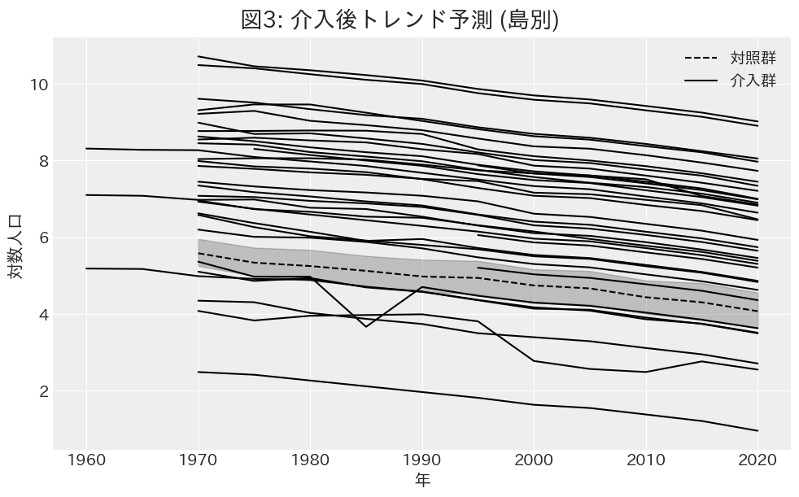
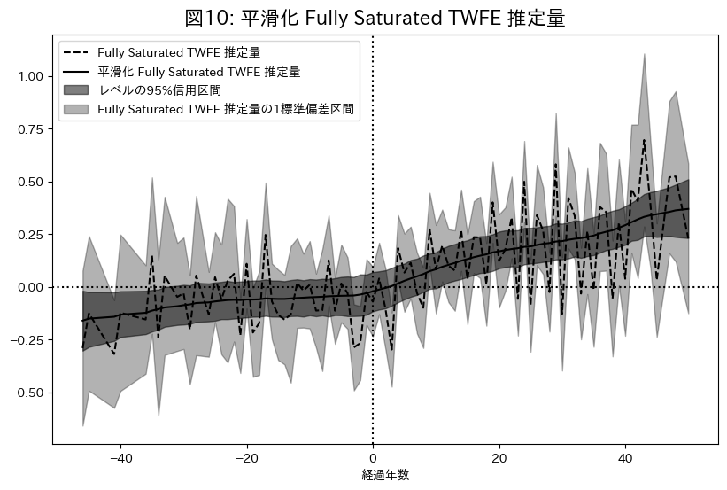

離島架橋の介入効果[^1]

[^1]: 本稿の執筆にあたり，指導教官として多大なご指を賜った導慶應義塾大学商学部商学科藪友良教授に深謝致します．ならびに藪友良研究会をはじめとする多くの学生から数々の有益な助言を頂きました．ここに感謝の意を表します．

慶應義塾大学商学部 4 年

穐谷慶成[^2]

[^2]: Email: keisei.akiya.0104@keio.jp

＜要約＞

本研究では，離島架橋が離島人口に与える影響を島別パネルデータを用いて推定した．時系列的及び横断的な介入効果の異質性を考慮した Fully Saturated TWFE モデルを利用して推定した結果，一時的なストロー効果が見られる例も少数確認されたが，離島架橋は総じて正の効果があり，その効果は長期的に高まることが示された．また，橋の開通前から効果が出るケースもあり，公共事業の開始によって地域経済の見通しを明るくし，例え島人口が少なくても残った島民の生活を守るためのインフラとして役立つことで人口減少の抑制に効果があることが示唆された．

＜キーワード＞

離島人口，離島架橋，Difference in Difference，Fully Saturated Two-way Fixed Effects，階層ベイズモデル，状態空間モデル

\newpage

# 1. はじめに

離島架橋とは，本土と離島，又は離島同士を結ぶために架けられる橋のことを指す．日本は 6,852 の島嶼により構成される島国であり，本州，北海道，四国，九州，沖縄本島を除く 6,847 島が離島である（国土交通省 国土政策局 離島振興課 2022）．このうち，離島振興法による離島振興対策実施地域に含まれる有人離島は 254 島であるが，1955 年から 2015 年までの間に，全国の人口が約 4 割増加する一方で，これらの有人離島の人口は約 6 割減少している．離島架橋はこのような離島の人口減少に有効な対策となりうるのか．離島架橋は，離島の交通インフラとして経済活動の活性化や生活環境の向上に寄与する可能性がある一方で，ストロー効果を引き起こし人口流出を招く可能性も指摘されている．本研究は，離島架橋が離島人口に与える影響を定量的に明らかにすることを目的とする．

続いて先行研究のレビューを行う．橋に肯定的な意見を持つ論文として，沖山ら $(2001)$，宮内ら $(2003)$ 等が挙げられる．一方でやや否定的なものは，寺井ら $(1998)$，湯本ら $(2002)$，黒田 $(2003)$，猪原ら $(2015)$ が挙げられる．その他，山崎ら $(2007)$ は架橋されていない中で人口が増加した島を分析しており，重松 $(2022)$ は人口変化の要因分析を行っているが架橋の効果に対してはどちらとも言えない立場である．

まず肯定的な意見を持つ論文からレビューを行う．沖山ら $(2001)$ は，佐賀県加部島における農業を事例として離島の基幹産業に与える架橋政策の影響に関する研究を行っている．架橋前は農道の発達が悪く，生産性が極めて低かったが，架橋後は，土地改良，農道の整備，農業の機械化を促進させ，生産性を向上させた上に，パイプラインによって農業用水が確保されたことで水不足が解消され，陸路によって安定した出荷が出来るようになった．宮内ら $(2003)$ は 沖縄県浜比嘉島を対象に $1997$ 年に架橋した浜比嘉大橋による人口増加の影響を分析している．米軍向け野菜供給地として指定されていたが，台湾からの安価な野菜輸入により需要が減少し，農業が衰退．農民層が労働需要の盛んな地域に移住したため激しい人口流出を経験した．浜比嘉大橋完成により，沖縄島と道路で結ばれた島には島外から U ターンを中心とする転入者が相次いだ．浜比嘉島は年通勤可能架橋島であるため，人口面の架橋効果が大きいとのことであった．離島の人口流出対策として，交通インフラ整備が有効であることを示唆している．

一方でやや否定的な意見を持つ論文として，寺井ら $(1998)$ は，芸予諸島において，本四架橋を契機とした島嶼整備のあり方に関する研究を行っている．架橋の問題点は，渡船業者が大きな影響を受け，島らしさを体現する観光資源を衰退に導いているということだと述べられている．湯本ら $(2002)$ では有人離島 $423$ 島農地離島振興法対象の $288$ 離島を対象に，離島の類型化と人口増減要因に関する基礎的分析を行っている．離島の類型化は $4$ 側面，自然特性 $12$ 指標，生活環境 $16$ 指標，産業形態 $19$ 指標，離島の側からのアピールポイント $11$ 指標から主成分分析によって行われた．特に生活環境に関する指標は交通，生活，保健，教育，余暇等からなる指標を用いており，ある主成分は正の方向に｢空港が利用可能｣ ｢船の大きさ｣ ｢中学校あり｣．負の方向に｢他から送水｣ ｢最大就航回数｣ ｢本土から行ける｣が付置されていることから，｢核的 ―― 枝的｣軸と解釈されている．人口増加に対しては，自然特性が圧倒的に大きな影響力を持ち，長期人口増及び社会増には本土へのアクセス等よりも島での快適な暮らしが効果的であると述べられている．黒田 $(2003)$ は架橋されている周防大島と架橋されていない小豆島を比較して，架橋の影響を分析している．架橋が行われる前は両者の傾向は変わらないが，架橋後は周防大島の方が減少の度合いが大きいと述べられている．猪原ら $(2015)$ は，明石海峡大橋を事例として空間経済学に基づくストロー効果の検証を行っている．ストロー効果を，交通インフラの整備等による $2$ 地域間輸送費の低下により，一方の地域の出荷額が他方の地域と比べて相対的に減少することと定義して分析しており，兵庫県では市場拡大効果が優勢で出荷額増加が観察された一方，徳島県では競争拡大効果が優勢で出荷額減少が見られた．明石海峡大橋開通後，徳島県の中小店舗が経済的影響を強く受けたとしている．

その他，山崎ら $(2007)$ は $1970$ 年から $30$ 年にわたって人口増加を続けた特異な離島である兵庫県姫路市家島町に属する防勢島を研究している．その島に橋はないが，防勢島は自然増が社会減を上回る形で人口が増加しているが，その要因は，養殖への産業構造の変化と埋め立てによる住宅用地の確保，新宅分けという慣行にあると述べられている．

どちらとも言えない立場として，重松 $(2022)$ は $1980$ から $2020$ 年の $272$ 島を分析対象として，離島の人口変化の要因分析を行っている．被説明変数には人口比率や合計特殊出生率，死亡率，転入率，転出率．説明変数には本土からの距離や平均気温等の自然地域特性，各産業の従業員数等の島内雇用，架橋の有無等の行政の取組，年代別の人口等を用いて重回帰分析をしている．架橋の有無を示すダミー変数のパラメータの推定値に関しては，$2020$ 年の人口変化率に対して $1.25$ と正の影響を与えているが，$2010$ 年の転入率に対しては $-0.52$ ，$2010$ 年の転出率に対しては $-0.40$ と負の影響を与えている．$2010$ 年時点では転出超過が起きるストロー効果が発生しているが，$2020$ 年ではストロー効果を起こしていないと述べられている．

これらの先行研究は，個別の離島における架橋の影響を詳細に分析しているものや，複数の離島を用いて類型化や要因分析を行っているものがあるが，離島架橋に注目してその平均的な効果を定量的に検証した研究は存在しない．本研究は，複数の離島における架橋前後のデータを用いて離島架橋の動的な介入効果を推定する点に新規性がある．

また本研究は，インフラ投資の政策効果を実証的に検証することで，離島振興政策の立案に示唆を与える点で社会的意義を持つ．離島架橋が人口維持に有効であれば，政府は離島架橋への財政支出を通じて離島の経済活動の活性化や生活環境の向上を図ることができる．一方，効果が限定的であれば，政府は他の政策手段を検討することで，有限な資源のより効果的な配分を目指すことができる．

本稿の構成は以下の通りである．第 $2$ 節では分析手法を説明する．第 $3$ 節では分析結果を示し，第 $4$ 節では実際の人口データと照らし合わせながら考察を述べ，第 $5$ 節ではまとめを行う．

# 2. 分析手法

本節では，まず使用するデータの説明をし，次に平行トレンドの仮定の検証をした後，$3$ つのモデルを紹介する．その後 $\text{Student-t}$ 分布を用いたロバスト推定及び状態空間モデルを用いた平滑化を説明する．

## 2.1 使用データ

本稿の実証分析では，島別のアンバランスドパネルデータを使用する．分析対象は島の多い瀬戸内地域を中心に中国・四国地方から選択した $78$ 島であり，介入群 $33$ 島，対照群 $45$ 島とする．
介入群の選定基準は，架橋前の人口データが入手可能かどうかであり，対照群の選定基準は，本土もしくは他の島からの距離が $1991m$ 以内であるかどうかである．$1991m$ は元世界最長の吊り橋としてギネスブックに掲載されていた明石海峡大橋の全長であり，これよりも距離が長い場合は技術の進歩を加味しても難しく架橋の動機も小さくなるためいずれ架橋される可能性は低い．また離れすぎていると人口動態が異なる場合があるため，対照群として適さないと判断した．
分析期間は最長で $1960$ 年から $2020$ 年，最短で $1995$ 年から $2020$ 年までとし，国勢調査を基本とした $5$ 年毎のデータを用いる．
人口データは主に国勢調査から取得[^3]し，足りない部分は離島統計年報や地方自治体のウェブサイトから補完した．
橋の開通年は地方自治体のウェブサイトを参照し，その島で最初に開通した橋の開通年を採用した．地方自治体のウェブサイトが見つからない場合は，Wikipedia 「日本の離島架橋」を参照した[^4]．

[^3]: 都道府県市区町村というウェブサイトから小地域区分を取得し，合計することで人口データを得た．
[^4]: 地方自治体の情報と Wikipedia の情報が異なる場合は前者を採用．

また，各変数の基本統計量は表 1 の通りである．人口は分散が大きく，最小値と最大値は $1$ 万倍以上の差がある．平均に対して標準偏差が非常に大きいため，正規性を仮定することが難しい．一方対数人口は安定した分散を持ち，正規性を仮定しやすい．その上，人口の変動を変化率で捉える事ができるため，被説明変数には対数人口を用いる．
介入変数は，架橋年以降で $1$ を取るダミー変数である．平均は $0.26$ であり，全てのデータポイント中 $26\%$ が介入後のデータとして扱われる．
介入年は $1970$ 年から $2016$ 年までの範囲であり，平均は $1989.56$ 年である．
経過年数は介入年からの相対年数であり，介入年を $0$，介入前を負の値，介入後を正の値で表す．平均は $5.88$ 年であり，最小値は $-46$ 年，最大値は $50$ 年である．

表 1: 基本統計量

|          |  平均   | 標準偏差 | 最小 |  中央  | 最大  |
| :------: | :-----: | :------: | :--: | :----: | :---: |
|   人口   | 2084.47 | 5664.25  |  4   | 232.50 | 44819 |
| 対数人口 |  5.70   |   2.02   | 1.39 |  5.45  | 10.71 |
| 介入変数 |  0.26   |   0.44   |  0   |   0    |   1   |
|  介入年  | 1989.56 |  12.48   | 1970 |  1988  | 2016  |
| 経過年数 |  5.88   |  20.04   | -46  |   6    |  50   |

注: 筆者作成

表 2 は，介入群において，どのような段階で介入が行われたかを示している．使用するデータの中で最初に橋が架かったのは笠佐島で，$1970$ 年に介入を受けたため，$1960$ 年及び $1965$ 年を介入前，$1970$ 年以降を介入後として扱う．

表 2: 段階的な介入

注: 地方自治体のウェブサイトや Wikipedia を元に筆者作成．$2$ 列目が開通年．$3$ 列目以降は使用するデータの時点．白部分が介入前．灰色部分が介入後．

表 3 に研究の再現性を担保するため対照群として使用した島の一覧を示す．適宜使用されたい．

注: 市町村は 2020 年時点．岡山県瀬戸内市前島，黄島，黒島は合計された人口しか手に入らなかったためそのまま用いている．

## 2.2 平行トレンドの仮定と検証

本稿では差の差分析 (DID) を基本としたモデルを使用する．DID における重要な識別仮定の一つである平行トレンドの仮定は，反実仮想として，介入がなかった場合の介入群のトレンドが対照群のトレンドと平行であったという想定を指す．本項では，この仮定の妥当性を定量的に検証する．

### 2.2.1 介入前のトレンド分析

図 1 は介入前の期間における介入群と対照群の平均対数人口の推移を示している．離島架橋は段階的導入により介入の実施時期が異なるため，時間の経過とともに介入前サンプルは減少するが，グループレベルで観察すると両群ともに類似した下降トレンドを示しており，介入前の傾向に顕著な差異は見られない．

注: 人口データを元に筆者作成．値は対数値．実線は介入前の介入群の平均．点線は対照群の平均．帯は $1$ 標準偏差．

図 2 は介入群の平均ではなく島別に示したものであるが，対照群と大きく異なるトレンドを示す島は存在しないことが分かる．

注: 人口データを元に筆者作成．横軸は年．縦軸は対数人口．対照群の帯は 1 標準偏差．

### 2.2.2 反実仮想による介入後のトレンド検証

より厳密な検証として，介入群の介入前のデータのみを用いて，もし介入がなかった場合の反実仮想的なトレンドを予測し，対照群と比較することで平行トレンドの仮定を検証する．予測モデルには，島効果と年効果のみを考慮した以下の Two-way Fixed Effects モデルを採用した．

$$
\begin{aligned}
\log{Y_{it}} &\sim \text{Student-t} (\nu, \mu_{it}, \sigma^2) \\
\nu &\sim \text{Gamma}(2, 0.1) \\
\mu_{it} &= \alpha_i + \lambda_t \\
\alpha_i &\sim \text{Normal}(\mu_{\alpha}, \sigma_{\alpha}^2) \\
\lambda_t &\sim \text{Normal}(\mu_{\lambda}, \sigma_{\lambda}^2) \\
\sigma &\sim \text{Cauchy}^+(1) \\
\end{aligned}
$$

添字 $i$ は島，$t$ は年を表す．被説明変数 $\log{Y_{it}}$ は対数人口であり，$2.4$ 項にて述べるが，外れ値への対処のため 自由度 $\nu$，平均 $\mu$，分散 $\sigma^2$ の $t$ 分布に従うと仮定している．$\alpha_i$ は島効果，$\lambda_t$ は年効果である．各事前分布は $2.3$ 項にて説明する．

図 3 は介入後のトレンドを予測により補完した対数人口の推移を示している．

注: 人口データを元に筆者作成．対照群の帯は 1 標準偏差．

予測された介入群の反実仮想トレンドは，対照群の実際のトレンドと高い類似性を示している．より詳細な評価のため，$95\%$ 信用区間を含む一部の予測結果を図 4 に示す．

注: 人口データ及び予測値を元に筆者作成．介入群の帯は $95\%$ 信用区間．介入群の帯は 95%信用区間．対照群の帯は $1$ 標準偏差．

ここからも介入群のトレンドは対照群のトレンドと類似していたことが示唆される．これらの分析結果から，本研究における平行トレンドの仮定は十分な妥当性を持つと判断できる．

本検証では $2$ つの留意点がある．第 $1$ に対数変換前の実数人口においては平行トレンドの性質が必ずしも保持されない可能性がある．第 $2$ に，自己相関や単位根などの基本的な時系列特性を考慮していないため，より厳密な時系列分析を用いた追加検証の余地が残されている．ただし，これらの制約は本稿の主要な結論を大きく損なうものではないと考えられる．

## 2.3 モデル

本稿では，離島架橋の介入効果を推定するために，以下 $3$ つのモデルを紹介する．

### 2.3.1 Two-way Fixed Effects

まずはじめのモデルとしては Two-way Fixed Effects (TWFE) を用いる．

$$
\begin{aligned}
\log{Y_{it}} &\sim \text{Student-t} (\nu, \mu_{it}, \sigma^2) \\
\nu &\sim \text{Gamma}(2, 0.1) \\
\mu_{it} &= \alpha_i + \lambda_t + \beta \cdot W_{it}\\
\alpha_i &\sim \text{Normal}(\mu_{\alpha}, \sigma_{\alpha}^2) \\
\lambda_t &\sim \text{Normal}(\mu_{\lambda}, \sigma_{\lambda}^2) \\
\beta &\sim \text{Normal}(0, 1) \\
\sigma &\sim \text{Cauchy}^+(1) \\
\end{aligned}
$$

被説明変数 $\log{Y}_{it}$ は対数人口であり，自由度 $\nu$ ，平均 $\mu_{it}$ ，分散 $\sigma_i^2$ の $t$ 分布に従う．$t$ 分布を使用することで外れ値に対してロバストな推定が可能になるが，詳細は自由度パラメータ $\nu$ とともに後ほど説明する．$\mu_{it}$ の構造は島効果 $\alpha_i$，年効果 $\lambda_t$，介入効果 $\beta$，介入変数 $W_{it}$ によって構成される．島効果 $\alpha_i$ は島 $i$ の固有の効果を示しており，ハイパーパラメータ $\mu_{\alpha}$ と $\sigma_{\alpha}$ によって平均と分散が決定される階層構造を仮定している．年効果 $\lambda_t$ は年 $t$ の固有の効果を示しており，同様にハイパーパラメータ $\mu_{\lambda}$ と $\sigma_{\lambda}$ によって平均と分散が決定される階層構造を仮定している．$\beta$ は介入の効果を示しており，これこそが $ATT$ (Average Treatment Effect on the Treated) である．事前分布として平均 $0$，標準偏差 $1$ の正規分布を設定している．$\sigma$ は誤差分散を示しており，事前分布としてスケールパラメータ $1$ の半コーシー分布を設定している．以降では島効果と年効果のハイパーパラメータ及び介入効果 $\beta$, 誤差分散 $\sigma^2$ の事前分布について説明する．

図 5 は島別対数人口の平均値の分布である．島ごとにグループ化した場合の対数人口の平均値の分布は，平均 $5.78$，標準偏差 $1.98$ であり，島ごとの違いは以上のような正規分布から生成されていると仮定できる．したがって，島効果を個別に推定するのではなく，適切なハイパーパラメータを設定することで推定精度を向上させる．島効果の期待値 $\mu_{\alpha}$ は $6$，島効果の標準偏差 $\sigma_{\alpha}$ は $2$ を中心に分布すると考え，それを事前分布として設定する．

$$
\begin{aligned}
\mu_{\alpha} &\sim \text{Normal}(6, 1) \\
\sigma_{\alpha} &\sim \text{Gamma}(3, 1) \\
\end{aligned}
$$

なお，これらの $1$ というスケールは，$\mu_{\alpha}$ がおよそ $4$ から $8$，$\sigma_{\alpha}$ が $1.6$, $8.2$ になることを考えれば十分広いものだと考えられる．

注: 人口データを元に筆者作成

年効果 $\lambda_t$ は年 $t$ の固有の効果を示しており，ハイパーパラメータ $\mu_{\lambda}$ と $\sigma_{\lambda}$ によって平均と分散が決定される．$1960$ 年を基準にした対数人口の年平均は，平均 $-0.968$，標準偏差は $0.588$ であった．したがって，年効果の期待値 $\mu_{\lambda}$ は $-1$，年効果の標準偏差 $\sigma_{\lambda}$ は $0.6$ を中心に分布すると考え，それを事前分布として以下のように設定する．

$$
\begin{aligned}
\mu_{\lambda} &\sim \text{Normal}(-1, 1) \\
\sigma_{\lambda} &\sim \text{Gamma}(2, 1) \\
\end{aligned}
$$

介入効果 $\beta$ は介入の効果を示しており，事前分布として平均 $0$，標準偏差 $1$ の正規分布を設定する．これは橋の効果がおよそ $-2$ から $2$．被説明変数が対数であることを考慮し，指数変換すると $-86\%$ から $639\%$ の範囲にあるという仮定であり，弱情報事前分布としては十分に広い範囲であると考えられる．

誤差分散 $\sigma^2$ は事前分布としてスケールパラメータ $1$ の半コーシー分布を設定する．対数人口の標準偏差は $2.02$ であり，誤差項はモデルで説明できない変動であるため，誤差項の標準偏差がこれよりも大きい値を取ることはない．したがって，スケールパラメータ $1$ の半コーシー分布は十分に広い範囲をカバーしている．

### 2.3.2 Dynamic TWFE

次に介入の動的な効果を測るため，Dynamic TWFE を用いる．

$$
\begin{aligned}
\log{Y_{it}} &\sim \text{Student-t} (\nu, \mu_{it}, \sigma^2) \\
\nu &\sim \text{Gamma}(2, 0.1) \\
\mu_{it} &= \alpha_i + \lambda_t + \sum_{\ell} \beta_{\ell} (\mathbb{1}\{t - E_i \in \ell\}) \\
\beta_{\ell} &\sim \text{Normal}(0, 1) \\
\sigma &\sim \text{Cauchy}^+(1) \\
\end{aligned}
$$

前述の TWFE との相違点は $\mu_{it}$ の構造にある．$\mathbb{1}\{t - E_i \in \ell\}$ は，$t$ を観測年，$E_i$ を島 $i$ の介入年，$\ell$ を介入の経過年数として，介入の経過年数 $\ell$ における介入効果を示すダミー変数であり，$\beta_{\ell}$ は介入の経過年数 $\ell$ における介入効果を示している．これを求めるべき $ATT_{\ell}$ とする．
このモデルは，介入効果が介入後に一定であるという TWFE の仮定を緩和し，介入後の経過年数によって介入効果が変化することを考慮している．その他の事前分布は TWFE と同様である．

### 2.3.3 Fully Saturated TWFE

Dynamic TWFE では介入効果が介入後の経過年数によって変化することを考慮しているが，介入時期が異なる島間で介入効果が異なる場合にバイアスを持つ (Sun & Abraham 2021)．したがって，介入効果の横断的な異質性を考慮した Fully Saturated TWFE を用いる．

$$
\begin{aligned}
\log{Y_{it}} &\sim \text{Student-t} (\nu, \mu_{it}, \sigma^2) \\
\nu &\sim \text{Gamma}(2, 0.1) \\
\mu_{it} &= \alpha_i + \lambda_t + \sum_{e} \sum_{\ell} \beta_{e, \ell} (\mathbb{1}\{E_i \in e\} \cdot \{t - E_i \in \ell\}) \\
\beta_{e, \ell} &\sim \text{Normal}(0, 1) \\
\sigma &\sim \text{Cauchy}^+(1) \\
\end{aligned}
$$

$\mathbb{1}\{E_i \in e\}$ は島 $i$ の介入時期 $e$ を示すダミー変数であり，$\beta_{e, \ell}$ は介入時期 $e$ の島における介入の経過年数 $\ell$ によって変動する介入効果を示している．架橋には優先順位があり，介入時期が早い島と遅い島では効果が異なると考えるのが現実的だ．例えば効果が高いと見込まれたから早期から介入を受けた等の理由により異質性が生じる可能性が高い．このような状況では上述の Dynamic TWFE ではバイアスが生じる．介入を受けた時期に基づいて分類されたものをコホートとし，コホート別に介入効果の事後分布を推定することで $CATT_{e,\ell}$ (Cohort Average Treatment Effect on the Treated) を得る．その後，各 $CATT_{e, \ell}$ を介入からの経過年数 $\ell$ で分類し，経過年数別に平均を計算することで $ATT_{\ell}$ を得る．その事後期待値を $\ell$ 時点の介入効果の期待値とし，事後標準偏差を $\ell$ 時点の介入効果の標準偏差とする．例えば $1990$ 年に開通した橋の $5$ 年後の効果 $CATT_{1990, 5}$ と $2000$ 年に開通した橋の $5$ 年後の効果 $CATT_{2000, 5}$ を推定した後，それらを平均することによって介入 $5$ 年後の効果 $ATT_5$ を得る．

## 2.4 外れ値への対処と頑健な推定

本稿で使用するモデルでは，外れ値に対する頑健性を確保するため，被説明変数が $\text{Student-t}$ 分布に従うと仮定している．外れ値の影響を評価するため，まず診断的分析としてレバレッジの検討を行う．レバレッジは観測値がデータ全体に与える影響の大きさを示す指標であり， $0$ から $1$ の値を取る．値が大きいほどその観測値がデータ全体に与える影響が大きく，潜在的な外れ値である可能性を示唆する．Hoaglin & Welsch (1978) に基づき，以下の手順でレバレッジを算出した．まず，説明変数のデザイン行列 $\mathbf{{X}}$ を用いてハット行列 $\mathbf{H}$ を計算する．

$$
\mathbf{H} = \mathbf{X}(\mathbf{X}^{\top}\mathbf{X})^{-1}\mathbf{X}^{\top}
$$

次にハット行列の対角成分を取得し， $i$ 番目の要素を $L_i$ として取得する．

$$
\text{L}_{i} = h_{ii}
$$

算出されたレバレッジの分布を図 6 に示している．横軸は観測番号，縦軸はレバレッジを示す．各水平線は下から順に平均レバレッジ，平均の $2$ 倍，$3$ 倍の値を示している．Hoaglin & Welsch (1978) では平均レバレッジの $2$ 倍を超える観測値を外れ値として扱っている．本データセットでは平均の $3$ 倍を超える観測値が $6$ 個検出されたため，これらを外れ値とみなす．このような外れ値が存在する場合，通常の正規分布を仮定したモデルでは推定結果が大きく歪む可能性がある．外れ値を除外する方法も考えられるが，重要な情報の損失を招く恐れがあるため，本稿では以下のように $\text{Student-t}$ 分布を用いたロバスト推定を採用する．

$$
\begin{aligned}
\log{Y_{it}} &\sim \text{Student-t} (\nu, \mu_{it}, \sigma_i^2) \\
\nu &\sim \text{Gamma}(2, 0.1) \\
\end{aligned}
$$

$\text{Student-t}$ 分布は，自由度 $\nu$ が無限大に近づくと正規分布に収束する一方，自由度が小さい場合には正規分布よりも裾の重い分布となる．この特性により，外れ値が推定結果に与える影響を自然に抑制することが可能となる．自由度パラメータ $\nu$ の事前分布には，Juárez and Steel (2010) に従い $\text{Gamma}(2, 0.1)$ を採用した．この設定により，データに応じて適切な自由度が推定され，モデルの柔軟性が確保される．

注: データを元に筆者作成．

## 2.5 平滑化

Dynamic TWFE 及び Fully Saturated TWFE では，動的な介入効果を計測する．推定結果については $3.2$ 項および $3.3$ 項で述べるが，今回のデータセットでは介入効果の推定値が年ごとに大きく変動し，推定値の不安定性及び解釈の困難性が生じる可能性があり，この問題を解決するため，介入効果の推定値を以下の状態空間モデルを用いて平滑化する．

$$
\begin{aligned}
\delta_{\ell} &= \delta_{\ell-1} + \zeta_{\ell}, \quad &\zeta_{\ell} \sim \text{Normal}(0, \sigma_{\zeta}^2)\\
\mu_{\ell} &= \mu_{\ell-1} + \delta_{\ell-1} + w_{\ell}, \quad &w_{\ell} \sim \text{Normal}(0, \sigma_{w}^2)\\
\beta_{\ell} &= \mu_{\ell} + v_{\ell}, \quad &v_{\ell} \sim \text{Normal}(0, \sigma_{v}^2)\\
\end{aligned}
$$

$\ell$ は経過年数であり，$\delta_{\ell}$ は $\ell$ 時点のトレンド，$\mu_{\ell}$ は $\ell$ 時点のレベル，$\beta_{\ell}$ は $\ell$ 時点の推定した介入効果の事後期待値を示している．$\zeta_{\ell}$，$w_{\ell}$，$v_{\ell}$ はそれぞれの誤差項であり，誤差項の分散の事前分布はスケールパラメータ $1$ の半コーシー分布とした．レベル $\mu_{\ell}$ がトレンド $\delta_{\ell}$ や状態誤差 $w_{\ell}$ によって変動し，その $\mu_{\ell}$ と観測誤差 $v_{\ell}$ によって介入効果 $\beta_{\ell}$ が生成されるというモデルである．
そのように推定したレベル $\mu_{\ell}$ を平滑化した介入効果の事後期待値として解釈する．なお，平滑化しない推定量の $95\%$ 信用区間の評価には観測誤差 $\zeta_{\ell}$ は使用せず，Dynamic TWFE や Fully Saturated TWFE によって推定された信用区間を用いて評価する．

# 3. 分析結果

本項では，2 節で提案した 3 つのモデルを用いて，離島架橋の介入効果の推定結果を示す[^5]．

[^5]: PyMC ver 5 を用いて NUTS サンプラー と呼ばれるマルコフ連鎖モンテカルロ法を用いて事後分布を推定した．事後分布の推定には 4 つのチェーンを用い，各チェーンについて 4,000 回の反復を行い，最初の 2,000 回をバーンインとして捨て，その後の 2,000 回を抽出した．収束診断にはゲルマン・ルービンの収束診断を用い，収束診断の基準は 1.1 以下とした．

## 3.1 Two-way fixed effect

表 3 は介入後の効果を一定と仮定する Two-way Fixed Effects モデルの推定結果である．EAP はパラメータの事後分布の期待値 (Expected A Posteriori)，post.sd は事後標準偏差を示している．$\hat{R}$ はゲルマン・ルービンの収束診断であり，1.1 以下で収束したと判断する．

表 3: Two-way Fixed Effects モデルの推定結果

|          params          |   EAP    | post.sd | 95%下限  | 95%上限  | $\hat{R}$ |
| :----------------------: | :------: | :-----: | :------: | :------: | :-------: |
|         $\beta$          |  0.208   |  0.031  |  0.151   |  0.266   |    1.0    |
|  $\mu_{\text{island}}$   | $6.342$  | $0.249$ | $5.858$  | $6.794$  |   $1.0$   |
| $\sigma_{\text{island}}$ | $1.994$  | $0.161$ | $1.702$  | $2.307$  |   $1.0$   |
|   $\mu_{\text{year}}$    | $-0.659$ | $0.202$ | $-1.048$ | $-0.285$ |   $1.0$   |
|  $\sigma_{\text{year}}$  | $0.577$  | $0.146$ | $0.345$  | $0.846$  |   $1.0$   |
|         $\sigma$         | $0.143$  | $0.009$ | $0.126$  | $0.160$  |   $1.0$   |
|          $\nu$           | $2.221$  | $0.271$ | $1.731$  | $2.728$  |   $1.0$   |

注: $\beta$ は介入効果を示すパラメータ．$\mu_{\text{island}}$ は島効果の期待値のハイパーパラメータ．$\sigma_{\text{island}}$ は島効果の分散のハイパーパラメータ．$\mu_{\text{year}}$ 年効果の期待値のハイパーパラメータ．$\sigma_{\text{year}}$ は年効果の分散のハイパーパラメータ．$\sigma$ は誤差項の標準偏差．$\nu$ は $\text{Student-t}$ 分布の自由度パラメータ．EAP は事後期待値．post.sd は事後標準偏差．95%下限及び 95%上限は信用区間．$\hat{R}$ はゲルマン・ルービンの収束診断であり 1.1 以下で収束したと判断する．

介入効果を示すパラメータである $\beta$ は 0.208 と推定された．95% 信用区間は 0 を含まず，介入効果が正，つまり介入後には介入前より人口が増加する確率は 100% と推定された．被説明変数は対数値であるため指数変換により評価すると架橋後の人口は平均 23.18% 増加する．

## 3.2 Dynamic TWFE

表 4 は介入の効果を時間変化させる Dynamic TWFE モデルの推定結果である．

島効果や年効果，誤差分散，自由度は TWFE と同様の結果が得られた．介入効果の時間変化を示すパラメータは図 7 で示す．

表 4: Dynamic TWFE モデルの推定結果

|          param           |   EAP    | post.sd | 95% 下側 | 95% 上側 | $\hat{R}$ |
| :----------------------: | :------: | :-----: | :------: | :------: | :-------: |
|  $\mu_{\text{island}}$   | $6.489$  | $0.258$ | $5.993$  | $7.006$  |   $1.0$   |
| $\sigma_{\text{island}}$ | $1.966$  | $0.163$ | $1.646$  | $2.284$  |   $1.0$   |
|   $\mu_{\text{year}}$    | $-0.758$ | $0.225$ | $-1.196$ | $-0.304$ |   $1.0$   |
|  $\sigma_{\text{year}}$  | $0.643$  | $0.161$ | $0.380$  | $0.951$  |   $1.0$   |
|         $\sigma$         | $0.119$  | $0.010$ | $0.101$  | $0.138$  |   $1.0$   |
|          $\nu$           | $1.881$  | $0.231$ | $1.452$  | $2.329$  |   $1.0$   |

注: $\mu_{\text{island}}$ は島効果の期待値のハイパーパラメータ．$\sigma_{\text{island}}$ は島効果の分散のハイパーパラメータ．$\mu_{\text{year}}$ 年効果の期待値のハイパーパラメータ．$\sigma_{\text{year}}$ は年効果の分散のハイパーパラメータ．$\sigma$ は誤差項の標準偏差．$\nu$ は $\text{Student-t}$ 分布の自由度パラメータ．EAP は事後期待値．post.sd は事後標準偏差．95%下限及び 95%上限は信用区間．$\hat{R}$ はゲルマン・ルービンの収束診断であり 1.1 以下で収束したと判断する．

注: 推定結果を元に筆者作成

介入前 46 年から介入後 50 年まで推定した介入効果の時間変化を示す．介入前は 0 付近で変動し，介入後は効果が上昇することがわかる．

表 5 は介入前から介入後までの各経過年数期間における事後期待値とパラメータが正である確率を示している．介入前の全期間における期待値は -8.095% であり，パラメータが正である確率は 39.278% である．すなわち，介入前は人口が約 8% 少ない．一方，介入後の全期間における期待値は 29.605% であり，パラメータが正である確率は 73.440% である．すなわち，介入後は人口が約 30% 増加するといえる．また，介入前で最も人口減少を経験しているのは $-30 \sim -21$ 年の期間であり，EAP は 13% であり，この期間が特に人口が減っているが，他の期間はあまり変わらない．一方，介入後は徐々に期待値が増加しており，最も人口増加を経験しているのは $31 \sim 40$ 年でピークを迎え，約 54% 増加している．

表 5: Dynamic TWFE モデルの介入効果の時間変化

|     介入前     |     EAP     | $P(ATT_{\ell} > 0)$ |    介入後    |    EAP     | $P(ATT_{\ell} > 0)$ |
| :------------: | :---------: | :-----------------: | :----------: | :--------: | :-----------------: |
|     全期間     | $-8.095\%$  |     $39.278\%$      |    全期間    | $29.605\%$ |     $73.440\%$      |
| $-10 \sim -2$  | $-6.519\%$  |     $43.492\%$      | $0 \sim 10$  | $14.038\%$ |     $66.862\%$      |
| $-20 \sim -11$ | $-4.438\%$  |     $41.055\%$      | $11 \sim 20$ | $28.899\%$ |     $75.097\%$      |
| $-30 \sim -21$ | $-13.388\%$ |     $31.710\%$      | $21 \sim 30$ | $25.412\%$ |     $68.020\%$      |
| $-46 \sim -31$ | $-8.829\%$  |     $39.828\%$      | $31 \sim 40$ | $53.903\%$ |     $83.784\%$      |
|       -        |      -      |          -          | $41 \sim 50$ | $30.787\%$ |     $74.255\%$      |

注: EAP は指数変換による事後期待値．

また，一見すると短期的な変動が激しいように見えるが，本来はこのような激しさは持たず，個別の橋の効果が強く出てしまっているだけだと考えられる．なぜなら，国勢調査では 5 年毎でしかデータが得られず，介入年が 1 年異なると各経過年数毎ではサンプルサイズが小さくなってしまうといった事情があるからだ．たとえば，1990 年に架かった橋と 1991 年に架かった橋があるとき，1995 年のデータは前者は 5 年目の効果，後者は 4 年目の効果のために使用される．そのため経過年数 -5 年や，経過年数 0 年，経過年数 10 年といったダミー変数によってそれぞれの効果を推定しているが，これらの変数の中で 1 をとる割合は平均的に 0.5% 程度と小さくなる．したがって両者の島の介入効果に異質性がある場合，個別の橋の効果が強く出てしまうだろう．そこで，得られた推定値に対して状態空間モデルを用いて平滑化を行なった．

誤差項の推定結果は表 6 に記している．トレンドの誤差項の分散 $\sigma_{\zeta}$ とレベルの誤差項の分散 $\sigma_{w}$ の期待値はそれぞれ 0.002 と 0.018 であるが，それに比べて介入効果の誤差項の分散 $\sigma_{v}$ は 0.229 と大きい．

表 6: Dynamic TWFE モデルの平滑化結果

|      param       |   EAP   | post.sd | 95% 下側 | 95% 上側 | $\hat{R}$ |
| :--------------: | :-----: | :-----: | :------: | :------: | :-------: |
| $\sigma_{\zeta}$ | $0.002$ | $0.002$ |   $0$    | $0.006$  |   $1.0$   |
|   $\sigma_{w}$   | $0.018$ | $0.013$ |   $0$    | $0.043$  |   $1.0$   |
|   $\sigma_{v}$   | $0.229$ | $0.018$ | $0.196$  | $0.265$  |   $1.0$   |

注: $\sigma_{\zeta}$ はトレンドの誤差項の分散．$\sigma_{w}$ はレベルの誤差項の分散．$\sigma_{v}$ は介入効果の誤差項の分散．EAP は事後期待値．post.sd は事後標準偏差．95%下限及び 95%上限は信用区間．$\hat{R}$ はゲルマン・ルービンの収束診断であり 1.1 以下で収束したと判断する．

図 8 に平滑化された Dynamic TWFE 推定量を示している．破線は平滑化をしていない介入効果の期待値であり，実線は平滑化した期待値，濃い灰色の帯はレベル $\mu_{\ell}$ の 95% 信用区間，薄い灰色の帯は Dynamic TWFE 推定量の 95% 信用区間である．平滑化を行うことで介入効果の時間変化が滑らかになり，解釈性が向上した．平滑化期待値は，介入の 40 年前はほぼ 0 であり，介入の 20 年前に向けて低下しているが，その後は方向を変えて徐々に上昇し，介入の 5 年前には期待値が 0.003 と正に転換した．介入 8 年目にはレベル $\mu_{\ell}$ の 95% 信用区間が 0 を含まなくなり，期待値は 0.13 に達している．その後の期待値は負になることなく上昇し，50 年目の期待値は 0.55 となった．一方で介入効果の信用区間は最後まで 0 を含んでいるが，これは，介入効果の出やすい島と出づらい島といった横断的な異質性が大きいためだと考えられる．しかし，負の割合は経過年数が進むにつれて減少しており，少なくとも人口減少を抑制する効果があることが示されている．

注: 推定結果を元に筆者作成

ここから言えることは，離島架橋は平均的に人口減少を改善させる可能性が高く，全てのケースにおいて人口増加をもたらすわけではないかもしれないが，少なくとも人口減少を抑制する効果があることが示されている．

## 3.3 Fully Saturated TWFE

時系列的な異質性に加え，横断的な異質性を考慮した Fully Saturated TWFE の推定結果は表 7 の通りである．島効果や年効果，誤差分散，自由度は TWFE，Dynamic TWFE と同様の結果が得られた．

表 7: Fully Saturated TWFE モデルの推定結果

|          param           |   EAP    | post.sd | 95% 下側 | 95% 上側 | $\hat{R}$ |
| :----------------------: | :------: | :-----: | :------: | :------: | :-------: |
|  $\mu_{\text{island}}$   | $5.930$  | $0.358$ | $4.968$  | $6.890$  |   $1.0$   |
| $\sigma_{\text{island}}$ | $1.975$  | $0.159$ | $1.674$  | $2.311$  |   $1.0$   |
|   $\mu_{\text{year}}$    | $-0.193$ | $0.337$ | $-1.112$ | $0.762$  |   $1.0$   |
|  $\sigma_{\text{year}}$  | $0.626$  | $0.157$ | $0.372$  | $0.946$  |   $1.0$   |
|         $\sigma$         | $0.137$  | $0.011$ | $0.116$  | $0.160$  |   $1.0$   |
|          $\nu$           | $2.446$  | $0.365$ | $1.766$  | $3.181$  |   $1.0$   |

注: $\mu_{\text{island}}$ は島効果の期待値のハイパーパラメータ．$\sigma_{\text{island}}$ は島効果の分散のハイパーパラメータ．$\mu_{\text{year}}$ 年効果の期待値のハイパーパラメータ．$\sigma_{\text{year}}$ は年効果の分散のハイパーパラメータ．$\sigma$ は誤差項の標準偏差．$\nu$ は $\text{Student-t}$ 分布の自由度パラメータ．EAP は事後期待値．post.sd は事後標準偏差．95%下限及び 95%上限は信用区間．$\hat{R}$ はゲルマン・ルービンの収束診断であり 1.1 以下で収束したと判断する．

$\beta_{e, \ell}$ は介入年別及び経過年数別に合計 250 個の介入効果を推定している．その後同じ経過年数を持つパラメータの事後分布を平均して $\bar{\beta_{\ell}}$ を得ることで，経過年数別の介入効果を推定した．その結果を図 9 に示している．横軸は介入年を 0 とした経過年数，縦軸は介入効果とする．介入前は 0 の周辺もしくはやや 0 以下に偏った形で分布しているが，介入後は正の方向に向かっていることがわかる．

注: 推定結果を元に筆者作成

事後分布のサンプルからそれぞれの期間において 0 を上回る確率を計算した結果を表 8 にまとめた．介入前の全期間における期待値は -7% であり，パラメータが正である確率は 38.574% である．一方，介入後の全期間における期待値は 20.126% であり，パラメータが正である確率は 70.884% である．すなわち，介入後は人口が約 20% 増加する．また，Dynamic TWFE による推定では $-30 \sim -21$ 年の期間が最も人口減少を経験していたが，Fully Saturated TWFE による推定では $-46 \sim -31$ 年の期間が最も人口減少を経験している．一方で，介入後は Dynamic TWFE よりも介入後の期待値は小さく推定され，最初の 10 年間は約 1.5% の効果しかなく，正である確率も 50% である．その後は効果が上昇し，最後の 10 年間である $41 \sim 50$ 年の期間が最も人口増加を経験しており，ピークは 50% を超えている．

表 8: Fully Saturated TWFE モデルの介入効果の時間変化

|     介入前     |     EAP     | $P(ATT_{\ell} > 0)$ |    介入後    |    EAP     | $P(ATT_{\ell} > 0)$ |
| :------------: | :---------: | :-----------------: | :----------: | :--------: | :-----------------: |
|     全期間     | $-7.332\%$  |     $38.574\%$      |    全期間    | $20.126\%$ |     $70.884\%$      |
| $-10 \sim -2$  | $-8.231\%$  |     $35.713\%$      | $0 \sim 10$  | $1.488\%$  |     $53.516\%$      |
| $-20 \sim -11$ | $-5.108\%$  |     $41.383\%$      | $11 \sim 20$ | $18.282\%$ |     $77.599\%$      |
| $-30 \sim -21$ | $-5.051\%$  |     $40.864\%$      | $21 \sim 30$ | $20.837\%$ |     $70.420\%$      |
| $-46 \sim -31$ | $-11.555\%$ |     $35.517\%$      | $31 \sim 40$ | $22.058\%$ |     $72.449\%$      |
|       -        |      -      |          -          | $41 \sim 50$ | $50.342\%$ |     $84.995\%$      |

注: EAP は指数変換による事後期待値．

Dynamic TWFE と同様に，同様の状態空間モデルを用いて平滑化を行なった．表 9 は状態空間モデルで推定した 3 つの誤差項の分散の推定結果である．トレンドの誤差項の分散 $\sigma_{\zeta}$ とレベルの誤差項の分散 $\sigma_{w}$ の期待値はそれぞれ 0.002 と 0.016 であり，Dynamic TWFE と比べても大きな変化はない．しかし，介入効果の誤差項の分散 $\sigma_{v}$ は 0.170 と Dynamic TWFE よりも小さく推定された．

表 9: Fully Saturated TWFE モデルの平滑化結果

|      params      |   EAP   | post.sd | 95%下限 | 95%上限 | $\hat{R}$ |
| :--------------: | :-----: | :-----: | :-----: | :-----: | :-------: |
| $\sigma_{\zeta}$ | $0.002$ | $0.002$ |   $0$   | $0.006$ |   $1.0$   |
|   $\sigma_{w}$   | $0.016$ | $0.012$ |   $0$   | $0.040$ |   $1.0$   |
|   $\sigma_{v}$   | $0.170$ | $0.014$ | $0.144$ | $0.197$ |   $1.0$   |

注: $\sigma_{\zeta}$ はトレンドの誤差項の分散．$\sigma_{w}$ はレベルの誤差項の分散．$\sigma_{v}$ は介入効果の誤差項の分散．EAP は事後期待値．post.sd は事後標準偏差．95%下限及び 95%上限は信用区間．$\hat{R}$ はゲルマン・ルービンの収束診断であり 1.1 以下で収束したと判断する．

図 10 は平滑化された Fully Saturated TWFE 推定量を示している．破線は平滑化をしていない介入効果の期待値であり，実線は平滑化した期待値，濃い灰色の帯はレベル $\mu_{\ell}$ の 95% 信用区間，薄い灰色の帯は Fully Saturated TWFE 推定量の 95% 信用区間である．平滑化を行うことで介入効果の時間変化が滑らかになり，解釈性が向上した．平滑化推定量は，介入前は常に負の値を取っており， -30 年から 0 は横ばいで推移している．介入年から傾きが変わって上昇し，人口に正の影響を与えていることがわかる．

注: 推定結果を元に筆者作成

この項の最後に Fully saturated TWFE と Dynamic TWFE の平滑化推定量を比較する．図 11 において実線は Fully saturated TWFE の平滑化推定量，破線は Dynamic TWFE の平滑化推定量である．Dynamic TWFE は効果が大きく推定されている傾向にある．-40 年の期待値はわずかに正である事に加え，‐18 年を最小値としてその後は介入効果が上昇している．一方で Fully saturated TWFE は基本的に Dynamic TWFE よりも小さく推定されている．介入前は負の値を取っており，介入効果の上昇は 0 または数年前から始まっている．Dynamic TWFE は介入前の効果を高く推定するバイアスがあり[^6] ，Fully saturated の方が現実的な推定値を示していると言える．

注: 推定結果を元に筆者作成

[^6]: DOORS 編集部 (2024) でも同様に介入前の効果を高く推定する傾向があった．

# 4. 考察

<!-- TODO 効果の大小を決めているのはなんだろうか -->

この節では，Fully Saturated TWFE で得られた $CATT_{e, \ell}$ 計 23 個の中から抜粋し，島の実際の人口変化率との比較をすることで橋の効果を考察する．

<!-- TODO 図表番号 -->

図 12 は広島県尾道市生口島に 1991 年に開通した生口橋の効果を示している．上段の実線は人口の最初の観測値を基準にした増加率であり，破線は研究対象の全ての島の人口の年平均変化率，縦の点線は介入年を示す．下段の実線は Fully Saturated TWFE による介入効果 $CATT_{1991, \ell}$ の推定値であり，帯は 95% 信用区間，縦の点線は介入年を示す．この島は最も架橋によって人口が増加したと推定されたサンプルであり，係数は介入の 1 年前では -33.50% [^7] であったのに比べて，介入 4 年後には 56.99% を示した．その後の人口変化率は介入前と同じような傾きで減少しているため，介入効果は一時的なものと思われるかもしれないが，係数は上昇を続けている．

[^7]: 指数変換により算出．以後断りがない限り指数変換による値を示す．

注: 人口データ及び推定結果を元に筆者作成．上段の実線は人口の最初の観測値を基準にした増加率．上段の破線は研究対象の全島人口の年平均変化率．下段の実線は Fully Saturated TWFE による介入効果 $CATT_{1991, \ell}$ の推定値．下段の帯は 95% 信用区間．両パネルの縦の点線は介入年．

図 13 は広島県江田島市沖野島に 1972 年に開通した早瀬大橋の効果を示している．こちらは一時的なストロー効果を経験したが，その後長年かけて正の効果が出た例である．介入後の 3 年間で人口が急激に減少し約 -50% となった．その後は 23 年後までデータが得られていないため，その間の推移は不明であるが，もし同様の傾向が続いているとすれば，架橋によってストロー効果が引き起こされたと考えるかもしれない．しかし，長年かけて年平均の減少率に追いつき，架橋から 28 年目には人口増加率が年平均を上回った．介入から 43 年後の係数は信用区間を考慮しても 0 を上回るようになり，期待値は 100.57% となった．ここまで効果が高いのには何か他に要因があるだろうが，架橋によって将来の人口減少が抑制されたと考えることもできる．

注: 人口データ及び推定結果を元に筆者作成．上段の実線は人口の最初の観測値を基準にした増加率．上段の破線は研究対象の全島人口の年平均変化率．下段の実線は Fully Saturated TWFE による介入効果 $CATT_{1972, \ell}$ の推定値．下段の帯は 95% 信用区間．両パネルの縦の点線は介入年．

図 14 は高知県須崎市中ノ島に 1982 年に架かった中ノ島大橋の効果を示している．上段の実績値を見ると架橋によって人口が増加しているように見える．しかし係数では介入の 12 年前で -46.15% と最も小さな値を取るが，その次に観測された介入の 7 年前では -35.53% となりそこから係数が増加しており，介入前から効果が現れている．個別の橋の建設期間を調査するのは難しいが，明石海峡大橋を参考にすると着工から完成まで 12 年掛かる[^8]．それよりは短いと考えられるが，5 年以上の期間があると仮定すると，橋の建設開始がその島の経済の見通しを明るくしたために人口増加を引き起こしたと考えられる．

[^8]: 鹿島建設の資料によると 1986 年着工．1998 年完成．

注: 人口データ及び推定結果を元に筆者作成．上段の実線は人口の最初の観測値を基準にした増加率．上段の破線は研究対象の全島人口の年平均変化率．下段の実線は Fully Saturated TWFE による介入効果 $CATT_{1982, \ell}$ の推定値．下段の帯は 95% 信用区間．両パネルの縦の点線は介入年．

図 15 は広島県福山市田島に 1989 年に開通した内海大橋の効果を示す．こちらは介入の 19 年前から 9 年前までは年平均と同様の動きをするが，介入 4 年前から人口減少率が小さくなり，以降は年平均と徐々に差が開くようになる．こちらも開通年より先に効果が出ている例である．また，もし年平均を無視すれば架橋していても減少傾向には変わりないため，ストロー効果があると解釈される事があるかもしれない．しかし，年平均を考慮すれば明らかに架橋によって人口減少が抑制されており，係数を見ても右肩上がりであり，介入後 6 年の期待値を見ると区間は広いものの 11.63% の効果があることがわかる．

注: 人口データ及び推定結果を元に筆者作成．上段の実線は人口の最初の観測値を基準にした増加率．上段の破線は研究対象の全島人口の年平均変化率．下段の実線は Fully Saturated TWFE による介入効果 $CATT_{1989, \ell}$ の推定値．下段の帯は $95\%$ 信用区間．両パネルの縦の点線は介入年．

図 16 は広島県大崎上島町にある長島に 1987 年に開通した長島大橋である．これは最も効果が悪い例であり，介入の 7 年前 から介入の 2 年前にかけて急激に人口が減った上，介入後の効果もずっと負である．1980 年時点では人口は 144 人いたが，1985 年には 39 人に減ってしまった．中國新聞 (1998) によると，1978 年に火力発電所の建設が決まり，島民が集団移転するという事情があった．しかし中國新聞には島民の声が掲載されており，橋ができたことで 1 時間半歩いて病院に通えるため住むには良いところだという意見があった．もし橋が無ければ人口流出が抑えられず，火力発電所の従業員のみが暮らす島になっている可能性はあるが，橋ができたことで残された島民の生活が改善されたと考えることもできる．

注: 人口データ及び推定結果を元に筆者作成．上段の実線は人口の最初の観測値を基準にした増加率．上段の破線は研究対象の全島人口の年平均変化率．下段の実線は Fully Saturated TWFE による介入効果 $CATT_{1987, \ell}$ の推定値．下段の帯は 95% 信用区間．両パネルの縦の点線は介入年．

黒田 (2003) で述べられていた橋の架かっている屋代島[^9] と橋の架かっていない小豆島[^10]の例を挙げる．山口県屋代島の大島大橋は 1976 年に開通しており，黒田曰く架橋前は同様の人口推移をしていたが，架橋後は屋代島の方が人口減少率は大きくなった．図 17 で 1970 年から 2020 年における人口増加率を確認する．一番上の点線が小豆島，中央の実線が屋代島，一番下の点線が研究対象全島における年平均の人口増加率である．縦の点線は介入が起こった 1976 年を示している．確かに小豆島よりも屋代島の方が人口減少しているが，どちらも年平均より減少率が小さい．

注: 人口データを元に筆者作成．実線は屋代島，一番上の点線は小豆島，一番下は研究対象の全島人口の年平均増加率．縦の点線は介入年．

図 18 は屋代島における介入効果を示している．黒田の指摘によれば介入効果は負になるはずだが，本研究の推定では介入前は負だった効果が介入後に徐々に増加し，介入から 10 年後には正になり，その後も効果は増加を続けている．したがって小豆島よりも人口が減少している原因が架橋にあるとは考えにくい．また湯本ら (2002)の分類軸によれば小豆島は核的な島だと考えられる．運航する船の大きさが大きいほど人口増加に影響を与えるそうだが，小豆島は瀬戸内海にある大きな島で，毎日 15 便のフェリーが航行[^11]しており観光地として有名である．その上日本一のオリーブ生産量[^12]を誇る農業の盛んな離島である．なお，香川県高松港からフェリーで 60 分，距離にして 22km であり，橋の架かる可能性が無いため，本研究では対照群から除外していた．このことから小豆島は例外的な島であり，屋代島に橋が架かっていない反事実的状況を表現するために小豆島を選ぶのは適切ではない．したがって黒田の指摘に反して屋代島に対する橋の効果は正であったと考えられる．

注: 人口データ及び推定結果を元に筆者作成．実線は Fully Saturated TWFE による介入効果 $CATT_{1976, \ell}$ の推定値．帯は 95% 信用区間．点線は介入年．

[^9]: 黒田は周防大島と呼んでいたが，それは島嶼群の名前であり，その本島は屋代島であるため，屋代島と表記する．
[^10]: 小豆島は小豆島町全体と土庄町の一部から成っており，土庄町の中で小豆島に住んでいる正確な人口を計算出来なかったため，小豆島町の人口を用いている．
[^11]: 小豆島フェリー株式会社ホームページより．
[^12]: 小豆島町ホームページより．

# 5. まとめ

本研究では，離島架橋の効果を因果推論の手法を用いて推定した．時系列的及び横断的な介入効果の異質性を考慮した Fully Saturated TWFE モデルを用いて推定した結果，橋は一時的なストロー効果が見られる例もありながら，総じて正の効果があり，長期的に効果が高まることが示された．また，橋の開通前から効果が出るケースもあり，公共事業の開始によって地域経済の見通しを明るくし，例え島人口が少なくても残った島民の生活を守るためのインフラとして役立つことで人口減少の抑制に効果があることが示唆された．

最後に本稿の課題点を 4 つ述べる．第 1 に横断的な異質性が生じる理由，つまりなぜ島によって橋の効果が異なるのかは判明しなかった．

第 2 に因果推論の SUTVA 条件には相互干渉がない (NI: No Interference) という仮定があり， NI の仮定は個体 A への介入が個体 B への結果に影響を与えないということを指すが，これが成り立たない可能性がある．近隣にある 2 島を想定しよう．一方は橋が架からずに衰退し，もう一方は橋が架かって活気づくことで，対照群から介入群に人口移動する可能性がある．その場合，対照群は架橋という介入を受けていないにも関わらず，架橋の影響を受けてしまう．したがって，架橋の効果を過大評価してしまう危険性がある．また，橋が架かって U ターンが起こることで，反対側の島や本土にも影響を及ぼす恐れもある．

第 3 に平行トレンドの仮定を緩和する方法がいくつかあるが本稿ではそこまで至らなかった．Angrist and Pischke (2009) (p.196) によると 3 期間以上のデータがある場合は個体別のタイムトレンドを含むモデルを推定することで平行トレンドの仮定を緩和し，より頑健で説得力のある推定が可能になる．本研究では 13 期間のデータがあるためこの方法を用いることができるのだが，タイムトレンドは島ごとにばらつきがなく殆ど年効果で説明出来てしまったため，多重共線性により推定が不安定になり，用いることが出来なかった．ラッソ回帰等の縮小推定を検討すれば推定できる可能性はあるが，これは島別のタイムトレンドに差異がなかったことの裏返しであり，変数に加えなくても問題ないと考えている．また，共変量を調整することで時間を通じて変化する交絡因子を統制し，平行トレンドの仮定を緩和することが出来る．例えば島の経済水準や学校数，病院数などの共変量を変数に追加することで，より良い推定が得られるが，データの入手が出来なかった．島の経済水準として所属する行政区分の所得が使用出来る[^13]が，島一つで少なくとも一つの行政区分を持つ必要があり，そのような島は稀で，その上平成の大合併でさらにデータが減少してしまったため，大半の島で使用出来なかった．

[^13]: 統計でみる都道府県・市区町村のすがたでは市区町村別の各種データが公開されている．

第 4 に不均一分散の問題は解消されていない．人口が 1,000 人の島から 1 人いなくなったとしても減少率は 0.1% であるが，2 人しかいない島から 1 人いなくなった場合は 50% となるため，人口が少ない島ほど変化率が大きくなる．または人口が少ない島ほど人口の流動性が低い可能性がある．したがって，不均一分散が生じると考える方が現実的である．しかし，本稿ではマルコフ連鎖モンテカルロ法を用いて推定したが，不均一分散を考慮したモデルでは上手く収束しなかったため，Dynamic TWFE と Fully Saturated TWFE のモデルには適用することが出来なかった．ただし，不均一分散を仮定した TWFE モデルの推定結果は均一分散を仮定したモデルと特に差がなかった．したがって不均一分散を考慮していなくても大きな問題はないとしたが，今後の研究でこの問題を解決することが求められる．

以上のような課題点があるため，今後の研究での発展が期待される．

\newpage

## 参考文献

＜ 論文 ＞

David C. Hoaglin, Roy E. Welsch. (1978). _The hat matrix in regression and ANOVA_. The American Statistician, 32, 1, 17-22. アクセス日: 2025 年 1 月 13 日. https://www.tandfonline.com/doi/abs/10.1080/00031305.1978.10479237

Miguel A. Juárez, Mark F.J. Steel. (2010). _Model-based clustering of non-Gaussian panel data_. Journal of Business & Economic Statistics, 28, 52-66. アクセス日: 2025 年 1 月 4 日. https://www.jstage.jst.go.jp/article/aija/66/550/66_KJ00004230417/_article/-char/ja/

Liyang Sun, Sarah Abraham. (2020). _Estimating dynamic treatment effects in event studies with heterogeneous treatment effects_. Journal of Econometrics, 225, 2, 175-199. アクセス日: 2025 年 1 月 13 日. https://www.sciencedirect.com/science/article/abs/pii/S030440762030378X

猪原龍介, 中村良平, 森田学. (2015). _空間経済学に基づくストロー効果の検証 --明石海峡大橋を事例として_. RIETI Discussion Paper Series. アクセス日: 2025 年 1 月 13 日. https://www.rieti.go.jp/jp/publications/summary/15070029.html

沖山観介, 後藤春彦. (2001). _離島の基幹産業に与える「架橋政策」の影響に関する研究：佐賀県加部島における農業を事例として_. 日本建築学会計画系論文集, 66, 550, 193-200. アクセス日: 2025 年 1 月 13 日. https://www.jstage.jst.go.jp/article/aija/66/550/66_KJ00004230417/_article/-char/ja/

黒田雅秀. (2003). 架橋と距離短縮に伴う島の地域変化の研究 ―― 周防大島と小豆島の比較考察より ――. 兵庫教育大学地理学研究室研究報告. アクセス日: 2025 年 1 月 12 日. https://hyogo-u.repo.nii.ac.jp/record/2431/files/geo0806.pdf

重松純平. (2022). _離島の人口変化とその要因分析_. 2021 年度 中央大学大学院理工学研究科都市人間環境学専攻修士論文発表会要旨集. アクセス日: 2025 年 1 月 4 日. https://chuo-u.repo.nii.ac.jp/record/16478/files/nenpou20N3100018F.pdf

寺井しおり, 荻原正三. (1998). _本四架橋を景気とした島嶼整備のあり方に関する研究 芸予諸島における観光的側面から_. 都市計画論文集, 33, 127-132. アクセス日: 2025 年 1 月 5 日. https://www.jstage.jst.go.jp/article/journalcpij/33/0/33_127/_article/-char/ja/

宮内久光, 下里潤. (2003). 都市通勤可能架橋島・沖縄県浜比嘉島における人口変動と転入者の存在形態. 島嶼研究, 4, 57-75. アクセス日: 2025 年 1 月 12 日. https://www.jstage.jst.go.jp/article/jis2000/2003/4/2003_4_57/_article/-char/ja/

山崎義人, 橋本大, 重村力, 山崎寿一, 杉野香織, 上野浩一. (2007). _人口増加を続けてきた居住システムの考察_. 日本建築学会計画系論文集, 72, 612, 57-62. アクセス日: 2025 年 1 月 5 日. https://www.jstage.jst.go.jp/article/aija/72/612/72_KJ00004494898/_article/-char/ja/

湯本能章, 十代田朗, 津々見崇. (2002). 離島の類型と人口増減要因に関する基礎的分析. 都市計画論文集, 37, 793-798. アクセス日: 2025 年 1 月 4 日. https://www.jstage.jst.go.jp/article/journalcpij/37/0/37_793/_article/-char/ja/

＜ 書籍 ＞

Joshua D. Angrist, Jörn-Steffen Pischke. (2000). _Mostly Harmless Econometrics: An Empiricist's Companion_. Princeton University Press. アクセス日: 2025 年 1 月 12 日. https://www.jstor.org/stable/j.ctvcm4j72

_離島統計年報 昭和 45 年版_.(1971). 日本離島センター.

_離島統計年報 昭和 50 年版_.(1976). 日本離島センター.

_離島統計年報 昭和 55 年版_.(1981). 日本離島センター.

_離島統計年報 昭和 60 年版_.(1986). 日本離島センター.

_離島統計年報 平成 2 年版_. (1991). 日本離島センター.

_離島統計年報 平成 7 年版_. (1996). 日本離島センター.

_離島統計年報 平成 12 年版_.(2001). 日本離島センター.

_離島統計年報 2005 [CD-ROM]_. (2006). 日本離島センター.

_離島統計年報 2010 [CD-ROM]_. (2011). 日本離島センター.

_離島統計年報 2015 [CD-ROM]_. (2016). 日本離島センター.

_離島統計年報 2021 [CD-ROM]_. (2022). 日本離島センター.

＜ ウェブサイト ＞

Aki Vehtari. (2024). _Prior Choice Recommendations_. Github. アクセス日: 2024 年 1 月 3 日. https://github.com/stan-dev/stan/wiki/Prior-Choice-Recommendations

DOORS 編集部. (2024). _介入タイミングが複数あるときの差分の差分法：Staggered DiD の紹介_. DOORS DX | ベストな DX への入り口が見つかるメディア. アクセス日: 2025 年 1 月 13 日. https://www.brainpad.co.jp/doors/contents/01_tech_2023-08-22-153000/#%E6%8B%A1%E5%BC%B5%EF%BC%9AStaggered_DiD

_Guinness World Records Longest suspension bridge span_. GuinnessWorldRecords. アクセス日: 2025 年 01 月 12 日. https://www.guinnessworldrecords.com/world-records/longest-bridge-cable-suspension-bridge

_Guinness World Records Longest suspension bridge (anchorage to anchorage)_. GuinnessWorldRecords. アクセス日: 2025 年 01 月 12 日. https://www.guinnessworldrecords.com/world-records/73393-longest-bridge-span-suspension-bridge

<!-- 下蒲刈島の蒲刈大橋の情報 -->

安芸灘大橋について. 広島県道路公社. アクセス日: 2025 年 1 月 13 日. https://www.hprc.or.jp/akinada_bridge/#:~:text=%E5%B7%9D%E5%B0%BB%EF%BD%9E%E4%B8%8B%E8%92%B2%E5%88%88%E5%B3%B6%EF%BC%882000,%E3%81%A7%E3%81%AF%E6%97%A5%E6%9C%AC%E4%B8%80%E3%81%AA%E3%82%93%E3%81%A0%E3%80%82

尾道市. (2024). _基幹統計調査の結果_. 尾道市ホームページ. アクセス日: 2024 年 12 月 14 日. https://www.city.onomichi.hiroshima.jp/soshiki/2/5481.html

<!-- 多くの橋の情報 誤り在り -->

小豆島町役場. (2024). _オリーブについて - 小豆島町_. アクセス日: 2025 年 1 月 18 日. https://www.town.shodoshima.lg.jp/gyousei/kakuka/kikakuzaisei/4/1637.html

小豆島フェリー株式会社. (2024). _時刻表・運賃 高松～小豆島（土庄）_. アクセス日: 2025 年 1 月 13 日. https://www.shikokuferry.com/timetable/takamatsu-tonoshou

来島第二大橋 - 発注者 本州四国連絡橋公団. 宮地エンジニアリング株式会社. アクセス日: 1 月 13 日. https://www.miyaji-eng.co.jp/technology/newsletter/media/14/no14-p000.pdf

高知県. (2013). _Untitled_. アクセス日: 2024 年 12 月 14 日. https://www.pref.kochi.lg.jp/doc/syuurakutyousa-kako/file_contents/2013100300213_www_pref_kochi_lg_jp_uploaded_attachment_103308.pdf

国土交通省 国土政策局 離島振興課. (2022). _離島の現状と取り組み事例について_. 国土交通省. アクセス日: 2025 年 1 月 4 日. https://www.mlit.go.jp/policy/shingikai/content/001478618.pdf

しまなみ海道の橋 10 本、ハシからハシまで！／広島県尾道市・愛媛県今治市. (2021). 瀬戸内 Finder. アクセス日: 2025 年 1 月 13 日. https://www.setouchi.travel/jp/trip-ideas/f34412/

下松市. (1989). _下松市史 通史編 人口の推移(テキスト) 第四編 近代の下松 第四章 日清日露戦争後の社会と生活 2 人口と災害六五九 (1) 人口の推移と死因_. 松市／郷土資料・文化遺産デジタルアーカイブ. アクセス日: 2024 年 12 月 14 日. https://adeac.jp/kudamatsu-city/text-list/d100010/ht040990

下松市. (1989). _下松市史 通史編 人口の推移(テキスト) 第五篇 現代の下松 第一章 行政・財政 8 理想都市の建設_. 松市／郷土資料・文化遺産デジタルアーカイブ. アクセス日: 2024 年 12 月 14 日. https://adeac.jp/kudamatsu-city/text-list/d100010/ht050380

下関市. (2016). _下関市地区別人口ビジョン 第 3 章 彦島地区の個別分析_. 下関市. アクセス日: 2024 年 12 月 14 日. https://www.city.shimonoseki.lg.jp/uploaded/attachment/1123.pdf

周囲圧する巨大煙突　－火電の島. (1998). 中國新聞. アクセス日: 2025 年 1 月 13 日. https://web.archive.org/web/20071007223152/http://www.chugoku-np.co.jp/setouti/seto/14/980319.html

周防大島町. (2021). _第 2 期 周防大島町人口ビジョン_. 周防大島町公式ホームページ. アクセス日: 2024 年 12 月 14 日. https://www.town.suo-oshima.lg.jp/uploaded/attachment/6470.pdf

統計でみる都道府県・市区町村のすがた. 総務省統計局. アクセス日: 2025 年 1 月 13 日. https://www.e-stat.go.jp/regional-statistics/ssdsview

_日本の離島架橋_. (2024). Wikipedia. アクセス日: 2025 年 01 月 13 日. https://ja.wikipedia.org/wiki/%E6%97%A5%E6%9C%AC%E3%81%AE%E9%9B%A2%E5%B3%B6%E6%9E%B6%E6%A9%8B

橋の建設物語 第 6 章 世界トップクラスの長大橋が並ぶ本四連絡橋 6-4. (2001). 鹿島建設. アクセス日: 2025 年 1 月 13 日. https://www.kajima.co.jp/gallery/const_museum/hashi/history/06/main6.html

_平成 7 年国勢調査_. (1995). 総務省統計局. アクセス日: 2024 年 12 月 14 日. https://www.stat.go.jp/data/kokusei/1995/index.html

_平成 12 年国勢調査_. (2000).総務省統計局. アクセス日: 2024 年 12 月 14 日. https://www.stat.go.jp/data/kokusei/2000/index.html

_平成 17 年国勢調査_. (2005).総務省統計局. アクセス日: 2024 年 12 月 14 日. https://www.stat.go.jp/data/kokusei/2005/index.html

_平成 22 年国勢調査_. (2010).総務省統計局. アクセス日: 2024 年 12 月 14 日. https://www.stat.go.jp/data/kokusei/2010/index.html

_平成 27 年国勢調査_. (2015). 総務省統計局. アクセス日: 2024 年 12 月 14 日. https://www.stat.go.jp/data/kokusei/2015/index.html

_令和 2 年国勢調査_. (2020). 総務省統計局. アクセス日: 2024 年 12 月 14 日. https://www.stat.go.jp/data/kokusei/2020/index.html

ものつくり大学 建設学科 橋梁・構造研究室(大垣研究室). (2024). _徳島の橋，建造物_. アクセス日: 2025 年 1 月 13 日. https://www.iot.ac.jp/building/ohgaki/%E5%BE%B3%E5%B3%B6%E3%81%AE%E6%A9%8B/
