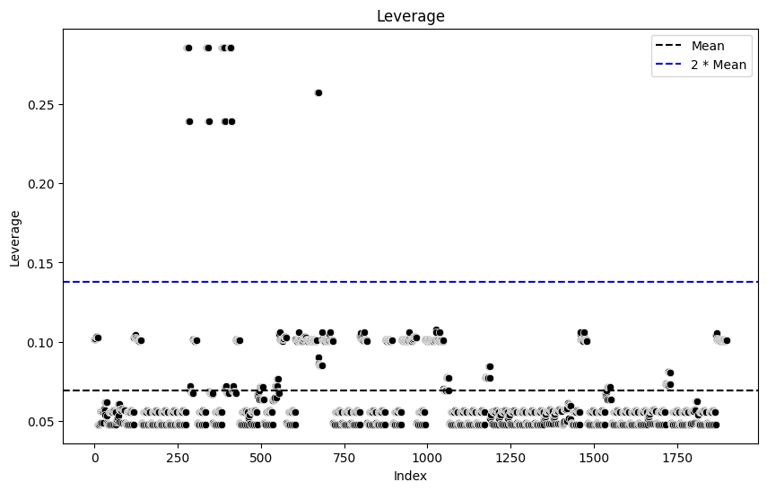
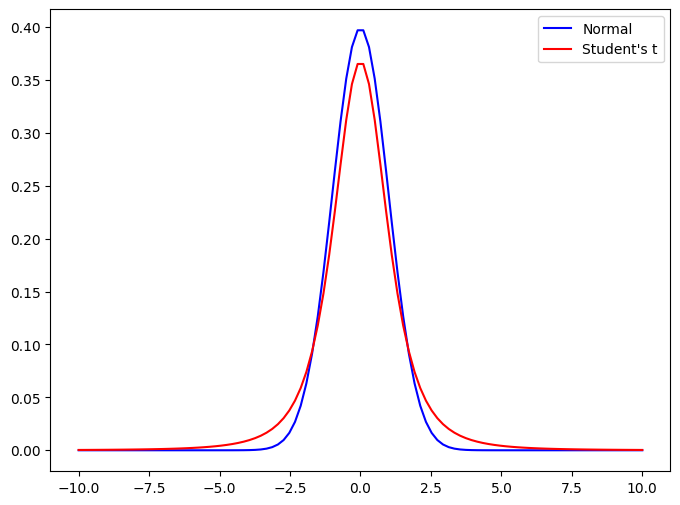
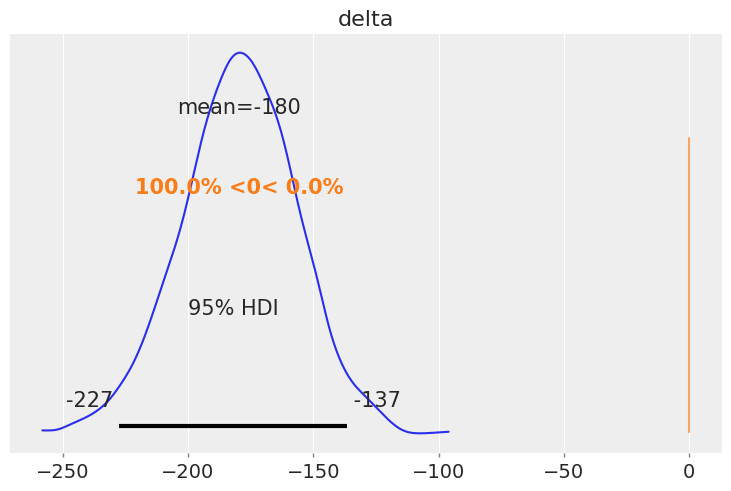
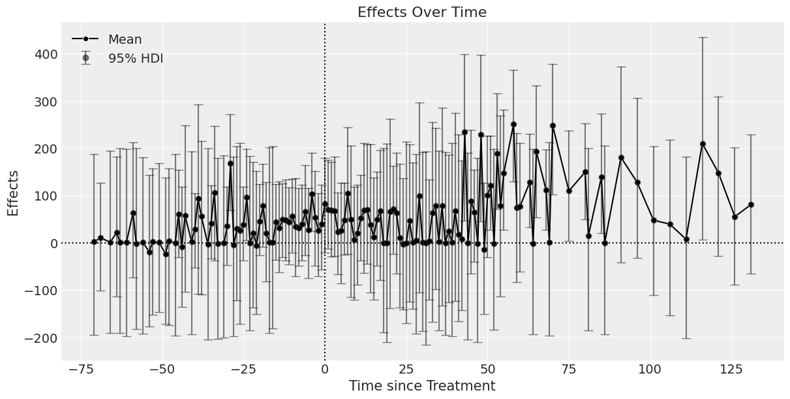
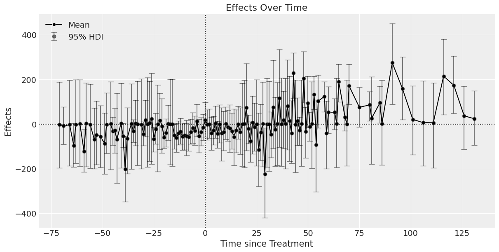

# 卒論: 離島架橋の介入効果

## 穐谷慶成

---

## 目次

1. はじめに
2. 先行研究
3. 新規性・社会的意義
4. ベイズ統計学の概略
5. データと分析手法
6. 分析結果と考察

---

<!-- header: 1. はじめに -->

## 1. はじめに

- 1.1 離島の人口動向
- 1.2 交通インフラの重要性に関する背景
- 1.3 島の橋が人口に及ぼす影響を研究する動機
- 1.4 リサーチクエスチョン

---

## 1.1 離島の人口動向

---

## 1.2 交通インフラの重要性に関する背景

---

## 1.3 島の橋が人口に及ぼす影響を研究する動機

---

## 1.4 リサーチクエスチョン

---

## 2. 先行研究

<!-- header: 2. 先行研究 -->

### 橋

- Maehata (2005)
- Miyauchi & Shimozato (2003)
- Kuwahara (2012)
- Terai & Sato (1999)
- Kashiwadori (1997)

### 橋以外

- Ishikawa & Fukushige (2009)
- Matsumura & Miyoshi (2017)
- Namiki & Kobayashi (2018)
- Fujimoto (2017)

---

## Maehara (2005)

沖縄県の浜比嘉島に架けられた浜比嘉大橋が地域社会に与えた影響を調査しています．

この橋の完成後，住民が増加した一方で，従来のコミュニティと伝統的な生活様式の減退が見られ，経済効果は限定的であったと報告されている．

---

## Miyauchi & Shimozato (2003)

浜比嘉大橋が島の住民数や生活に与えた影響．

この橋の建設により住民の通勤が容易になり，特に若年層の帰郷が増加したが，地域内での経済活動には依然として課題があるとされている．

---

## Kuwahara (2012)

日本の離島開発政策，特に地域間格差の是正を目的とした離島振興法の歴史的概観を提供している．

この研究では，奄美や沖縄のような島々における経済的，インフラ的な改善が強調されている．

日本政府が 1953 年に施行した「離島振興法」に基づき，離島地域の開発政策とその歴史的な変遷について概観している．

特に，奄美や沖縄でのインフラ整備と架橋が地域経済に及ぼした効果を分析している．

---

## Terai & Sato (1999)

西瀬戸自動車道が広島県の生口島に与えた観光産業への影響を調査し、架橋がもたらす観光効果や地域特性の変化について述べている．

---

## Kashiwadori (1997)

四国と本州を結ぶ架橋が地域経済に与えた重要性について検討し，住民の長年の願望であった架橋が経済活性化の鍵であると論じています．

---

## Ishikawa & Fukushige (2009)

財政支出と人口規模が日本の離島の所得水準にプラスの影響を与えることを明らかにした。

しかし、観光は所得に有意な影響を与えなかったことから、離島経済を維持するためには、政府による継続的な支援が必要であることが示唆された．

---

## Matsumura & Miyoshi (2017)

対馬における地域エネルギー企業の影響について論じている．

本土からの輸入に依存することで高い燃料費に直面しがちな離島にとって、地元で調達するエネルギーはより持続可能で経済的に実行可能であると論じている．

---

## Namiki & Kobayashi (2018)

日本最西端の島である与那国島における独自の医療課題を研究している．

彼らは、島外への頻繁な紹介を必要とし、医療アクセシビリティに影響を与える、限られた医療インフラを強調している．

---

## Fujimoto (2017)

日本の離島の経済的持続可能性を調査し、こうした地域社会を維持する上で政府の財政支援が重要な役割を果たしていることを強調している．

藤本は、離島の人口を支える能力は、地元で生み出される収入に大きく依存すると論じている．

---

<!-- header: 3. 新規性&社会的意義 -->

## 3. 新規性&社会的意義

### 新規性

橋の介入効果を計測する論文はない．

### 社会的意義

インフラ投資の効果を計測することで，政策決定の参考になる．

---

<!-- header: 4. ベイズ統計学の概略 -->

## 4. ベイズ統計学の概略

- 4.1 頻度論との違い
- 4.2 一般化線形混合効果モデル (GLMM)
- 4.3 階層ベイズモデル

---

## 4.1 頻度論との違い

ベイズはモデルの柔軟性が高く，結果も直感的に理解しやすい．

|            | 頻度論             | ベイズ                       |
| ---------- | ------------------ | ---------------------------- |
| パラメータ | 固定値             | 確率変数                     |
| アプローチ | 観測データより推定 | 観測データと事前情報より推定 |
| 区間推定   | 信頼区間           | 確信区間                     |
| 仮説検定   | 帰無仮説を棄却     | 仮説が正しい確率を直接計算   |
| 計算手法   | 最尤推定・最小二乗 | マルコフ連鎖モンテカルロ法   |
| 特徴       | 客観的・経験主義的 | 主観的 (※事前情報次第)       |

---

## 4.2 一般化線形混合モデル (GLMM)

- 4.2.1 一般化線形モデル (GLM)
- 4.2.2 線形混合モデル (LMM)

---

## 4.2.1 一般化線形モデル (GLM)

- 正規分布以外の確率分布を仮定する手法．

---

## 4.2.2 線形混合モデル (LMM)

- ランダム切片
- ランダム係数

---

## 4.3 階層ベイズモデル

$$
P(\theta|\text(Data)) \propto {P(\text(Data)|\theta)P(\theta)}
$$

---

<!-- header: 5. データと分析手法 -->

## 5. データと分析手法

- 5.1 離島人口データの説明
- 5.2 データの出典
- 5.3 モデル
- 5.4 欠損値
- 5.5 外れ値

---

## 5.1 離島人口データの説明

---

## 5.2 データの出典

---

## 5.3 モデル

- 5.3.1 分析に用いるフレームワークの紹介
- 5.3.2 ベイズモデルへの拡張

---

## 5.3.1 分析に用いるフレームワークの紹介

- Two-way Fixed Effects
- Dynamic TWFE
- Fully-saturated TWFE

---

## 5.3.1 分析に用いるフレームワークの紹介 TWFE

$$
Y_{it} = \alpha_i + \lambda_t + \delta T_{it} + \epsilon_{it}
$$

- $\alpha_i$ : 個体効果
- $\lambda_t$ : 時間効果
- $\delta$ : 介入効果パラメータ
- $T_{it}$ : 介入変数 (介入前: $0$．介入後: $1$．)
- $\epsilon_{it}$ : 誤差項

介入効果 $\delta$ は個体や時間を通じて一定という仮定を置いている．
現実的には $\delta$ は横断的・時系列的な異質性を持つため，バイアスが生じる．

---

## 5.3.1 分析に用いるフレームワークの紹介 Dynamic TWFE

時系列的な異質性に対処．

$$
Y_{it} = \alpha_i + \lambda_t + \sum_{\ell \in L} \delta_{\ell} \mathbf{1}[t - k_i = \ell] + \epsilon_{it}
$$

- $t$ : 観測年
- $k_i$ : 個体 $i$ 毎の介入タイミング
- $l$ : 介入タイミングに対する相対的な年数．正ならば介入の経過年数を表す．
  - 介入前: 負．橋ができる $10$ 年前のデータは$-10$
  - 介入年: $0$
  - 介入後: 正

横断的な異質性には対処していない点で問題がある．

---

## 5.3.1 分析に用いるフレームワークの紹介 Fully-saturated TWFE

Sun & Abraham (2021)

横断的・時系列的な異質性に対処．

$$
Y_{it} = \alpha_i + \lambda_t + \sum_{k \notin C}\sum_{\ell \in L} \delta_{\ell,k} \mathbf{1}[G_k=k]\mathbf{1}[t-k=\ell] + \epsilon_{it}
$$

- $k$ : 介入タイミング．
- $l$ : 介入タイミングに対する相対的な年数．

介入タイミングを表すダミーと相対的な年数を表すダミーの交差項を導入．
効果がありそうな個体ほど先に介入する．

---

## 5.3.2 ベイズモデルへの拡張

1. Pooled model
2. TWFE
   島，年のランダム効果を追加
3. Dynamic TWFE
   介入効果パラメータに介入経過年数のばらつきを考慮
4. Fully-saturated TWFE
   介入効果パラメータに介入タイミングのばらつきを考

---

## 5.3.2 ベイズモデルへの拡張 TWFE

頻度論

$$
Y_{it} = \alpha_i + \lambda_t + \delta T_{it} + \epsilon_{it}
$$

ベイズモデル

$$
\begin{aligned}
Y_{it} &\sim \mathcal{t} (\nu=3, \mu, \sigma^2) \\
\mu &= \text{intercept} + \delta T_{it} + \text{island}_i + \text{year}_t \\
\sigma &\sim \text{Half-}\mathcal{t}(\nu=3, 100^2) \\
\text{intercept} &\sim \mathcal{N}(0, 100^2) \\
\delta &\sim \mathcal{N}(0, 100^2) \\
\text{island}_i &\sim \mathcal{N}(0, 100^2) \\
\text{year}_t &\sim \mathcal{N}(0, 100^2) \\
\end{aligned}
$$

---

## 5.3.2 ベイズモデルへの拡張 TWFE

階層ベイズモデル

$$
\begin{aligned}
Y_{it} &\sim \mathcal{t} (\nu=3, \mu, \sigma^2) \\
\mu &= \text{intercept} + \delta T_{it} + \text{island}_i + \text{year}_t \\
\sigma &\sim \text{Half-}\mathcal{t}(\nu=3, 100^2) \\
\text{intercept} &\sim \mathcal{N}(0, 100^2) \\
\delta &\sim \mathcal{N}(0, 100^2) \\
\text{island}_i &\sim \mathcal{N}(\mu_{island}, \sigma_{island}^2) \\
\text{year}_t &\sim \mathcal{N}(\mu_{year}, \sigma_{year}^2) \\
\end{aligned}
$$

ハイパーパラメータ

$$
\begin{aligned}
\mu_{hyper} &\sim \mathcal{N}(0, 100^2) \\
\sigma_{hyper} &\sim \text{Half-}\mathcal{t}(\nu=3, 100^2)
\end{aligned}
$$

---

## 5.3.2 ベイズモデルへの拡張 Dynamic TWFE

頻度論

$$
Y_{it} = \alpha_i + \lambda_t + \sum_{\ell \in L} \delta_{\ell} \mathbf{1}[t - k_i = \ell] + \epsilon_{it}
$$

ベイズモデル

$$
\begin{aligned}
Y_{it} &\sim \mathcal{t} (\nu=3, \mu, \sigma^2) \\
\mu &= \text{intercept} + (\delta + {\gamma}_{\ell}) T_{it} + \text{island}_i + \text{year}_t \\
\sigma &\sim \text{Half-}\mathcal{t}(\nu=3, 100^2) \\
\text{intercept} &\sim \mathcal{N}(0, 100^2
\delta &\sim \mathcal{N}(0, 100^2) \\
\gamma_{\ell} &\sim \mathcal{N}(0, 100^2) \\
\text{island}_i &\sim \mathcal{N}(0, 100^2) \\
\text{year}_t &\sim \mathcal{N}(0, 100^2) \\
\end{aligned}
$$

---

## 5.3.2 ベイズモデルへの拡張 Dynamic TWFE

階層ベイズモデル

$$
\begin{aligned}
Y_{it} &\sim \mathcal{t} (\nu=3, \mu, \sigma^2) \\
\mu &= \text{intercept} + (\delta + {\gamma}_{\ell}) T_{it} + \text{island}_i + \text{year}_t \\
\sigma &\sim \text{Half-}\mathcal{t}(\nu=3, 100^2) \\
\text{intercept} &\sim \mathcal{N}(0, 100^2) \\
\delta &\sim \mathcal{N}(0, 100^2) \\
\gamma_{\ell} &\sim \mathcal{N}(\mu_{\gamma}, \sigma_{\gamma}^2) \\
\text{island}_i &\sim \mathcal{N}(\mu_{island}, \sigma_{island}^2) \\
\text{year}_t &\sim \mathcal{N}(\mu_{year}, \sigma_{year}^2) \\
\end{aligned}
$$

ハイパーパラメータ

$$
\begin{aligned}
\mu_{hyper} &\sim \mathcal{N}(0, 100^2) \\
\sigma_{hyper} &\sim \text{Half-}\mathcal{t}(\nu=3, 100^2)
\end{aligned}
$$

---

## 5.3.2 ベイズモデル拡張 Fully-saturated TWFE

頻度論

$$
Y_{it} = \alpha_i + \lambda_t + \sum_{k \notin C}\sum_{\ell \in L} \delta_{\ell,k} \mathbf{1}[G_k=k]\mathbf{1}[t-k=\ell] + \epsilon_{it}
$$

ベイズモデル

$$
\begin{aligned}
Y_{it} &\sim \mathcal{t} (\nu=3, \mu, \sigma^2) \\
\mu &= \text{intercept} + (\delta + {\gamma}_{\ell} + \gamma_k) T_{it} + \text{island}_i + \text{year}_t \\
\sigma &\sim \text{Half-}\mathcal{t}(\nu=3, 100^2) \\
\text{intercept} &\sim \mathcal{N}(0, 100^2
\delta &\sim \mathcal{N}(0, 100^2) \\
\gamma_{\ell} &\sim \mathcal{N}(0, 100^2) \\
\gamma_k &\sim \mathcal{N}(0, 100^2) \\
\text{island}_i &\sim \mathcal{N}(0, 100^2) \\
\text{year}_t &\sim \mathcal{N}(0, 100^2) \\
\end{aligned}
$$

---

## 5.3.2 ベイズモデルの拡張 Fully-saturated TWFE

階層ベイズモデル

$$
\begin{aligned}
Y_{it} &\sim \mathcal{t} (\nu=3, \mu, \sigma^2) \\
\mu &= \text{intercept} + (\delta + {\gamma}_{\ell} + \gamma_{k}) T_{it} + \text{island}_i + \text{year}_t \\
\sigma &\sim \text{Half-}\mathcal{t}(\nu=3, 100^2) \\
\text{intercept} &\sim \mathcal{N}(0, 100^2) \\
\delta &\sim \mathcal{N}(0, 100^2) \\
\gamma_{\ell} &\sim \mathcal{N}(\mu_{\gamma_{\ell}}, \sigma_{\gamma_{\ell}}^2) \\
\gamma_k &\sim \mathcal{N}(\mu_{\gamma_k}, \sigma_{\gamma_k}^2) \\
\text{island}_i &\sim \mathcal{N}(\mu_{island}, \sigma_{island}^2) \\
\text{year}_t &\sim \mathcal{N}(\mu_{year}, \sigma_{year}^2) \\
\end{aligned}

$$

---

## 5.4 欠損値

人口データが手に入らないこともあるので，欠損値が 10%ほどある．

PyMC が良い感じで補完してくれるので一旦はそれでやっている．

勉強中につき，まだ謎だが，デフォルトで補完機能がついているので信頼している．

---

## 5.5 外れ値

- 5.5.1 レバレッジ
- 5.5.2 $t$ 分布によるロバスト推定

---

## 5.5.1 レバレッジ

各観測値がモデルに与える影響度を評価できる．
レバレッジスコアが高い観測値はモデルに対して強い影響を持つ．

説明変数 $X$ のハット行列の対角要素．

$$
H = \mathbf{X} (\mathbf{X}^T \mathbf{X})^{-1} \mathbf{X}^T
$$

レバレッジスコア $L_i$ は $H$ の $i$ 番目の対角要素．

$$
L_i = H_{ii}
$$

なお，$0 \leq L_i \leq 1$．

(Hoaglin & Welsch, 1978)

---

## 5.5.1 レバレッジ

|                       | $L_{i}$  |
| --------------------- | -------- |
| 平均値                | $0.0689$ |
| 理論値                | $0.0695$ |
| 最大値                | $0.2860$ |
| 平均値の$2$倍         | $0.1379$ |
| $2$倍以上の観測値数   | $43$     |
| $2$倍以上の観測値割合 | $2.26\%$ |

(※理論値 $=\frac{k+1}{n}$)

---

## 5.5.2 $t$ 分布によるロバスト推定

誤差項に正規分布ではなく，
正規分布より裾が重い
自由度$3$の $t$ 分布を設定．
外れ値にロバストな
回帰を実行できる．
(Gelman et al., 2013)

(例の欠損値補完が変でもそれに耐えうる推定ができると期待している．)

---

<!-- header: 6. 分析結果と考察 -->

## 6. 分析結果と考察

---

## Two-way Fixed Effects

|              | $\text{Eq}1$ | $\text{Eq}2$ | $\text{Eq}3$ | $\text{Eq}4$ |
| ------------ | ------------ | ------------ | ------------ | ------------ |
| 切片         | $53.82$      | $347.96$     | $44.00$      | $538.22$     |
|              | $(97.15)$    | $(22.79)$    | $(80.43)$    | $(92.84)$    |
| 介入効果     | $-178.77$    | $46.77$      | $44.00$      | $538.22$     |
|              | $(22.47)$    | $(8.25)$     | $(80.43)$    | $(92.84)$    |
| 誤差標準偏差 | $69.78$      | $118.95$     | $1034.10$    | $4987.31$    |
|              | $(2.40)$     | $(6.08)$     | $(18.64)$    | $(88.64)$    |
| WAIC         | $-11916$     | $-13374$     | $-14314$     | $-16871$     |
|              | $(172.38)$   | $(183.69)$   | $(162.60)$   | $(144.00)$   |
| 階層構造     | Yes          | No           | Yes          | No           |
| 分布型       | $t$ 分布     | $t$ 分布     | 正規分布     | 正規分布     |

括弧内は事後標準偏差又は標準誤差

$t$ 分布の方が
正規分布よりも
外れ値の影響を緩和し
推定値が小さい．

WAIC は小さいほうが良い．
$t$ 分布かつ階層ベイズモデルの方が良いモデルと言える．

---

## 介入効果 $\delta$ の事後分布

事後期待値 $= -180$
$Pr(\delta < 0): 100 \%$

橋が架かると人口が 180 人減少する．

しかし，介入効果には
横断的・時系列的な異質性があり
バイアスが生じているはず．

---

## Dynamic TWFE

|              | $\text{Eq}5$ | $\text{Eq}6$ |
| ------------ | ------------ | ------------ |
| 切片         | $$           | $326.83$     |
|              | $()$         | $(24.96)$    |
| 介入効果     | $$           | $129.89$     |
|              | $()$         | $(27.41)$    |
| 誤差標準偏差 | $69.01$      | $119.58$     |
|              | $(2.50)$     | $(6.05)$     |
| WAIC         | $-11949$     | $-13343$     |
|              | $(142.60)$   | $(184.84)$   |
| 階層構造     | Yes          | No           |

括弧内は事後標準偏差又は標準誤差

誤差項の分布型には $t$ 分布を使用．

階層ベイズモデルの方が WAIC が小さいので良いモデル．

介入効果は 136 年分あるので次．

---

## Dynamic TWFE (ベイズモデル) 介入効果 $\delta$ の事後分布

正の影響を
与える期間が多い．

---

## Dynamic TWFE (階層ベイズモデル) 介入効果 $\delta$ の事後分布

橋がかかる前と
架橋数年後は負

架橋後約 $50$ 年以降は正に転じる．

---

## Dynamic TWFE

結果が示すのは以下の $2$ 点．

- 橋ができる前とできた後の数年は人口減少している．
- 橋が出来てから 50 年程経つと人口が増加に転じている．

しかし，まだ横断的な異質性によるバイアスに対処出来ていない．

架橋後 50 年以降のデータが観測されている島は，ほかより早く橋が架かった．
橋を架ける優先順位が高い島々のデータが観測されているにすぎない．
優先順位の高い島々の介入効果は高い事が期待されるため，
介入効果を一般化するためには割り引いて考える必要がある．

---

## Fully-saturated TWFE

|              | $\text{Eq}7$ | $\text{Eq}8$ |
| ------------ | ------------ | ------------ |
| 誤差標準偏差 | $$           | $130.53$     |
|              | $()$         | $(7.38)$     |
| WAIC         | $$           | $-13511$     |
|              | $()$         | $(180.11)$   |
| 階層構造     | Yes          | No           |

括弧内は事後標準偏差又は標準誤差

# 右の子要素

同じくここは**右側**です！
同じくここは**右側**です！

# 下側のゾーン

ここはレイアウトで**下側**に位置します！フッターやまとめの文を挿入できます。

---

<!-- header: 7. 結論 -->

## 7. 結論

---

## 参考文献

DC Hoaglin, RE Welsch. (1978). "The hat matrix in regression and ANOVA." The American Statistician. Taylor & Francis.

Andrew Gelman, John B. Carlin, Hal S. Stern, David B. Dunson, Aki Vehtari, and Donald B. Rubin. (2013). "Bayesian Data Analysis." Chapman and Hall/CRC.
