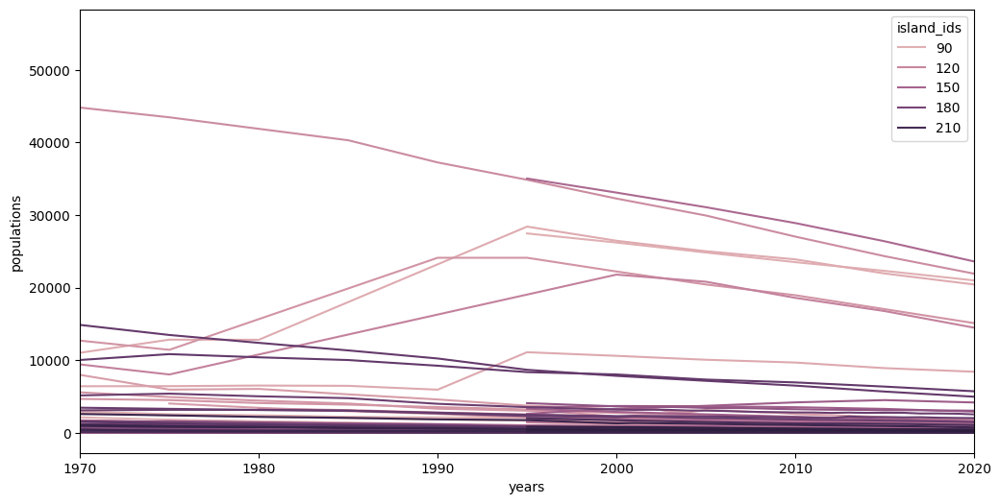
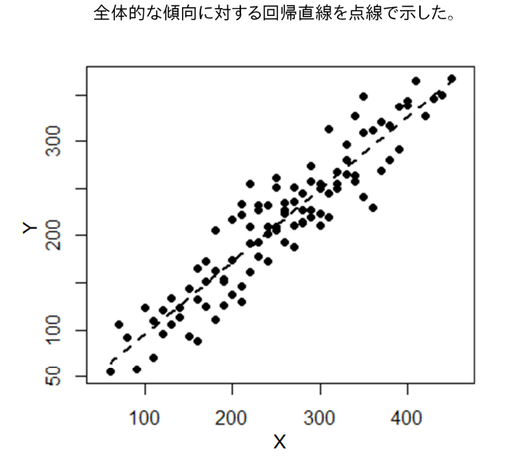
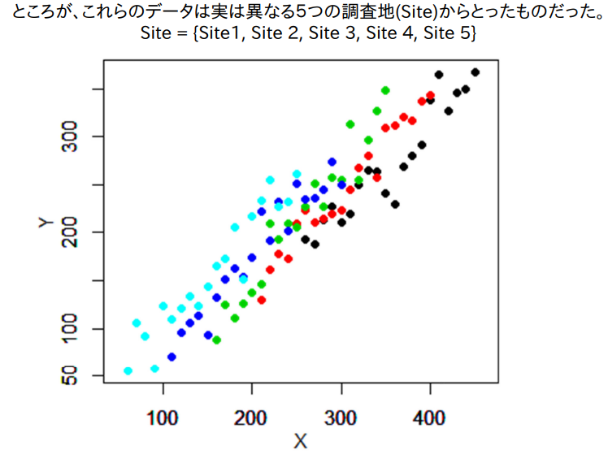
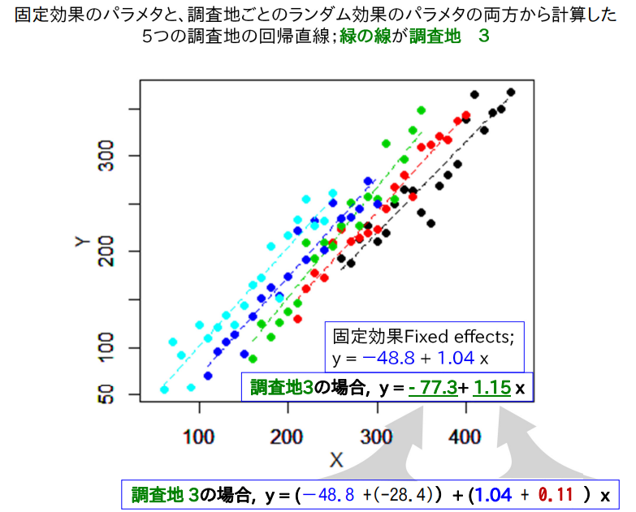

# 卒論: 離島架橋の介入効果

## 穐谷慶成

---

## 目次

1. はじめに
2. 先行研究
3. 新規性・社会的意義
4. ベイズ統計学の概略
5. データと分析手法
6. 分析結果と考察

---

<!-- header: 1. はじめに -->

## 1. はじめに

- 1.1 離島の人口動向
- 1.2 島の橋が人口に及ぼす影響を研究する動機
- 13 リサーチクエスチョン

---

## 1.1 離島の人口動向

---

## 1.2 島の橋が人口に及ぼす影響を研究する動機

離島に橋を架けることで便利になるのはいいが，
ストロー効果を引き起こす可能性があるという説もある(森田ら 2020)．

実際どうなのか調べたい．

---

## 1.3 リサーチクエスチョン

離島架橋が離島人口に与える影響

---

## 2. 先行研究

<!-- header: 2. 先行研究 -->

### 橋

- 前原 (2005)
- 宮内 & 下里 (2003)
- 桑原 (2012)
- 寺井 & 佐藤 (1999)
- 柏鳥 (1997)

### 橋以外

- 石川 & 福重 (2009)
- 松村 & 三好 (2017)
- 並木 & 小林 (2018)
- 藤本 (2017)

---

## 宮内 & 下里 (2003)

浜比嘉大橋が島の住民数や生活に与えた影響．

この橋の建設により住民の通勤が容易になり，特に若年層の帰郷が増加したが，地域内での経済活動には依然として課題があるとされている．

---

## 桑原 (2012)

日本の離島開発政策，特に地域間格差の是正を目的とした離島振興法の歴史的概観を提供している．

この研究では，奄美や沖縄のような島々における経済的，インフラ的な改善が強調されている．

日本政府が 1953 年に施行した「離島振興法」に基づき，離島地域の開発政策とその歴史的な変遷について概観している．

特に，奄美や沖縄でのインフラ整備と架橋が地域経済に及ぼした効果を分析している．

---

## 寺井 & 佐藤 (1999)

西瀬戸自動車道が広島県の生口島に与えた観光産業への影響を調査し、架橋がもたらす観光効果や地域特性の変化について述べている．

---

## 柏島 (1997)

四国と本州を結ぶ架橋が地域経済に与えた重要性について検討し，住民の長年の願望であった架橋が経済活性化の鍵であると論じています．

---

<!-- header: 3. 新規性&社会的意義 -->

## 3. 新規性&社会的意義

### 新規性

橋の介入効果を計測する論文はない．

### 社会的意義

インフラ投資の効果を計測することで，政策決定の参考になる．

---

<!-- header: 4. ベイズ統計学の概略 -->

## 4. ベイズ統計学の概略

- 4.1 頻度論との違い
- 4.2 一般化線形混合効果モデル (GLMM)
- 4.3 階層ベイズモデル

---

## 4.1 頻度論との違い

ベイズはモデルの柔軟性が高く，結果も直感的に理解しやすい．

|            | 頻度論             | ベイズ                       |
| ---------- | ------------------ | ---------------------------- |
| パラメータ | 固定値             | 確率変数                     |
| アプローチ | 観測データより推定 | 観測データと事前情報より推定 |
| 区間推定   | 信頼区間           | 確信区間                     |
| 仮説検定   | 帰無仮説を棄却     | 仮説が正しい確率を直接計算   |
| 計算手法   | 最尤推定・最小二乗 | マルコフ連鎖モンテカルロ法   |
| 特徴       | 客観的・経験主義的 | 主観的 (※事前情報次第)       |

---

## 4.2 一般化線形混合モデル (GLMM)

- 4.2.1 一般化線形モデル (GLM)
- 4.2.2 混合モデル

---

## 4.2.1 一般化線形モデル (GLM)

正規分布以外の確率分布を仮定する手法．

例

- ベルヌーイ分布(ロジスティック回帰)
- ポアソン分布
- $t$ 分布

---

## 4.2.2 混合モデル

パラメータは個体やグループで固定されているという仮定から脱却し，

以下の 2 つを考慮する手法．

- ランダム切片
- ランダム係数

なお，固定効果とランダム効果という用語が登場するが，
計量経済学のパネル分析の用語とは異なるので混乱注意．

---

## 4.2.2 混合モデル

単回帰

$$
Y = \beta_0 + \beta_1 X + \epsilon
$$

混合モデル

$$
Y_{ij} = (\eta_0 + \gamma_{0j}) + (\eta_1 + \gamma_{1j}) X_{ij} + \epsilon_{ij}
$$

$\eta$: 固定効果 (全体的な傾向)
$\gamma$: ランダム効果 (全体的な傾向からのばらつき)
添字 $0$は切片，$1$は傾き，$i$は個体 $j$はグループ

---

https://www2.kpu.ac.jp/for_ecol/obenkyou/GLMMexample.pdf

---

https://www2.kpu.ac.jp/for_ecol/obenkyou/GLMMexample.pdf

---

https://www2.kpu.ac.jp/for_ecol/obenkyou/GLMMexample.pdf

---

## 4.3 階層ベイズモデル

ランダム効果パラメータがより上位のハイパーパラメータから生成される．
階層モデルによってグループ間の情報が共有されることで，グループ毎にデータがアンバランスでも推定ができる(ピーター D ホフ. 標準ベイズ統計学)．

---

<!-- header: 5. データと分析手法 -->

## 5. データと分析手法

- 5.1 データ
- 5.2 モデル
- 5.3 欠損値
- 5.4 外れ値

---

## 5.1 データ

- 5.1.1 データの出展
- 5.1.2 分析対象

---

## 5.1.1 データの出典

- 人口
  - 国勢調査
  - 離島統計年報
- 橋の有無
  - Google Earth
- 橋の建設年
  - 色々な所から．

---

## 5.1.2 分析対象

四国中国地方 (島根，岡山，広島，山口，徳島，香川，愛媛，高知)
島数: 94
期間: 1970 年から 2020 年(欠損あり)

※遠すぎる島は除外(橋のギネス世界記録が明石海峡大橋$1991ｍ$)

---

## 5.3 モデル

- 5.3.1 分析に用いるフレームワークの紹介
- 5.3.2 ベイズモデルへの拡張

---

## 5.3.1 分析に用いるフレームワークの紹介

- Two-way Fixed Effects
- Dynamic TWFE
- Fully-saturated TWFE

---

## 5.3.1 分析に用いるフレームワークの紹介 TWFE

$$
Y_{it} = \alpha_i + \lambda_t + \delta T_{it} + \epsilon_{it}
$$

- $\alpha_i$ : 個体効果
- $\lambda_t$ : 時間効果
- $\delta$ : 介入効果パラメータ
- $T_{it}$ : 介入変数 (介入前: $0$．介入後: $1$．)
- $\epsilon_{it}$ : 誤差項

介入効果 $\delta$ は個体や時間を通じて一定という仮定を置いている．
現実的には $\delta$ は横断的・時系列的な異質性を持つため，バイアスが生じる．

---

## 5.3.1 分析に用いるフレームワークの紹介 Dynamic TWFE

時系列的な異質性に対処．

$$
Y_{it} = \alpha_i + \lambda_t + \sum_{\ell \in L} \delta_{\ell} \mathbf{1}[t - k_i = \ell] + \epsilon_{it}
$$

- $t$ : 観測年
- $k_i$ : 個体 $i$ 毎の介入タイミング
- $l$ : 介入タイミングに対する相対的な年数．正ならば介入の経過年数を表す．
  - 介入前: 負．橋ができる $10$ 年前のデータは$-10$
  - 介入年: $0$
  - 介入後: 正

横断的な異質性には対処していない点で問題がある．

---

## 5.3.1 分析に用いるフレームワークの紹介 Fully-saturated TWFE

Sun & Abraham (2021)

横断的・時系列的な異質性に対処．

$$
Y_{it} = \alpha_i + \lambda_t + \sum_{k \notin C}\sum_{\ell \in L} \delta_{\ell,k} \mathbf{1}[G_k=k]\mathbf{1}[t-k=\ell] + \epsilon_{it}
$$

- $k$ : 介入タイミング．
- $l$ : 介入タイミングに対する相対的な年数．

介入タイミングを表すダミーと相対的な年数を表すダミーの交差項を導入．
効果がありそうな個体ほど先に介入する．

---

## 5.3.2 ベイズモデルへの拡張

1. TWFE
   島，年のランダム効果を追加
2. Dynamic TWFE
   介入効果パラメータに介入経過年数のばらつきを考慮
3. Fully-saturated TWFE
   介入効果パラメータに介入タイミングのばらつきを考

---

## 5.3.2 ベイズモデルへの拡張 TWFE

頻度論

$$
Y_{it} = \alpha_i + \lambda_t + \delta T_{it} + \epsilon_{it}
$$

ベイズモデル

$$
\begin{aligned}
Y_{it} &\sim \mathcal{t} (\nu=3, \mu, \sigma^2) \\
\mu &= \text{intercept} + \delta T_{it} + \text{island}_i + \text{year}_t \\
\sigma &\sim \text{Half-}\mathcal{t}(\nu=3, 100^2) \\
\text{intercept} &\sim \mathcal{N}(0, 100^2) \\
\delta &\sim \mathcal{N}(0, 100^2) \\
\text{island}_i &\sim \mathcal{N}(0, 100^2) \\
\text{year}_t &\sim \mathcal{N}(0, 100^2) \\
\end{aligned}
$$

---

## 5.3.2 ベイズモデルへの拡張 TWFE

階層ベイズモデル

$$
\begin{aligned}
Y_{it} &\sim \mathcal{t} (\nu=3, \mu, \sigma^2) \\
\mu &= \text{intercept} + \delta T_{it} + \text{island}_i + \text{year}_t \\
\sigma &\sim \text{Half-}\mathcal{t}(\nu=3, 100^2) \\
\text{intercept} &\sim \mathcal{N}(0, 100^2) \\
\delta &\sim \mathcal{N}(0, 100^2) \\
\text{island}_i &\sim \mathcal{N}(\mu_{island}, \sigma_{island}^2) \\
\text{year}_t &\sim \mathcal{N}(\mu_{year}, \sigma_{year}^2) \\
\end{aligned}
$$

ハイパーパラメータ

$$
\begin{aligned}
\mu_{hyper} &\sim \mathcal{N}(0, 100^2) \\
\sigma_{hyper} &\sim \text{Half-}\mathcal{t}(\nu=3, 100^2)
\end{aligned}
$$

---

## 5.3.2 ベイズモデルへの拡張 Dynamic TWFE

頻度論

$$
Y_{it} = \alpha_i + \lambda_t + \sum_{\ell \in L} \delta_{\ell} \mathbf{1}[t - k_i = \ell] + \epsilon_{it}
$$

ベイズモデル

$$
\begin{aligned}
Y_{it} &\sim \mathcal{t} (\nu=3, \mu, \sigma^2) \\
\mu &= \text{intercept} + (\delta + {\gamma}_{\ell}) T_{it} + \text{island}_i + \text{year}_t \\
\sigma &\sim \text{Half-}\mathcal{t}(\nu=3, 100^2) \\
\text{intercept} &\sim \mathcal{N}(0, 100^2
\delta &\sim \mathcal{N}(0, 100^2) \\
\gamma_{\ell} &\sim \mathcal{N}(0, 100^2) \\
\text{island}_i &\sim \mathcal{N}(0, 100^2) \\
\text{year}_t &\sim \mathcal{N}(0, 100^2) \\
\end{aligned}
$$

---

## 5.3.2 ベイズモデルへの拡張 Dynamic TWFE

階層ベイズモデル

$$
\begin{aligned}
Y_{it} &\sim \mathcal{t} (\nu=3, \mu, \sigma^2) \\
\mu &= \text{intercept} + (\delta + {\gamma}_{\ell}) T_{it} + \text{island}_i + \text{year}_t \\
\sigma &\sim \text{Half-}\mathcal{t}(\nu=3, 100^2) \\
\text{intercept} &\sim \mathcal{N}(0, 100^2) \\
\delta &\sim \mathcal{N}(0, 100^2) \\
\gamma_{\ell} &\sim \mathcal{N}(\mu_{\gamma}, \sigma_{\gamma}^2) \\
\text{island}_i &\sim \mathcal{N}(\mu_{island}, \sigma_{island}^2) \\
\text{year}_t &\sim \mathcal{N}(\mu_{year}, \sigma_{year}^2) \\
\end{aligned}
$$

ハイパーパラメータ

$$
\begin{aligned}
\mu_{hyper} &\sim \mathcal{N}(0, 100^2) \\
\sigma_{hyper} &\sim \text{Half-}\mathcal{t}(\nu=3, 100^2)
\end{aligned}
$$

---

## 5.3.2 ベイズモデル拡張 Fully-saturated TWFE

頻度論

$$
Y_{it} = \alpha_i + \lambda_t + \sum_{k \notin C}\sum_{\ell \in L} \delta_{k,\ell} \mathbf{1}[G_k=k]\mathbf{1}[t-k=\ell] + \epsilon_{it}
$$

ベイズモデル

$$
\begin{aligned}
Y_{it} &\sim \mathcal{t} (\nu=3, \mu, \sigma^2) \\
\mu &= \text{intercept} + (\delta + {\gamma}_{k,\ell}) T_{it} + \text{island}_i + \text{year}_t \\
\sigma &\sim \text{Half-}\mathcal{t}(\nu=3, 100^2) \\
\text{intercept} &\sim \mathcal{N}(0, 100^2
\delta &\sim \mathcal{N}(0, 100^2) \\
\gamma_{k,\ell} &\sim \mathcal{N}(0, 100^2) \\
\text{island}_i &\sim \mathcal{N}(0, 100^2) \\
\text{year}_t &\sim \mathcal{N}(0, 100^2) \\
\end{aligned}
$$

---

## 5.3.2 ベイズモデルの拡張 Fully-saturated TWFE

階層ベイズモデル

$$
\begin{aligned}
Y_{it} &\sim \mathcal{t} (\nu=3, \mu, \sigma^2) \\
\mu &= \text{intercept} + (\delta + {\gamma}_{k,\ell}) T_{it} + \text{island}_i + \text{year}_t \\
\sigma &\sim \text{Half-}\mathcal{t}(\nu=3, 100^2) \\
\text{intercept} &\sim \mathcal{N}(0, 100^2) \\
\delta &\sim \mathcal{N}(0, 100^2) \\
\gamma_{k,\ell} &\sim \mathcal{N}(\mu_{\gamma_{k,\ell}}, \sigma_{\gamma_{k,\ell}}^2) \\
\text{island}_i &\sim \mathcal{N}(\mu_{island}, \sigma_{island}^2) \\
\text{year}_t &\sim \mathcal{N}(\mu_{year}, \sigma_{year}^2) \\
\end{aligned}
$$

ハイパーパラメータ

$$
\begin{aligned}
\mu_{hyper} &\sim \mathcal{N}(0, 100^2) \\
\sigma_{hyper} &\sim \text{Half-}\mathcal{t}(\nu=3, 100^2)
\end{aligned}
$$

---

## 5.4 欠損値

人口データが手に入らないこともあるので，欠損値が 10%ほどある．

PyMC が良い感じ(？)で補完してくれるので一旦はそれでやっている．

勉強中につき，まだ謎だが，デフォルトで補完機能がついているので信頼している．

従来の欠損値の対処には以下の問題があるので，他の対処方法が推奨される(ピーター D ホフ. 標準ベイズ統計)．

- 欠損をすべて消すのは情報の損失
- 何かを代入することは観測されていないデータを使う

---

## 5.5 外れ値

- 5.5.1 レバレッジ
- 5.5.2 $t$ 分布によるロバスト推定

---

## 5.5.1 レバレッジ

各観測値がモデルに与える影響度を評価できる．
レバレッジスコアが高い観測値はモデルに対して強い影響を持つ．

説明変数 $X$ のハット行列の対角要素．

$$
H = \mathbf{X} (\mathbf{X}^T \mathbf{X})^{-1} \mathbf{X}^T
$$

レバレッジスコア $L_i$ は $H$ の $i$ 番目の対角要素．

$$
L_i = H_{ii}
$$

なお，$0 \leq L_i \leq 1$．

(Hoaglin & Welsch, 1978)

---

## 5.5.1 レバレッジ

|                       | $L_{i}$  |
| --------------------- | -------- |
| 平均値                | $0.0689$ |
| 理論値                | $0.0695$ |
| 最大値                | $0.2860$ |
| 平均値の$2$倍         | $0.1379$ |
| $2$倍以上の観測値数   | $43$     |
| $2$倍以上の観測値割合 | $2.26\%$ |

(※理論値 $=\frac{k+1}{n}$)

---

## 5.5.2 $t$ 分布によるロバスト推定

正規分布

$$
Y_{it} \sim \mathcal{N}(\mu, \sigma^2)
$$

ではなく，
正規分布より裾が重い
自由度$3$の $t$ 分布

$$
Y_{it} \sim \mathcal{t}(\nu=3, \mu, \sigma^2)
$$

を設定．
外れ値にロバストな
回帰を実行できる．
(Gelman et al., 2013)

(例の欠損値補完が変でもそれに耐えうる推定ができると期待している．)

---

<!-- header: 6. 分析結果と考察 -->

## 6. 分析結果と考察

---

## Two-way Fixed Effects

|              | $\text{Eq}1$ | $\text{Eq}2$ |
| ------------ | ------------ | ------------ |
| 切片         | $53.82$      | $347.96$     |
|              | $(97.15)$    | $(22.79)$    |
| 介入効果     | $-178.77$    | $46.77$      |
|              | $(22.47)$    | $(8.25)$     |
| 誤差標準偏差 | $69.78$      | $118.95$     |
|              | $(2.40)$     | $(6.08)$     |
| WAIC         | $-11916$     | $-13374$     |
|              | $(172.38)$   | $(183.69)$   |
| 階層構造     | Yes          | No           |

括弧内は事後標準偏差又は標準誤差

WAIC はモデルの適合度と複雑さを評価するための情報量基準．
小さいほうが良い．
階層ベイズモデルの方が良いモデルと言える．

---

## 介入効果 $\delta$ の事後分布

事後期待値 $= -180$
$Pr(\delta < 0): 100 \%$

橋が架かると人口が 180 人減少する．

しかし，介入効果には
横断的・時系列的な異質性があり
バイアスが生じているはず．

---

## Dynamic TWFE

|              | $\text{Eq}3$ | $\text{Eq}4$ |
| ------------ | ------------ | ------------ |
| 切片         | $67.83$      | $326.83$     |
|              | $(99.98)$    | $(24.96)$    |
| 介入効果     | $-182.29$    | $129.89$     |
|              | $(23.29)$    | $(27.41)$    |
| 誤差標準偏差 | $70.16$      | $119.58$     |
|              | $(2.44)$     | $(6.05)$     |
| WAIC         | $-12113.89$  | $-13343$     |
|              | $(188.72)$   | $(184.84)$   |
| 階層構造     | Yes          | No           |

括弧内は事後標準偏差又は標準誤差．

---

## Fully-saturated TWFE

|              | $\text{Eq}5$ | $\text{Eq}6$ |
| ------------ | ------------ | ------------ |
| 切片         | $59.82$      | $341.21$     |
|              | $(94.08)$    | $(23.92)$    |
| 介入効果     | $-311.63$    | $97.29$      |
|              | $(47.58)$    | $(25.81)$    |
| 誤差標準偏差 | $46.03$      | $130.77$     |
|              | $(1.92)$     | $(7.52)$     |
| WAIC         | $-11751$     | $-13433$     |
|              | $(221.88)$   | $(177.39)$   |
| 階層構造     | Yes          | No           |

括弧内は事後標準偏差又は標準誤差

---

## 結果のまとめ

|              | TWFE       | DTWFE      | FSTWFE     |
| ------------ | ---------- | ---------- | ---------- |
| 切片         | $53.82$    | $67.83$    | $59.82$    |
|              | $(97.15)$  | $(99.98)$  | $(94.08)$  |
| 介入効果     | $-178.77$  | $-182.29$  | $-311.63$  |
|              | $(22.47)$  | $(23.29)$  | $(47.58)$  |
| 誤差標準偏差 | $69.78$    | $70.16$    | $46.03$    |
|              | $(2.40)$   | $(2.44)$   | $(1.92)$   |
| WAIC         | $-11916$   | $-12114$   | $-11751$   |
|              | $(172.38)$ | $(188.72)$ | $(221.88)$ |
| 階層構造     | Yes        | Yes        | Yes        |

WAIC を見ると FSTWFE が一番良さそう．

島や年によってばらつきはあれど，固定効果をみると 311 人減る．

---

<!-- header: 7. 今後の方針 -->

## 7. 今後の方針

- わからない所を潰す．
- ランダム効果の解釈

---

## 参考文献

森田, 猪原, 中村. (2020). "空間経済学に基づくストロー効果の発生条件とその影響 --明石海峡大橋を事例として". 日本経済研究.

ピーター D ホフ. (2022). "標準ベイズ統計". 朝倉書店.

DC Hoaglin, RE Welsch. (1978). "The hat matrix in regression and ANOVA." The American Statistician. Taylor & Francis.

Andrew Gelman, John B. Carlin, Hal S. Stern, David B. Dunson, Aki Vehtari, and Donald B. Rubin. (2013). "Bayesian Data Analysis." Chapman and Hall/CRC.
