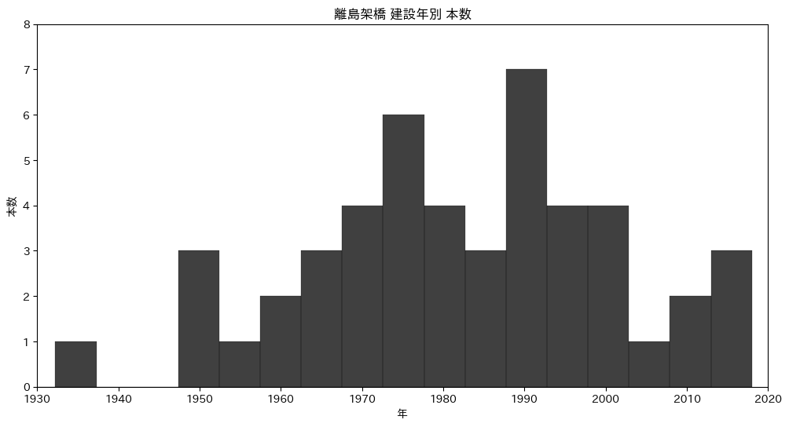

# 卒論: 離島架橋の介入効果

## 穐谷慶成

---

## 目次

1. はじめに
2. 先行研究
3. 新規性・社会的意義
4. データと分析手法
5. 分析結果と考察

---

<!-- header: 1. はじめに -->

## 1. はじめに

- 1.1 離島の人口動向
- 1.2 島の橋が人口に及ぼす影響を研究する動機
- 13 リサーチクエスチョン

---

## 1.1 離島の人口動向

---

## 1.2 島の橋が人口に及ぼす影響を研究する動機

離島に橋を架けることで便利になるのはいいが，
ストロー効果を引き起こす可能性があるという説もある(森田ら 2020)．

実際どうなのか調べたい．

---

## 1.3 リサーチクエスチョン

離島架橋が離島人口に与える動的な効果を調査する．

---

## 2. 先行研究

<!-- header: 2. 先行研究 -->

### 橋

- 前原 (2005)
- 宮内 & 下里 (2003)
- 桑原 (2012)
- 寺井 & 佐藤 (1999)
- 柏鳥 (1997)

### 橋以外

- 石川 & 福重 (2009)
- 松村 & 三好 (2017)
- 並木 & 小林 (2018)
- 藤本 (2017)

---

## 宮内 & 下里 (2003)

浜比嘉大橋が島の住民数や生活に与えた影響．

この橋の建設により住民の通勤が容易になり，特に若年層の帰郷が増加したが，地域内での経済活動には依然として課題があるとされている．

---

## 桑原 (2012)

日本の離島開発政策，特に地域間格差の是正を目的とした離島振興法の歴史的概観を提供している．

この研究では，奄美や沖縄のような島々における経済的，インフラ的な改善が強調されている．

日本政府が 1953 年に施行した「離島振興法」に基づき，離島地域の開発政策とその歴史的な変遷について概観している．

特に，奄美や沖縄でのインフラ整備と架橋が地域経済に及ぼした効果を分析している．

---

## 寺井 & 佐藤 (1999)

西瀬戸自動車道が広島県の生口島に与えた観光産業への影響を調査し，架橋がもたらす観光効果や地域特性の変化について述べている．

---

## 柏島 (1997)

四国と本州を結ぶ架橋が地域経済に与えた重要性について検討し，住民の長年の願望であった架橋が経済活性化の鍵であると論じている．

---

<!-- header: 3. 新規性&社会的意義 -->

## 3. 新規性&社会的意義

### 新規性

橋の介入効果を計測する論文はない．

### 社会的意義

インフラ投資の効果を計測することで，政策決定の参考になる．

---

<!-- header: 4. データと分析手法 -->

## 5. データと分析手法

- 5.1 データ
- 5.2 フレームワーク
- 5.3 欠損値
- 5.4 外れ値
- 5.5 モデリング

---

## 5.1 データ

- 5.1.1 データの出展
- 5.1.2 分析対象

---

## 5.1.1 データの出典

- 人口
  - 国勢調査
  - 離島統計年報 (住民基本台帳調査から)
- 橋の有無
  - Google Earth
- 橋の建設年
  - 色々な所から(Wikipedia 等含む)．

---

## 5.1.2 分析対象

中国四国地方
(島根，岡山，広島，山口，徳島，香川，愛媛，高知)
島数: 94
期間: 1970 年から 2020 年(欠損あり)

※ ギネス世界記録の世界最長の吊橋を参考に遠すぎる島を除外
1915 Çanakkale Bridge は$2023m$ で 2022 年に認定された．
明石海峡大橋は $1991m$ で 1998 年に認定された．

---

## 5.2 フレームワーク

- 基本形:
  - Two-way Fixed Effects
- 介入の動的な効果を測る:
  - Dynamic Two-way Fixed Effects
- 横断的な異質性に対処する:
  - Fully-saturated Two-way Fixed Effects

---

## 5.2 フレームワーク概要

人口

島の個体差

年ごとの共通要因

介入

---

## 5.2.1 Two-way Fixed Effects (TWFE)

$$
\text{人口}_{it} = \text{切片} + \text{介入}_{it} + \text{島の個体差}_{i} + \text{年毎の共通要因}_{t}
$$

- 添字 $i$: 島． $t$: 年．
- 介入:
  - 橋が架かっているか否か．
- 島の個体差:
  - 本土からの距離や，地形的な橋の架けにくさ等の特性．
- 年毎の共通要因:
  - 全国的な人口減少，経済成長．

---

## 5.2.2 Dynamic TWFE

$$
人口_{it} = \text{切片} + (\beta + \gamma_{\ell})\text{介入}_{it} + \text{島}_i + \text{年}_t + \epsilon_{it}
$$

- $\text{介入}_{it}$: 介入後に 1．
- $\beta$: 介入の全体的な傾向を示す固定効果
- $\gamma$: 介入の $\ell$(経過年数) によって変動するランダム効果

経過年数によって介入の効果は異なるはず．
時間を通じて平均的な効果を $\beta$ で表し，経過年数毎に変動する効果を $\gamma_{\ell}$ で表す．

※経過年$\ell$
介入後: 正，介入時: 0 ，介入前: 負(2000 年に出来た島の 1990 年のデータは $\ell = -10$)

---

## 5.2.2 Dynamic TWFE

問題点

架橋は同時に行われない．
効果がありそうな所から橋を架けるだろう．

- 先に架かった橋:
  良い効果が出るはず．
- 後に架かった橋:
  良い効果は出にくいはず．

---

## 5.2.3 Fully-saturated TWFE

Sun & Abraham (2021)

$$
Y_{it} = \alpha_i + \lambda_t + \sum_{k \notin C}\sum_{\ell \in L} \delta_{\ell,k} \mathbf{1}[G_k=k]\mathbf{1}[t-k=\ell] + \epsilon_{it}
$$

- $k$ : 介入タイミング．
- $l$ : 介入タイミングに対する相対的な年数．

介入タイミングを表すダミーと相対的な年数を表すダミーの交差項を導入．
効果がありそうな個体ほど先に介入する．

---

## 5.3 欠損値

人口データが手に入らないこともあるので，欠損値が 10%ほどある．

PyMC が良い感じ(？)で補完してくれるので一旦はそれでやっている．

勉強中につき，まだ謎だが，デフォルトで補完機能がついているので信頼している．

従来の欠損値の対処には以下の問題があるので，他の対処方法が推奨される(ピーター D ホフ. 標準ベイズ統計)．

- 欠損をすべて消すのは情報の損失
- 何かを代入することは観測されていないデータを使う

---

## 5.4 外れ値

- 5.4.1 レバレッジ
- 5.4.2 $t$ 分布によるロバスト推定

---

## 5.4.1 レバレッジ

各観測値がモデルに与える影響度を評価できる．
レバレッジスコアが高い観測値はモデルに対して強い影響を持つ．

説明変数 $X$ のハット行列の対角要素．

$$
H = \mathbf{X} (\mathbf{X}^T \mathbf{X})^{-1} \mathbf{X}^T
$$

レバレッジスコア $L_i$ は $H$ の $i$ 番目の対角要素．

$$
L_i = H_{ii}
$$

なお，$0 \leq L_i \leq 1$．

(Hoaglin & Welsch, 1978)

---

## 5.4.1 レバレッジ

|                       | $L_{i}$  |
| --------------------- | -------- |
| 平均値                | $0.0689$ |
| 理論値                | $0.0695$ |
| 最大値                | $0.2860$ |
| 平均値の$2$倍         | $0.1379$ |
| $2$倍以上の観測値数   | $43$     |
| $2$倍以上の観測値割合 | $2.26\%$ |

(※理論値 $=\frac{k+1}{n}$)

---

## 5.4.2 $t$ 分布によるロバスト推定

正規分布

$$
Y_{it} \sim \mathcal{N}(\mu, \sigma^2)
$$

ではなく，
正規分布より裾が重い
自由度$3$の $t$ 分布

$$
Y_{it} \sim \mathcal{t}(\nu=3, \mu, \sigma^2)
$$

を設定．
外れ値にロバストな
回帰を実行できる．
(Gelman et al., 2013)

(例の欠損値補完が変でもそれに耐えうる推定ができると期待している．)

---

## 5.5 モデリング

Fully-saturated TWFE

$$
\begin{aligned}
Y_{it} &\sim \mathcal{t} (\nu=3, \mu_{it}, \sigma^2) \\
\log(\mu_{it}) &= \alpha + (\beta + {\gamma}_{k,\ell}) T_{it} + \text{island}_i + \text{year}_t \\
\sigma &\sim \text{Half-}\mathcal{t}(\nu=3, 1) \\
\end{aligned}
$$

事前分布，ハイパーパラメータは $\mathcal{N}(0, 1)$ の無情報事前分布を使用．

---

事前分布の定義

$$
\begin{aligned}
\alpha &\sim \mathcal{N}(0, 100^2) \\
\beta &\sim \mathcal{N}(0, 100^2) \\
\gamma_{k,\ell} &\sim \mathcal()
\end{aligned}
$$

---

<!-- header: 6. 分析結果と考察 -->

## 6. 分析結果と考察

---

## TWFE

階層ベイズモデル

| パラメータ | 平均    | 標準偏差 | 95%信用区間      |
| ---------- | ------- | -------- | ---------------- |
| 切片       | $1.918$ | $0.815$  | $(0.326, 3.462)$ |
| 介入効果   | $0.145$ | $0.021$  | $(0.104, 0.184)$ |
| WAIC       | 428.12  | 56.34    |                  |

ベイズモデル

| パラメータ | 平均    | 標準偏差 | 95%信用区間      |
| ---------- | ------- | -------- | ---------------- |
| 切片       | $5.590$ | $0.192$  | $(5.215, 5.951)$ |
| 介入効果   | $0.164$ | $0.020$  | $(0.126, 0.200)$ |
| WAIC       | 427.88  | 55.97    |                  |

---

## Dynamic TWFE

階層ベイズモデル

| 固定効果 | 平均 | 標準偏差 | 95%信用区間 |
| -------- | ---- | -------- | ----------- |
| 切片     | $$   | $$       | $(, )$      |
| 介入効果 | $$   | $$       | $(, )$      |
| WAIC     | $$   | $$       |             |

ベイズモデル

| 固定効果 | 平均     | 標準偏差 | 95%信用区間      | $\hat{R}$ |
| -------- | -------- | -------- | ---------------- | --------- |
| 切片     | $4.559$  | $0.237$  | $(4.091, 5.011)$ | $1.01$    |
| 介入効果 | $2.155$  | $0.217$  | $(1.730, 2.561)$ | $1.01$    |
| WAIC     | $431.02$ | $58.67$  |                  |           |

---

<!-- header: 7. 今後の方針 -->

## 7. 今後の方針

- わからない所を潰す．
- ランダム効果の解釈

---

## 参考文献

森田, 猪原, 中村. (2020). "空間経済学に基づくストロー効果の発生条件とその影響 --明石海峡大橋を事例として". 日本経済研究.

ピーター D ホフ. (2022). "標準ベイズ統計学". 朝倉書店.

DC Hoaglin, RE Welsch. (1978). "The hat matrix in regression and ANOVA." The American Statistician. Taylor & Francis.

Andrew Gelman, John B. Carlin, Hal S. Stern, David B. Dunson, Aki Vehtari, and Donald B. Rubin. (2013). "Bayesian Data Analysis." Chapman and Hall/CRC.
