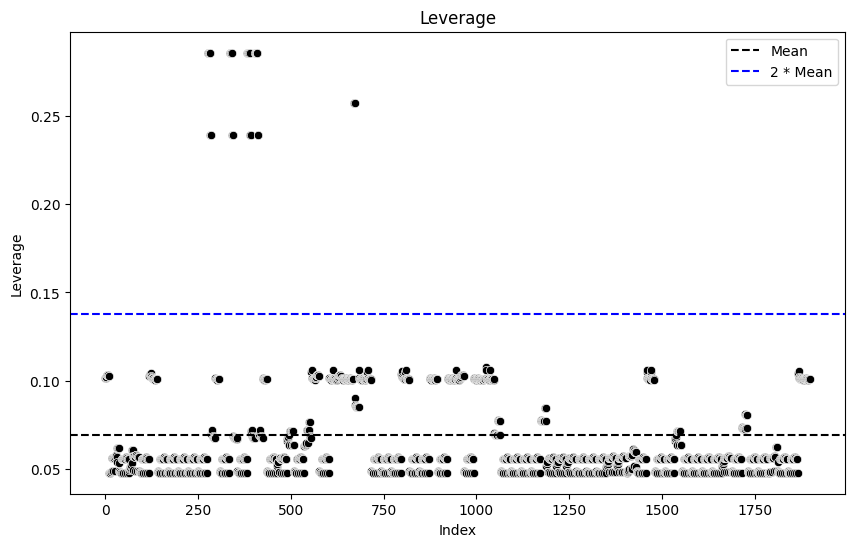
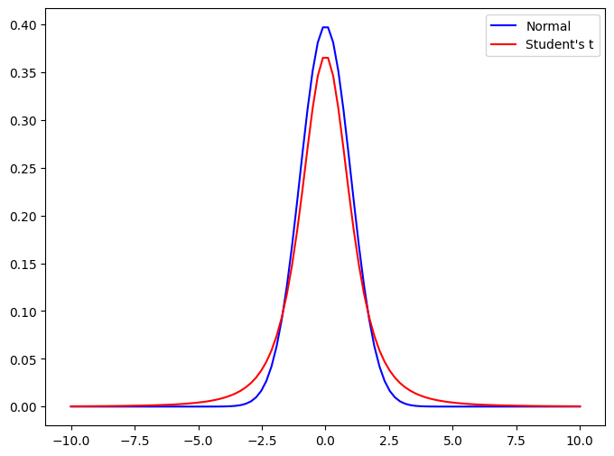

# 離島架橋の介入効果

## 慶應義塾大学 商学部 4 年 穐谷慶成

---

## 目次

1. はじめに
2. データと分析手法
3. 分析結果
4. 今後の方針

---

<!-- header: 1. はじめに -->

## 1. はじめに

- 1.1 離島の人口動向
- 1.2 離島架橋が人口に及ぼす影響を研究する動機
- 1.3 先行研究
- 1.4 新規性・社会的意義
- 1.5 リサーチクエスチョン

---

## 1.1 離島の人口動向

---

## 1.2 離島架橋が人口に及ぼす影響を研究する動機

### 好影響派

- (柏島 1997)
  経済活性化の鍵である．

- (宮内 & 下里 2003)
  住民の通勤が容易になり，
  特に若年層の帰郷が増加した．

### 悪影響派

- (森田ら 2020)
  離島架橋はストロー効果を
  引き起こす可能性がある．

---

## 1.3 先行研究

### 離島架橋に関する研究

- 柏鳥 (1997)
- 寺井 & 佐藤 (1999)
- 宮内 & 下里 (2003)
- 前原 (2005)
- 桑原 (2012)
- 森田ら (2020)

### 橋以外の離島に関する研究

- 石川 & 福重 (2009)
- 松村 & 三好 (2017)
- 藤本 (2017)
- 並木 & 小林 (2018)

人口に対する離島架橋の平均的な効果を計測する論文は無し．

---

## 1.4 新規性&社会的意義

### 新規性

橋の介入効果を計測する．

### 社会的意義

インフラ投資の効果を計測することで，政策決定の参考になる．

---

## 1.5 リサーチクエスチョン

離島架橋が離島人口に与える動的な効果を調査する．

---

<!-- header: 2. データと分析手法 -->

## 2. データと分析手法

- 2.1 データ
- 2.2 分析手法

---

## 2.1 データ

- 2.1.1 データの出展
- 2.1.2 分析対象

---

## 2.1.1 データの出典

- 人口
  - 国勢調査
  - 離島統計年報 (住民基本台帳調査から)
- 橋の有無
  - Google Earth
- 橋の建設年
  - 色々な所から(Wikipedia 等含む)．

---

## 2.1.2 分析対象

中国四国地方
(島根，岡山，広島，山口，徳島，香川，愛媛，高知)
島数: 94
期間: 1970 年から 2020 年(欠損あり)

※ ギネス世界記録の世界最長の吊橋を参考に遠すぎる島を除外
1915 Çanakkale Bridge は$2023m$ で 2022 年に認定された．
明石海峡大橋は $1991m$ で 1998 年に認定された．

---

## 2.2 分析手法

- 2.2.1 DiD
- 2.2.2 DiD の発展型: Two-way Fixed Effect
- 2.2.3 TWFE の時系列的な拡張: Dynamic TWFE
- 2.2.4 TWFE の横断的な拡張: Fully-saturated TWFE

---

## 2.2.1 DiD

---

## 2.2.1 DiD

---

## 2.2.1 Two-way Fixed Effect

DiD は 2 時点間のデータを用いる手法．

扱うデータは

- 複数年度にわたってデータを収集している．
- 介入タイミングが島によって異なる．

---

## 2.2.1 Two-way Fixed Effect

---

## 2.2.1 Two-way Fixed Effects

$$
\text{人口}_{it} = \text{切片} + \text{介入}_{it} + \text{島の個体差}_{i} + \text{年毎の共通要因}_{t}
$$

- 添字 $i$: 島． $t$: 年．
- 介入:
  - 橋が架かっているか否か．
- 島の個体差:
  - 本土からの距離や，地形的な橋の架けにくさ等の特性．
- 年毎の共通要因:
  - 全国的な人口減少，経済成長．

---

## 2.2.2 Dynamic TWFE

介入効果は時間変動するはずだ．

---

## 2.2.2 Dynamic TWFE

---

## 2.2.2 Dynamic TWFE

$$
人口_{it} = \text{切片} + (\beta + \gamma_{\ell})\text{介入}_{it} + \text{島}_i + \text{年}_t
$$

- $\text{介入}_{it}$: 介入後に 1．
- $\beta$: 介入の全体的な傾向を示すパラメータ
- $\gamma_{\ell}$: 介入の 経過年数($\ell$) によって変動するパラメータ

経過年数によって介入の効果は異なるはず．
時間を通じて平均的な効果を $\beta$ で表し，経過年数毎に変動する効果を $\gamma_{\ell}$ で表す．

---

## 2.2.3 Fully-saturated TWFE

Dynamic TWFE には問題点がある．

---

## 2.2.3 Fully-saturated TWFE

---

## 2.2.3 Fully-saturated TWFE

架橋にはばらつきがある．

- 先に架かった橋:
  効果が大きいと予想されたから先に架かった．
- 後に架かった橋:
  効果が小さいと予想されたから後に架かった．

先に架かった橋の効果を小さく，
後に架かった橋の効果を大きく修正することでバイアスを取り除く．

---

## 2.2.3 Fully-saturated TWFE

Sun & Abraham (2021)

$$
\text{人口}_{it} = \text{切片} + (\beta + \gamma_{k, \ell})介入_{it} + \text{島}_i + \text{年}_t
$$

- $\text{介入}_{it}$: 介入後に $1$．
- $\beta$: 介入の全体的な傾向を示すパラメータ．
- $\gamma_{k,\ell}$: 介入タイミング($k$)別の 経過年数($\ell$) によって変動するパラメータ．

---

<!-- header: 3. 分析結果と考察 -->

## 3. 分析結果と考察

- 3.1 TWFE
- 3.2 Dynamic TWFE
- 3.3 Fully-saturated TWFE

---

## 3.1 TWFE

介入効果の時系列的な変動を考慮しない推定．

|          | 期待値  | 標準偏差 | 95%信用区間      |
| -------- | ------- | -------- | ---------------- |
| 切片     | $5.740$ | $0.235$  | $(5.269, 6.173)$ |
| 介入効果 | $0.165$ | $0.021$  | $(0.126, 0.210)$ |

被説明変数: 人口の対数値

介入後は人口が
$17.94\% (13.43\%, 23.37\%)$
増加する
(推定値を指数変換)．

---

## 3.2 Dynamic TWFE

介入効果の時系列的な変動を考慮した推定．

|              | 期待値  | 標準偏差 | 95%信用区間      |
| ------------ | ------- | -------- | ---------------- |
| 切片         | $5.652$ | $0.209$  | $(5.250, 6.070)$ |
| 介入固定効果 | $0.476$ | $0.128$  | $(0.210, 0.720)$ |

被説明変数: 人口の対数値
介入固定効果: 介入の全体的な傾向

介入後は人口が
$60.96\% (23.37\%, 105.44\%)$
増加する
(推定値を指数変換)．

介入効果の時系列的な変動は次のページ

---

※ 介入固定効果($= 0.476$)からのばらつきを示す．

---

## 3.3 Fully-saturated TWFE

介入効果の時系列的な変動に加え，横断的な異質性も考慮した推定．

|              | 期待値  | 標準偏差 | 95%信用区間      |
| ------------ | ------- | -------- | ---------------- |
| 切片         | $5.605$ | $0.223$  | $(5.164, 6.038)$ |
| 介入固定効果 | $0.408$ | $0.081$  | $(0.247, 0.561)$ |

被説明変数: 人口の対数値
介入固定効果: 介入の全体的な傾向

介入後は人口が
$50.38\% (28.02\%, 75.24\%)$
増加する
(推定値を指数変換)．

---

## 3.3 Fully-saturated TWFE

橋が架かった年別に時間的な変動を見ることが出来る．

橋は年別に 25 個あるので，中からいくつか紹介．

- サンプル中，最も古い橋
- 効果が高め
- 効果が低め
- 初期は低いが，徐々に効果が高まる
- 最初少し高いが，徐々に効果が低くなる
- 最初から効果が減少傾向

(ぐちゃぐちゃしているので閲覧注意．)

---

### サンプル中，最も古い橋

---

### 効果が高めの例

---

### 効果が低めの例

---

初期は低いが，徐々に効果が高まる例

---

初期は低いが，徐々に効果が高まる例

---

最初少し高いが，効果が減りつつある例．

---

最初から効果が減少傾向の例

---

## 分類が可能

9 通り

- 初期: 効果なし，上振れ，下振れ
- その後: 増加，横ばい，減少

---

<!-- header: 4. 今後の方針 -->

## 4. 今後の方針

- わからない所を潰す．
- 分類を元にその島を調べる．
- 加重平均方法を学ぶ．

---

<!-- header: 参考文献 -->

## 参考文献

- 宮内, 下里. (2003). "都市通勤可能架橋島・沖縄県浜比嘉島における人口変動と転入者の存在形態". 島嶼研究.

- 森田, 猪原, 中村. (2020). "空間経済学に基づくストロー効果の発生条件とその影響 --明石海峡大橋を事例として". 日本経済研究.

- ピーター D ホフ. (2022). "標準ベイズ統計学". 朝倉書店.

- DC Hoaglin, RE Welsch. (1978). "The hat matrix in regression and ANOVA." The American Statistician. Taylor & Francis.

- Andrew Gelman, John B. Carlin, Hal S. Stern, David B. Dunson, Aki Vehtari, and Donald B. Rubin. (2013). "Bayesian Data Analysis." Chapman and Hall/CRC.

- Liyang Sun, Sarah Abraham. (2021). "Estimating dynamic treatment effects in event studies with heterogeneous treatment effects". Journal of Econometrics.

---

<!-- header: 最後 -->

## ご清聴ありがとうございました．

---

<!-- header: 補足 -->

## 2.3 欠損値

人口データが手に入らないこともあるので，欠損値が 10%ほどある．

PyMC が良い感じ(？)で補完してくれるので一旦はそれでやっている．

勉強中につき，まだ謎だが，デフォルトで補完機能がついているので信頼している．

従来の欠損値の対処には以下の問題があるので，他の対処方法が推奨される(ピーター D ホフ. 標準ベイズ統計学)．

- 欠損をすべて消すのは情報の損失．
- 何かを代入することは実際には観測されていないデータを使うので問題がある．

---

## 2.4 外れ値

- 2.4.1 レバレッジ
- 2.4.2 $t$ 分布によるロバスト推定

---

## 2.4.1 レバレッジ

各観測値がモデルに与える影響度を評価できる．
レバレッジスコアが高い観測値はモデルに対して強い影響を持つ．

説明変数 $X$ のハット行列の対角要素．

$$

H = \mathbf{X} (\mathbf{X}^T \mathbf{X})^{-1} \mathbf{X}^T

$$

レバレッジスコア $L_i$ は $H$ の $i$ 番目の対角要素．

$$

L*i = H*{ii}

$$

なお，$0 \leq L_i \leq 1$．

(Hoaglin & Welsch, 1978)

---

## 2.4.1 レバレッジ

|                       | $L_{i}$  |
| --------------------- | -------- |
| 平均値                | $0.0689$ |
| 理論値                | $0.0695$ |
| 最大値                | $0.2860$ |
| 平均値の$2$倍         | $0.1379$ |
| $2$倍以上の観測値数   | $43$     |
| $2$倍以上の観測値割合 | $2.26\%$ |

(※理論値 $=\frac{k+1}{n}$)

---

## 2.4.2 $t$ 分布によるロバスト推定

正規分布

$$

Y\_{it} \sim \mathcal{N}(\mu, \sigma^2)

$$

ではなく，
正規分布より裾が重い
自由度$3$の $t$ 分布

$$

Y\_{it} \sim \mathcal{t}(\nu=3, \mu, \sigma^2)

$$

を設定．
外れ値にロバストな
回帰を実行できる．
(Gelman et al., 2013)

(例の欠損値補完が変でもそれに耐えうる推定ができると期待している．)

---

## 3.5 モデリング

Fully-saturated TWFE

$$

\begin{aligned}
Y*{it} &\sim \mathcal{t} (\nu=3, \mu_{it}, \sigma^2) \\
\log(\mu_{it}) &= \alpha + (\beta + {\gamma}_{k,\ell}) T_{it} + \text{island}_i + \text{year}_t \\
\sigma &\sim \text{Half-}\mathcal{t}(\nu=3, \sigma=1) \\
\end{aligned}

$$

事前分布は $\mathcal{N}(0, 1)$ の弱情報事前分布を使用．

---

$$
$$
