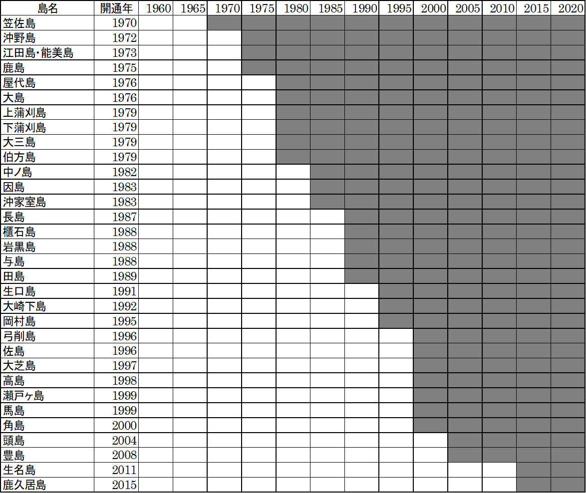
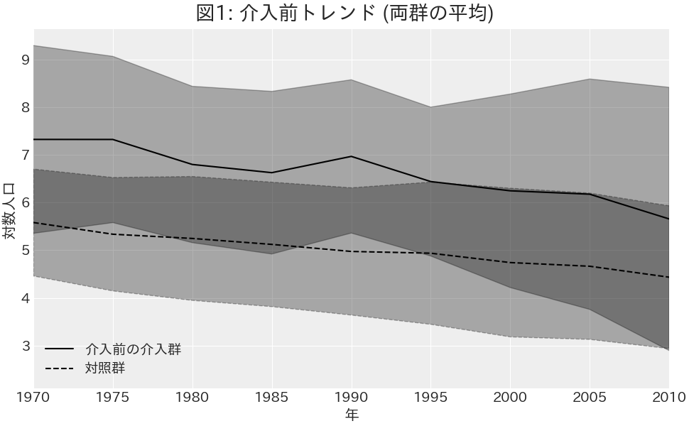
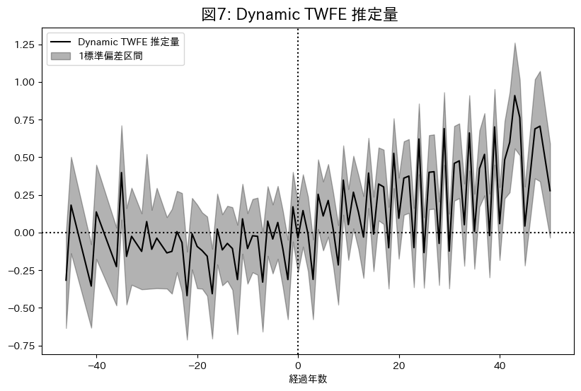
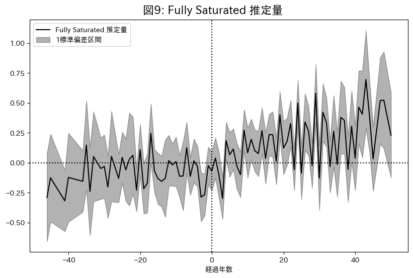
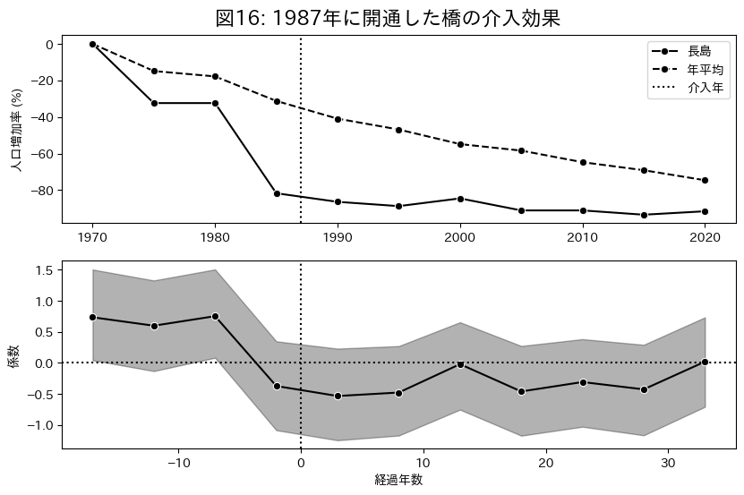

# 離島架橋の介入効果

慶應義塾大学商学部 4 年

穐谷慶成

---

# 目次

1. はじめに
2. 分析手法
3. 分析結果
4. 考察
5. まとめ

---

# 1. はじめに

1955 年から 2015 年まで

- 全国の人口: 約 4 割増加．
- 有人離島の人口: 約 6 割減少．

（国土交通省 国土政策局 離島振興課 2022）

---

離島架橋には以下の指摘がある．

- 離島の交通インフラとして経済活動の活性化や生活環境の向上に寄与する．
- ストロー効果を引き起こし人口流出を招く．

離島架橋が離島人口に与える影響を定量的に明らかにする．

---

## 先行研究

- 個別の島の事例を見て橋に肯定的

  - 沖山ら (2001)，宮内ら (2003)

- 個別の島の事例を見て橋に否定的

  - 寺井ら (1998)，黒田 (2003)，猪原ら (2015)

- 島の分類や人口増加要因の研究他

  - 湯本ら (2002) 山崎ら (2007)，重松 (2022)

---

### 新規性

- 複数の離島における架橋前後のデータを用いて離島架橋の動的な介入効果を推定．

### 社会的意義

- インフラ投資の政策効果を実証的に検証することで，離島振興政策の立案に示唆を与える．

- 離島架橋が人口維持に有効であれば，政府は離島架橋への財政支出を通じて離島の経済活動の活性化や生活環境の向上を図ることができる．

- 効果が限定的であれば，政府は他の政策手段を検討することで，有限な資源のより効果的な配分を目指すことができる．

---

# 2. 分析手法

- 使用するデータの説明
- 平行トレンドの仮定の検証
- $3$ つのモデルの紹介

---

## 2.1 使用データ

- 分析対象: 島の多い瀬戸内地域を中心に中国・四国地方から選択した 78 島
  - 介入群 33 島 (架橋前の人口データが入手可能)
  - 対照群 45 島 (距離 1991m 以内)
- 分析期間は最長で 1960 年から 2020 年，最短で 1995 年から 2020 年 ( 5 年毎)
- 橋の開通年: 地方自治体のウェブサイトを参照し，その島で最初に開通した橋の開通年を採用した．地方自治体のウェブサイトが見つからない場合は，Wikipedia 「日本の離島架橋」を参照した．

---

---

## 2.2 平行トレンドの仮定

<!-- Setting width to 900px -->

---

## 2.3 モデル

離島架橋の介入効果を推定するために，以下 3 つのモデルを紹介する．

---

### 2.3.1 Two-way Fixed Effects

$$
\begin{aligned}
\log{Y_{it}} &\sim \text{Student-t} (\nu, \mu_{it}, \sigma^2) \\
\nu &\sim \text{Gamma}(2, 0.1) \\
\mu_{it} &= \alpha_i + \lambda_t + \beta \cdot W_{it}\\
\alpha_i &\sim \text{Normal}(\mu_{\alpha}, \sigma_{\alpha}^2) \\
\lambda_t &\sim \text{Normal}(\mu_{\lambda}, \sigma_{\lambda}^2) \\
\beta &\sim \text{Normal}(0, 1) \\
\sigma &\sim \text{Cauchy}^+(1) \\
\end{aligned}
$$

$\beta$: $ATT$ (Average Treatment Effect on the Treated)

---

### 2.3.2 Dynamic TWFE

介入後の経過年数によって介入効果が変化することを考慮．

$$
\begin{aligned}
\mu_{it} &= \alpha_i + \lambda_t + \sum_{\ell} \beta_{\ell} (\mathbb{1}\{t - E_i \in \ell\}) \\
\beta_{\ell} &\sim \text{Normal}(0, 1) \\
\end{aligned}
$$

- $\beta_{\ell}$ : $ATT_{\ell}$
- $\mathbb{1}\{t - E_i \in \ell\}$ : 経過年数ダミー

---

### 2.3.3 Fully Saturated TWFE

介入時期が異なる島間で介入効果が異なる事を考慮

$$
\begin{aligned}
\mu_{it} &= \alpha_i + \lambda_t + \sum_{e} \sum_{\ell} \beta_{e, \ell} (\mathbb{1}\{E_i \in e\} \cdot \{t - E_i \in \ell\}) \\
\beta_{e, \ell} &\sim \text{Normal}(0, 1) \\
\end{aligned}
$$

- $\beta_{e, \ell}$ : $CATT_{e, \ell}$ (Cohort ATT)
- $\mathbb{1}\{E_i \in e\} \cdot \{t - E_i \in \ell\}$ : 介入年ダミー $\times$ 経過年数ダミー

---

架橋には優先順位があり，
介入時期が早い島と遅い島では効果が異なると考えるのが現実的．

- $1990$ 年に開通した橋の $5$ 年後の効果 $CATT_{1990, 5}$
- $2000$ 年に開通した橋の $5$ 年後の効果 $CATT_{2000, 5}$

を推定した後，
それらを平均することによって介入 $5$ 年後の効果 $ATT_5$ を得る．

---

# 3. 分析結果

本項では，2 節で提案した 3 つのモデルを用いて，離島架橋の介入効果の推定結果を示す．

---

## 3.1 Two-way fixed effect

|          params          |   EAP    | post.sd | 95%下限  | 95%上限  |
| :----------------------: | :------: | :-----: | :------: | :------: |
|         $\beta$          | $0.208$  | $0.031$ | $0.151$  | $0.266$  |

架橋後の人口は平均 23.18% 増加する．

---

## 3.2 Dynamic TWFE

---

<!-- |     介入前     |     EAP     | $P(ATT_{\ell} > 0)$ |    介入後    |    EAP     | $P(ATT_{\ell} > 0)$ |
| :------------: | :---------: | :-----------------: | :----------: | :--------: | :-----------------: |
|     全期間     | $-8.095\%$  |     $39.278\%$      |    全期間    | $29.605\%$ |     $73.440\%$      |
| $-10 \sim -2$  | $-6.519\%$  |     $43.492\%$      | $0 \sim 10$  | $14.038\%$ |     $66.862\%$      |
| $-20 \sim -11$ | $-4.438\%$  |     $41.055\%$      | $11 \sim 20$ | $28.899\%$ |     $75.097\%$      |
| $-30 \sim -21$ | $-13.388\%$ |     $31.710\%$      | $21 \sim 30$ | $25.412\%$ |     $68.020\%$      |
| $-46 \sim -31$ | $-8.829\%$  |     $39.828\%$      | $31 \sim 40$ | $53.903\%$ |     $83.784\%$      |
|       -        |      -      |          -          | $41 \sim 50$ | $30.787\%$ |     $74.255\%$      | -->

<!-- --- -->

## 3.3 Fully Saturated TWFE

---

|     介入前     |     EAP     | $P(ATT_{\ell} > 0)$ |    介入後    |    EAP     | $P(ATT_{\ell} > 0)$ |
| :------------: | :---------: | :-----------------: | :----------: | :--------: | :-----------------: |
|     全期間     | $-7.332\%$  |     $38.574\%$      |    全期間    | $20.126\%$ |     $70.884\%$      |
| $-10 \sim -2$  | $-8.231\%$  |     $35.713\%$      | $0 \sim 10$  | $1.488\%$  |     $53.516\%$      |
| $-20 \sim -11$ | $-5.108\%$  |     $41.383\%$      | $11 \sim 20$ | $18.282\%$ |     $77.599\%$      |
| $-30 \sim -21$ | $-5.051\%$  |     $40.864\%$      | $21 \sim 30$ | $20.837\%$ |     $70.420\%$      |
| $-46 \sim -31$ | $-11.555\%$ |     $35.517\%$      | $31 \sim 40$ | $22.058\%$ |     $72.449\%$      |
|       -        |      -      |          -          | $41 \sim 50$ | $50.342\%$ |     $84.995\%$      |

---

---

# 4. 考察

この節では，Fully Saturated TWFE で得られた $CATT_{e, \ell}$ 計 23 個の中から抜粋し，島の実際の人口変化率との比較をすることで橋の効果を考察する．

---

この島は最も架橋によって人口が増加したと推定された．

- 介入の 1 年前では -33.50%
- 介入 4 年後 56.99%

---

- ストロー効果を経験
  - 介入後の 3 年間で人口が急激に減少し約 -50% となった．

- 長年かけて正の効果．
  - 年平均の減少率に追いつき，28 年目には年平均を上回った．

---

架橋後に人口増加しているが，
効果は開通年より前から現れている．

この橋は知らないが，明石海峡大橋の建設に 12 年掛かったことを考慮すると

橋の建設開始が
その島の経済の見通しを
明るくしたために
人口増加を引き起こした
と考えられる．

---

最も効果が悪い例

- 1980 年: 144 人
- 1985 年: 39 人

火力発電所の建設が決まり，島民が集団移転．

「橋ができたことで 1 時間半歩いて病院に通えるため住むには良いところだ」
という意見があった．
橋で残された島民の生活が改善されたか．

---

# 5. まとめ

- 一時的なストロー効果もあるが，総じて正の効果．
- 長期的に効果が高まる．
- 橋の開通前から効果が出るケースもあり．
  - 公共事業の開始が地域経済の見通しを明るくしたか．
- 残った島民の生活を守るためのインフラとして役立つことで人口減少抑制．

---

## 課題点

- SUTVA 条件: 相互干渉がない (NI: No Interference)

  - 橋の架かっていない島から橋の架かった島へ移動が起こると，対照群が介入を受けたことになる．
  - $ATT$ の過大評価

- 平行トレンドの仮定を緩和する方法．

  - 個体別のタイムトレンド: 多重共線性．
  - コントロール変数: データの入手が出来なかった．

- 不均一分散:
  - TWFE ではあまり違いがなかった．
  - Dynamic TWFE，Fully Saturated TWFE では収束しなかった．

---

# $2$ 年間ありがとうございました．
